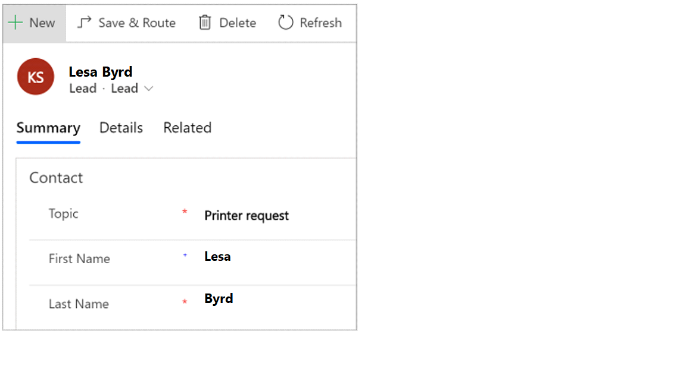

# Route records manually using unified routing

[!INCLUDE[cc-data-platform-banner](../includes/cc-data-platform-banner.md)]

[!INCLUDE[cc-use-with-omnichannel](../includes/cc-use-with-omnichannel.md)]

After you set up and enable a record for routing, you can manually start the routing for the records using the **Save & Route** button on the record forms.

## Route records using Save and Route option

When you enable a record for routing, you'll see the **Save & Route** option on the form ribbon on the command bar and **Apply Routing Rules** on the entity view ribbon on the command bar. You can use these commands to route the record.

1. Sign in to your model-driven app.

2. Select the record you want to route or select the record on your record view.   For example, in this procedure, **Leads** is enabled for routing, so you can see the **Save & Route** button on the Leads form command bar.

3. Select **Leads** in the site map, and you can view the **Apply Routing Rules** in the entity view ribbon command bar. Selecting **Apply Routing Rules** also routes the record.

4. Select a lead record from the **My Open Leads** view.

5. Select **Save & Route** on the command bar. The **Route Case** dialog box appears.

6. Select **Route**. The record is routed based on the active routing rule set.

    > [!div class=mx-imgBorder] 
    > 

### See also

[Overview of routing](overview-unified-routing.md)  
[Set up routing for records](set-up-record-routing.md)  
[Automatically route records using custom flow](routing-trigger-automatic.md)  
[Sample code to trigger routing for non-case records](trigger-routing-non-case-records.md)  

[!INCLUDE[footer-include](../includes/footer-banner.md)]
