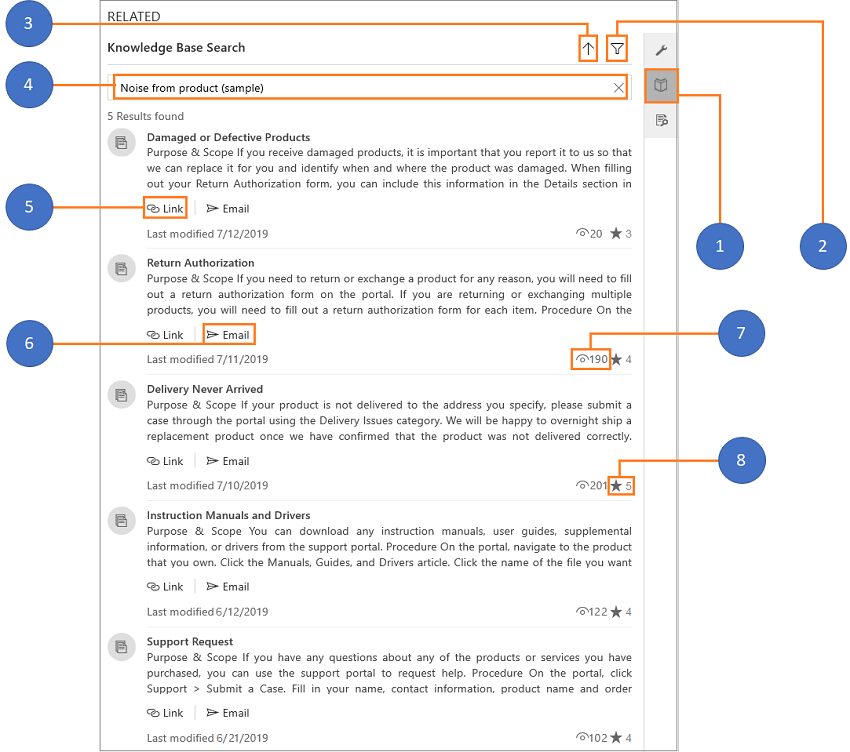
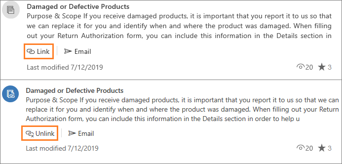

# Search for knowledge articles in the Customer Service Hub
 Knowledge base search in the Customer Service Hub app lets you search for relevant knowledge articles to resolve a case. To search for knowledge articles in a case form, select the **Knowledge Base Search** search box in the **Knowledge Base Search control** of the **Related** section.

The search results are automatically populated based on a field your administrator configured in the **Knowledge Base Search** control properties. Out of the box, for a case this is the title of the case record.

> [!IMPORTANT]
>  Knowledge base search in the Customer Service Hub shows relevant knowledge articles only when your organization is set up to use the native [!INCLUDE[pn_crm_shortest](../includes/pn-crm-shortest.md)] knowledge management capability. For more information, talk to your administrator.

For more information, see [Knowledge Base Search control](#knowledge-base-search-control).

## Knowledge base search control powered by Relevance search 

Knowledge base search in the Customer Service Hub now comes with an improved search functionality. The knowledge base search is now enabled to use Relevance search mechanism in the knowledge base search control area, in addition to the global search area where the Relevance search mechanism was already enabled.

[!INCLUDE[proc_more_information](../includes/proc-more-information.md)] [How Relevance Search works](../admin/configure-relevance-search-organization.md#how-relevance-search-works)

Relevance search mechanism uses Azure search service to index and search records.  Relevance search provides improved search functionality like better relevance, highlighted search keyword text, and search within attachments and notes. With Relevance search, you can also configure searchable fields in the knowledge article entity. 

[!INCLUDE[proc_more_information](../includes/proc-more-information.md)] [Configure searchable fields for Relevance Search](../admin/configure-relevance-search-organization.md#configure-searchable-fields-for-relevance-search)

> [!NOTE]
> To enable Relevance search for knowledge article entity, see [Enable Relevance Search](../admin/configure-relevance-search-organization.md#enable-relevance-search) and [Select entities for Relevance Search](../admin/configure-relevance-search-organization.md#select-entities-for-relevance-search). 
If Relevance search is not enabled for the entity, standard Full-text search is used. 

For more information, see [Understand knowledge base search mechanisms](knowledge-base-search-methods.md).

### Before you begin using Relevance search

Relevance search uses the scoring concepts as defined by Azure search. To be able to search the knowledge base using Relevance search, certain view columns should be mandatorily configured in the Quick Find view columns list. If any of these columns are deleted or missing, the search query displays an error.

> [!NOTE]
> An admin can configure the knowledge article quick find view columns list by navigating to **Settings > Customizations > Entities > Knowledge Article > Views > Quick Find View > View Columns**.

Here are the required view columns:

- Article Public Number
- Title 
- Created On 
- Keywords
- Knowledge Article Views 
- Language
- Major Version Number 
- Minor Version Number 
- Rating
- Status
- Modified On

## Knowledge Base Search control

[!include[cc-beta-prerelease-disclaimer](../includes/cc-beta-prerelease-disclaimer.md)]

The Customer Service Hub comes with an enhanced Knowledge search that shows you the articles arranged in a single stream. Searching, sorting, and filtering the articles in the search control will be faster and more responsive with improvements to article viewability and usability.

When you select the Knowledge Base Search option in the RELATED section, knowledge base search control loads, and you can view the following:

  

  1. Knowledge Base Search
  2. Open filter pane
  3. Sort search results by
  4. Search knowledge articles
  5. Link this article to the current record (unlink will be displayed when the article is already linked to a record)
  6. Link this article to a record and send via Email
  7. Views
  8. Rating

In the knowledge base search control, you perform the following:
- Search for knowledge articles
- Filter the articles with multiple filter options
- Sort the knowledge articles
- Link and unlink the knowledge article to a record
- Email the knowledge article
- View the knowledge article inline in the search control

### Search for knowledge articles

Type a keyword in the search box to search for knowledge articles.

  

- If Relevance search is not enabled, the keywords that you enter will initiate  a search (using Full-text search mechanism) in the following fields of a knowledge article: **Title**, **Content**, **Keywords**, **Description**, and **Article Public Number**.

- If Relevance search is enabled, you can configure the fields based that you want to be searched upon. [!INCLUDE[proc_more_information](../includes/proc-more-information.md)] [Configure searchable fields for Relevance Search](../admin/configure-relevance-search-organization.md#configure-searchable-fields-for-relevance-search)

[!INCLUDE[proc_more_information](../includes/proc-more-information.md)] [Add the Knowledge Base Search control to Main forms](add-knowledge-base-search-control-forms.md#add-the-knowledge-base-search-control-to-main-forms)

### Filter knowledge articles

With the help of text and visual filters, you can filter the knowledge articles. To see knowledge articles in specific states, use the **Status** filter. You can filter search results to see all draft, published, or approved articles. See articles that are categorized as internal and external. You can also filter the articles based on date and language.
When you select the filter icon, you can see the **Filter by** menu where you can filter the items based on the following categories.

  | Category | Sub-category |
  |-----------------------|-----------------------|
  | Status | <ul> <li> Draft </li> <li> Approved </li> <li> Published </li> </ul> |
  | Visibility | <ul> <li> Internal </li> <li> External </li> <li> All </li> </ul> |
  | Date | <ul> <li> Last 7 days </li> <li> Last 30 days </li> <li> Last 6 months </li> <li> Last year </li> <li> All </li> </ul> |
  | Language | <ul> <li> List of languages </li> </ul> **Note:** The language list based on the articles that are present in the those languages. For example, there are a total of 50 articles in five different languages such as French, English, Japanese, Spanish, and Danish. The language filter will show only these five languages. |

    

### Sort knowledge articles

The knowledge base search control provides sort the knowledge articles interactions. Select the up-arrow icon to view the sorting options and select one of the options from the following: 

- Relevance
- Number of views
- Last modified date (newest first) 
- Last modified date (oldest first)

  

### Link and unlink the knowledge article to a record

You can associate and dissociate the knowledge article with a record by using the **Link** and **Unlink** buttons.

   

### Email the knowledge article

Use the **Email** button to send the knowledge article via mail. When you select the **Email** button, first, the knowledge article is linked to the current case record. Simultaneously, an email form opens with the link to the article. The article content is populated in the email body. The fields are automatically populated based on the case and customer details. Add other information as needed, and then on the command bar, select **Send**.

  

### View the knowledge article inline in the search control

Select a article title to see its full content rendered in the same control. The article opens inline and you can scroll to read the complete article. In this view mode, you can perform the actions such as linking the knowledge article to a record and emailing the knowledge article to a customer. To learn more about send the knowledge articles via email, see [Email the knowledge article](#email-the-knowledge-article).

  

> [!Note]
> - Select the **Copy Link** button  to copy the external URL of the article so you can share it with your customers over channels like chat or email.  If you use a browser other than [!INCLUDE[pn_Internet_Explorer](../includes/pn-internet-explorer.md)], this option isn’t available. 
>
> - Copy Link and Email Link options are available only if your organization is using an external portal to publish the knowledge articles and your administrator has selected the **Use an external portal** check box in the **Embedded Knowledge search** setup.  [!INCLUDE[proc_more_information](../includes/proc-more-information.md)] [Use embedded knowledge search to set up knowledge management](set-up-knowledge-management-embedded-knowledge-search.md).
>
> - Copy Link, Email Link, and Email options can be used only for published and expired articles.

### See also

[Add the Knowledge Base Search control to forms](add-knowledge-base-search-control-forms.md)

[Create and manage knowledge articles](customer-service-hub-user-guide-knowledge-article.md)

[Understand knowledge base search mechanisms](knowledge-base-search-methods.md)

