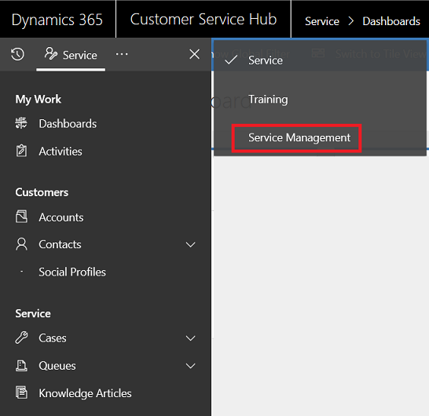

# Service Manager Guide (Customer Service Hub and Customer Service app)

[!INCLUDE[cc-applies-to-update-9-0-0](../includes/cc_applies_to_update_9_0_0.md)]

Service Management module lets your customers quickly deploy their business processes. It helps customer service managers automate various customer service processes, improve agent turn-around time, and lead towards optimum customer satisfaction. 

Service Management module empowers the admin to set up everything related to customer service, like defining parent-child case hierarchy, creating queues,routing rule sets, rules for automatic case creation, service level agreements (SLAs), entitlements, and customer service schedule. 

Service Management now moves under the Customer Service Hub, enabling customer service managers to access the configurations from inside the application. Built on Unified Interface, the new Service Management helps to easily configure service tasks, enabling increased productivity.
  
> [!NOTE]
> With the October ’18 release, you can access and manage all admin settings from the Customer Service Hub sitemap except for **Routing Rule sets**, **Automatic Record Creation,** and **Service Level Agreements**.   To access and manage these three admin settings, go to **Settings** > **Service Management** in the web application.  These three admin settings (Routing Rule sets, Automatic Record Creation, and Service Level Agreements) will be available in the Customer Service Hub sitemap beginning with the January 2019 release.

## Access Service Management

Use the Service Manager to set up various admin tasks for customer service. You can access service management from the Customer Service Hub sitemap.

In the Customer Service Hub sitemap, select **...** to go to Service Management.

[!INCLUDE[proc_more_information](../includes/proc-more-information.md)] [Understand the sitemap navigation](customer-service-hub-user-guide-basics.md#understand-the-sitemap-navigation)

  

## Case Settings

[Queues](set-up-queues-manage-activities-cases.md)

[Parent and Child case settings](define-settings-parent-child-cases.md)

[Routing Rule Sets](create-rules-automatically-route-cases.md)

[Automatic Record Creation](set-up-rules-to-automatically-create-or-update-records.md)

[Subjects](create-manage-subject-tree.md)
  
## Service Terms  

[Service Level Agreements](define-service-level-agreements.md)

[Entitlements](create-entitlement-define-support-terms-customer.md)

[Holiday Schedule](set-up-holiday-schedule.md)

[Service Configuration Settings](../admin/system-settings-dialog-box-service-tab.md)

[Customer Service Schedule](create-customer-service-schedule-define-work-hours.md)

## Knowledge Base Management 

[Embedded Knowledge Search](set-up-knowledge-management-embedded-knowledge-search.md)

[Categories](create-manage-categories.md)

## Templates

[Entitlement Templates](set-up-entitlements-templates.md)

[Email Templates](../admin/create-templates-email.md)

[Article Templates](../admin/create-templates-articles.md)

## Service Scheduling (deprecated)

[Business Closure](set-when-business-closed.md)

[Services](create-edit-service.md)

[Facilities/Equipment](add-facilities-equipment-service-scheduling.md)

[Resource Groups](create-edit-resource-group.md)

[Sites](use-sites-manage-service-locations.md)

> [!NOTE]
> Service Scheduling settings on the **Service Management** and **Business Management** pages have been deprecated. For more information, see [Important changes coming](https://docs.microsoft.com/dynamics365/get-started/whats-new/customer-engagement/important-changes-coming).

### See also

[User Guide (Customer Service Hub)](user-guide-customer-service-hub.md)
