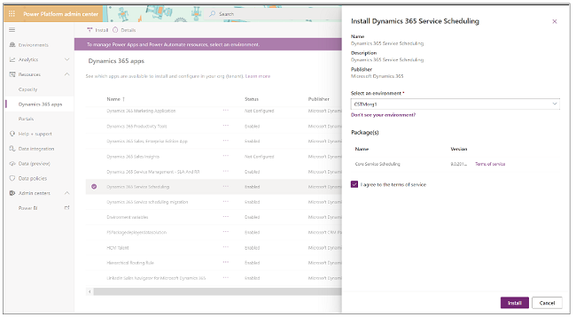

#  Service scheduling FAQ

Read this topic to find answers to some common questions regarding service scheduling, its legacy experience and new experience, setup, and other key concepts.

## What licenses do I need to enable service scheduling for my org?
 
The new scheduling experience is available to you if you have one of the following licenses:

- D365_ENTERPRISE_P1 – Customer Engagement
- D365_ENTEPRISE_CS – Customer Service
- D365_ENTERPRISE_CM – Case Management

## Is the new scheduling experience automatically available with the next Dynamics 365 Customer Service upgrade?

Scheduling in the Customer Service Hub is a customer-driven update. You need to avail and enable the service scheduling package, which also includes the Universal Resource Scheduling (URS) functionality. 

[!INCLUDE[proc_more_information](../includes/proc-more-information.md)] [Set up the scheduling experience](basics-service-service-scheduling.md#set-up-the-service-scheduling-experience)

## Is manual selection of resources supported in a service activity in the new scheduling experience?

While creating a service activity, manual selection of resources is not supported in the new scheduling experience in Customer Service Hub.

## How do I install Core Service Scheduling from the Power Platform admin center?

To install Core Service Scheduling from the Power Platform admin center, do the following:

1. Expand **Resources**, and then select **Dynamics 365 apps**.

  
  
2. Under the list of application names, select **Dynamics 365 Service Scheduling**, and then select **Install**.

3. Select the environment where you would like to install the latest app (the installation will start with the dev environment, then once the dev instance succeeds, it will change to test and then production.

  

4. If you agree to the terms and conditions, select the checkbox next to **I agree to the terms of service**, and then select **Install**.

### See also

[Service Scheduling Guide](basics-service-service-scheduling.md)

[!INCLUDE[footer-include](../includes/footer-banner.md)]
