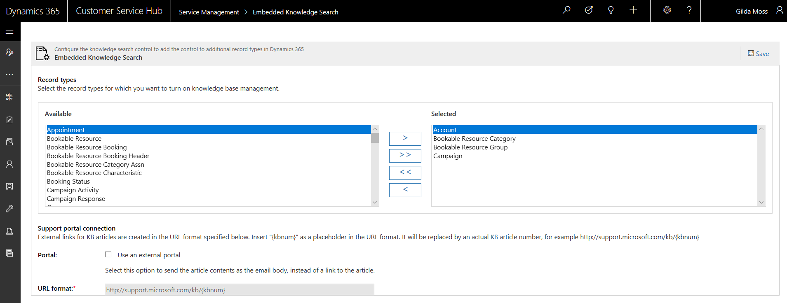

# Use embedded knowledge search to set up knowledge management

[!INCLUDE[cc-applies-to-update-9-0-0](../includes/cc_applies_to_update_9_0_0.md)] [!INCLUDE[cc-applies-to-update-8-2-0](../includes/cc_applies_to_update_8_2_0.md)]

A comprehensive knowledge base is a key to increased customer satisfaction and improved productivity of users. Give users quick access to the knowledge base by setting up knowledge management in [!INCLUDE[pn_dynamics_crm](../includes/pn-dynamics-crm.md)].  
  
 [!INCLUDE[pn_dynamics_crm](../includes/pn-dynamics-crm.md)] supports two knowledge management solutions that you can choose from:  
  
- Native [!INCLUDE[pn_crm_shortest](../includes/pn-crm-shortest.md)] knowledge management. This option is available for [!INCLUDE[pn_crm_online_shortest](../includes/pn-crm-online-shortest.md)] users. For [!INCLUDE[pn_CRM_Online](../includes/pn-crm-online.md)] organizations, the native [!INCLUDE[pn_crm_shortest](../includes/pn-crm-shortest.md)] knowledge solution is only available if you've updated to [!INCLUDE[pn_crm_online_2016_update_shortest](../includes/pn-crm-online-2016-update-shortest.md)].
  
- [!INCLUDE[pn_parature](../includes/pn-parature.md)] knowledgebase. This option is available only for [!INCLUDE[pn_crm_online_shortest](../includes/pn-crm-online-shortest.md)] users. 

> [!IMPORTANT]
> Usage of [!INCLUDE[pn_parature](../includes/pn-parature.md)] knowledgebase as a knowledge management solution for [!INCLUDE[pn_crm_shortest](../includes/pn-crm-shortest.md)] has been deprecated. For more information, see [Important changes coming](https://docs.microsoft.com/en-us/dynamics365/get-started/whats-new/customer-engagement/important-changes-coming).
  
After knowledge management is set up, users will be able to:  
  
- Search for relevant KB articles right from [!INCLUDE[pn_dynamics_crm](../includes/pn-dynamics-crm.md)] as they're working on a record.  
  
- See the content of the KB article inline, including images and videos.  
  
- Give timely and consistent information to customers when working on their cases by using actions like opening the article and sharing the information or emailing the article link to customers.   

> [!NOTE]
> With the October'18 release, embedded knowledge search in service management is available in the Customer Service Hub based on the Unified Interface experience. We recommend that you set up knowledge management using embedded knowledge search in the new experience.
  
## Set up knowledge management (Customer Service Hub)
  
[!INCLUDE[proc_permissions_system_admin_and_customizer](../includes/proc-permissions-system-admin-and-customizer.md)] You must also be the tenant administrator of [!INCLUDE[pn_MS_Office_365](../includes/pn-ms-office-365.md)].
  
1. In the Customer Service Hub sitemap, go to **Service Management** and select **Knowledge Base Management** > **Embedded Knowledge Search**. 
  
2. In the **Knowledge Base Management Settings** wizard, in **Record Types**, select the record types you want to turn on knowledge management for. The list will include all entities that are available for an N:N relationship. Knowledge management is enabled for case entity by default.  

  
3. In the **Support Portal Connection** section, enter the following:  
  
   - **Use an external portal**. You can integrate an external portal for publishing knowledge articles. If your organization uses one, select this check box.  
  
   - **URL Format**. Type the portal URL that will be used to create external (public-facing) portal links for knowledge articles, which the service agents can share with the customers. The external URL is created in the following format:  http://\<support portal URL>/kb/{kbnum}   
  
        The placeholder "{kbnum}" is replaced by an actual knowledge article number.  
  
4. Select **Save**.  

   
 

## Set up knowledge management (Customer Service app)

1. [!INCLUDE[proc_permissions_system_admin_and_customizer](../includes/proc-permissions-system-admin-and-customizer.md)] You must also be the tenant administrator of [!INCLUDE[pn_MS_Office_365](../includes/pn-ms-office-365.md)].  
  
2. [!INCLUDE[proc_settings_service_management](../includes/proc-settings-service-management.md)]  
  
3. Under **Knowledge Base Management**, click **Embedded Knowledge Search**.  
  
4. In the **Knowledge Base Management Settings** wizard, in **Record Types**, select the record types you want to turn on knowledge management for. The list will include all entities that are available for an N:N relationship. Knowledge management is enabled for case entity by default.  
  
5. Under **Knowledge Source**, in the **Knowledge Solution** field, select the [!INCLUDE[pn_crm_shortest](../includes/pn-crm-shortest.md)] native knowledge solution.  
  
6. In the **Support Portal Connection** section, enter the following:  
  
   - **Use an external portal**. You can integrate an external portal for publishing knowledge articles. If your organization uses one, select this check box.  
  
   - **URL Format**. Type the portal URL that will be used to create external (public-facing) portal links for knowledge articles, which the service agents can share with the customers. The external URL is created in the following format: http://\<support portal URL>/kb/{kbnum}  
  
        The placeholder "{kbnum}" is replaced by an actual knowledge article number.  
  
7. Click **Next**.  
  
8. If you’ve specified the details correctly, the page shows the connection details for [!INCLUDE[pn_crm_shortest](../includes/pn-crm-shortest.md)]. Click **Finish** to complete the setup.  
  
### See also  
 [Add the Knowledge Base Search control to a Dynamics 365 form](../customer-service/add-knowledge-base-search-control-forms.md)   
 
