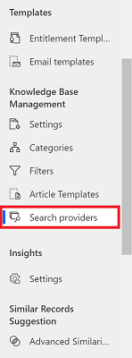
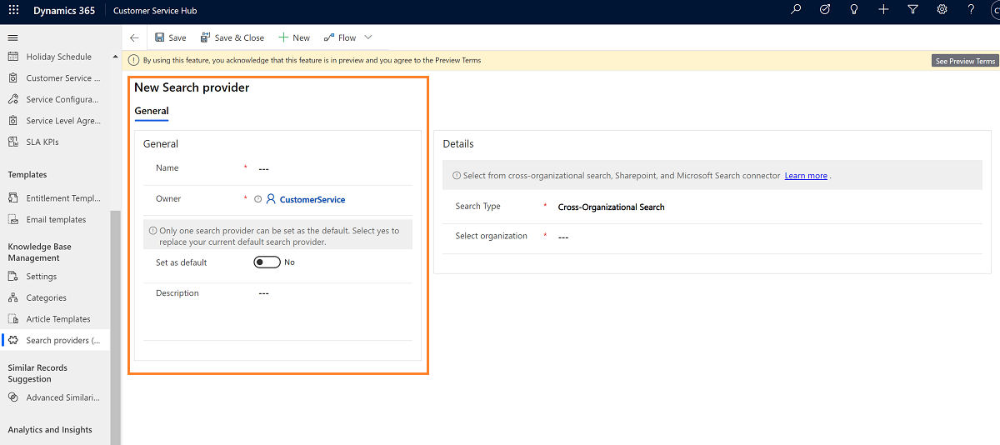

# Set up a search provider in Customer Service Hub (Preview)

[!include[cc-beta-prerelease-disclaimer](../includes/cc-beta-prerelease-disclaimer.md)]

> [!IMPORTANT]
>
> - A preview is a feature that is not complete, as it may employ reduced privacy, security, and/or compliance commitments, but is made available before it is officially released for general availability so customers can get early access and provide feedback. Previews are provided "as-is," "with all faults," "as available," and without warranty.
> - This preview feature does not come with technical support and Microsoft Dynamics 365 Technical Support won't be able to help you with issues or questions.  If Microsoft does elect to provide any type of support, such support is provided "as is," "with all faults," and without warranty, and may be discontinued at any time.
> - Previews are not meant for production use, especially to process Personal Data or other data that is subject to heightened compliance requirements, and any use of "live" or production data is at your sole risk. All previews are subject to separate [Terms and Conditions](../legal/supp-dynamics365-preview.md).

You can use search providers to federate the search of files, documents, or articles from data sources outside of your current Dynamics 365 organization.

There are three types of search providers you can set up: 
  -	**Cross-Organizational Search**: This option allows you to specify a different organization under the same tenant of the current organization and search the articles from that organization. The list from the current tenant is automatically identified. 
  -	**Sharepoint**: This option requires you to enter the SharePoint URL. 
  -	**Microsoft Search Connector**: This option is for organizations that already use Microsoft search to index all external data. You only need to specify the unique connection ID when you create the connector. To learn more about Microsoft search connectors, see [Overview of Microsoft Graph connectors](https://docs.microsoft.com/microsoftsearch/connectors-overview). **Note**: For the public preview release of search provider, only enterprise websites and the MediaWiki connector will work. Other connectors will be added in future releases.
  
From an authentication perspective, your agents must have access to external content or they won't be able to view search results.

## Set up a search provider

To set up a search provider, do the following:

1.	Open the **Customer Service Hub** app and select **Change area > Service Management**.

    > [!div class=mx-imgBorder]
    > 

2.	Under the **Knowledge Base Management** section, select **Search providers**, and then select **New**.

    > [!div class=mx-imgBorder]
    > 
    
    The **New Search provider** page is displayed.

3.	Under **General**, enter the name and owner information for the search provider. You can optionally also enter a description.

    > [!div class=mx-imgBorder]
    > 
    
4. If you want this search provider to be your default provider, toggle **Set as default** to **Yes**.
    
5. Under **Details**, from the drop-down menu, select the type of search provider you want to use and the organization.

    > [!div class=mx-imgBorder]
    > 

6. When you are finished, select **Save** in the lower-right corner.

## Post-configuration agent experience

After you have configured the search providers, agents who are using search can see a drop-down option with links to those providers in their search results.

   > [!div class=mx-imgBorder]
   > 
   
For more information about the agent search experience, see [Search for knowledge articles in the Customer Service Hub](search-knowledge-articles-csh.md).
   
### See also

[Add the Knowledge Base Search control to forms](add-knowledge-base-search-control-forms.md)

[Create and manage knowledge articles](customer-service-hub-user-guide-knowledge-article.md)

[Understand knowledge base search mechanisms](knowledge-base-search-methods.md)

[Search for knowledge articles in the Customer Service Hub](search-knowledge-articles-csh.md)
