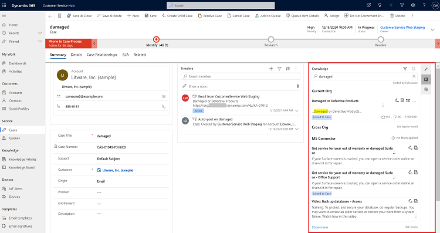

# Set up external knowledge search providers

Knowledge management plays a vital role in enabling organizations to deliver customer care. Agents can create rich, high-quality knowledge resources and show the right knowledge content across engagement channels, including self-service, assisted service, and onsite service. This helps expedite issue resolution and leads to customer and agent satisfaction and productivity.

The ability to create, import, and share knowledge bases is a core capability of successful support delivery. With knowledge management, agents and supervisors can author knowledge articles from templates, add knowledge search providers from multiple sources (SharePoint, Microsoft Search, and other Dynamics 365 organizations), and receive AI-triggered knowledge suggestions while helping customers to accelerate support delivery.

You can use search providers to federate the search of files, documents, or articles from data sources outside your current Dynamics 365 organization. In Microsoft Cloud for Sovereignty, the external search providers feature is available for use only in GCC.

You can set up the following search providers:

  -	**Cross-Organizational Search**: This option allows you to specify a different organization within the same tenant of the current organization and search the articles from that organization. The list from the current tenant is automatically identified. If the tenant has organizations located across multiple geographical locations, search data transfer happens across these locations.
  -	**Sharepoint**: This option requires you to enter the SharePoint URL, which must also be a part of the same tenant as that of the current organization.
  -	**Microsoft Graph connector**: This option is for organizations that already use Microsoft Search to index all external data. You only need to specify the unique connection ID when you create the connector. To learn more about Microsoft Graph connectors, see [Overview of Microsoft Graph connectors](/microsoftsearch/connectors-overview).
  
From an authentication perspective, your agents must have access to external content, or they won't be able to view search results.

You can also set up additional search providers such as enterprise websites based on the site map protocol by integrating search providers. Setting up external search providers doesn't require an ingestion, whereas setting up integrated search providers requires ingesting articles from  external providers into Microsoft Dataverse. For more information on integrated search providers, go to: [Manage integrated search providers](add-search-provider.md#manage-integrated-search-providers).

## Set up a search provider

> [!NOTE]
>
> Before you set up a search provider, ensure that your firewall doesn't block the https://www.d365ccafpi.com/ domain. Otherwise, users will encounter errors.

You can set up a search provider in the Customer Service admin center or Customer Service Hub app by performing the following steps:

1. Go to **External search providers**.
  
### [Customer Service admin center](#tab/customerserviceadmincenter)

> [!NOTE]
  > **Search Providers** on the **Knowledge** page has been renamed as **External search providers**.

  1. In the site map, select **Knowledge** in **Agent experience**. The **Knowledge** page appears.
  2. In the **External search providers** section, select **Manage**.

### [Customer Service Hub](#tab/customerservicehub)

* In the site map, go to **Service Management**, and select **Search providers** in **Knowledge Base Management**.

---

2.	Select **New**.

3.	On the **New Search provider** page, **General** section, enter the name and owner of the search provider. Optionally, you can enter a description.
     
5. In the **Details** section, select the organization and the type of search provider you want to use from the **Select organization** and the **Search Type** dropdown, respectively.

    :::image type="content" source="media/search-provider-details.png" alt-text="Search provider details":::

6. Select **Save**.

## Post-configuration agent experience

After you've configured the search providers, agents using search can view links in their search results for each search provider included in their current organization.

>[!NOTE]
>
>If at least one knowledge search provider is enabled and configured, then the configured value for article search results won't be applicable. For each configured search provider, three article search results will be displayed. Agents can select **Show more** to view additional results. For more information on articles shown in search results, go to [Add the Knowledge Base Search control to forms](./add-knowledge-base-search-control-forms.md).

   > [!div class=mx-imgBorder]
   > 
   
For more information about the agent search experience, go to [Search for knowledge articles in the Customer Service Hub](search-knowledge-articles-csh.md).

> [!NOTE]
>
> Custom roles must have **Read**, **Create**, **Append**, and **AppendTo** access to the following entities to see search results from other search providers:
> - Knowledge Federated Article
> -	Knowledge FederatedArticle Incident
   
### See also

[Add the Knowledge Base Search control to forms](add-knowledge-base-search-control-forms.md)

[Create and manage knowledge articles](customer-service-hub-user-guide-knowledge-article.md)

[Understand knowledge base search mechanisms](knowledge-base-search-methods.md)

[Search for knowledge articles in the Customer Service Hub](search-knowledge-articles-csh.md)

[!INCLUDE[footer-include](../includes/footer-banner.md)]
