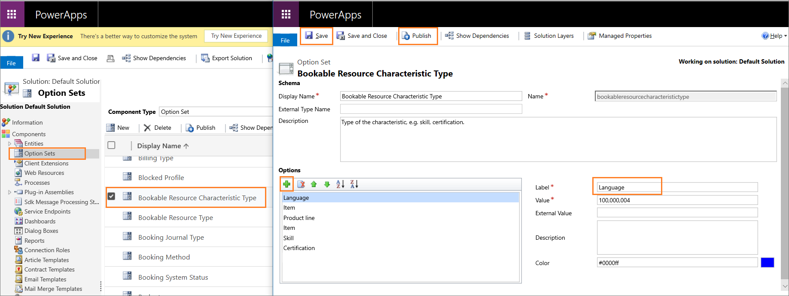

# Set up skills and assign agents

[!INCLUDE[cc-data-platform-banner](../includes/cc-data-platform-banner.md)]

[!INCLUDE[cc-use-with-omnichannel](../includes/cc-use-with-omnichannel.md)]

## Set up skills

As an administrator, to create skills, you need at least one skill type in the system. For example, to add **Spanish** as a skill, you need a skill type called **Language**. You must first create a skill type and then create skills.

### Create skill type

1. Sign in to the Dynamics 365 instance as an administrator.

2. Select **Settings** > **Customizations** >  **Customize the System**.

3. Select **Option Sets** from the left pane.

4. Double-click the **Bookable Resource Characteristic Type** from the list. A new window opens.

5. Select the **Add** icon under the Options container.

6. Type a name for the Label field. For example, **Language**.

7. Select **Save** to save the skill type.

8. Select **Publish** to publish the customization changes.

    > [!div class=mx-imgBorder] 
    > 

### Create skills

After you create a skill-type, you can create skills.

1. Sign in to the Omnichannel Administration app.

2. Select **Skills** under **Queues & Users** in the sitemap.

3. Select **+ New**.

4. Specify the following in the **New Skill** page.

    | Field | Description  | Example value |
    |-----------|---------------------|------------------------------|
    | Name | Specify the name of the skill. | Spanish   **Note:**   The name must be unique. |    
    | Type | Select a skill type from the drop-down list. | Language |
    | Description | Provide a description of the skill. | This record is used to define the skill level of the Spanish language. |

5. Select **Save**. 

After you save, the **Agents** section appears. In this section, you add the agents and rating value. To learn more, see [Assign agents to the skill](#assign-agents-to-skill).

### Add agents as bookable resource

To assign agents to a skill, you need to add the agents as bookable resource. 

1. Sign in to the Omnichannel Administration app.

2. Select **Users** under **Queues & Users**.

3. Select a user from the list and select **Omnichannel** tab.

4. Select **+ New Bookable Resource** in the **Skills Configurations** section. The **New Bookable Resource** page appears.

5. Specify the name of the user in the **Name** field.

6. Select **Save**.

### Assign agents to skill

1. Sign in to the Omnichannel Administration app.

2. Select **Skills** under **Users & Queues** in the sitemap.

3. Select a skill from the list for which you want to assign the agents.

4. Select **+ New Bookable Resource Characteristic** in the **Users (Agents)** section. The **Quick Create: Bookable Resource Characteristic** pane appears.

5. Select an agent name for the **User (Agent)** field. Only the name of the agents who are added as Bookable Resources appears in drop-down.

6. Select a rating value from the list. The values that appear are based on the rating model and rating values that you created. To learn more, see [Rating value of skills](enable-skill-routing-create-rating-model.md#rating-value-of-skills).

7. Select **Save and Close** to save and add the user (agent) to the grid.

    > [!div class=mx-imgBorder] 
    > 

8. Repeat steps 4 through 7 to add more agents to the skill.

9. Select **Save** to save the skill.

Alternatively, you can also add a skill to the user (agent). To learn more, see [Manage users](users-user-profiles.md).

## See also

[Overview of skill-based routing](overview-skill-work-distribution.md)

[Enable skill-based routing and create rating model](enable-skill-routing-create-rating-model.md)

[Attach skills to conversation](attach-skills.md)

[Manage users](users-user-profiles.md)

[!INCLUDE[footer-include](../includes/footer-banner.md)]