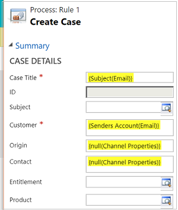
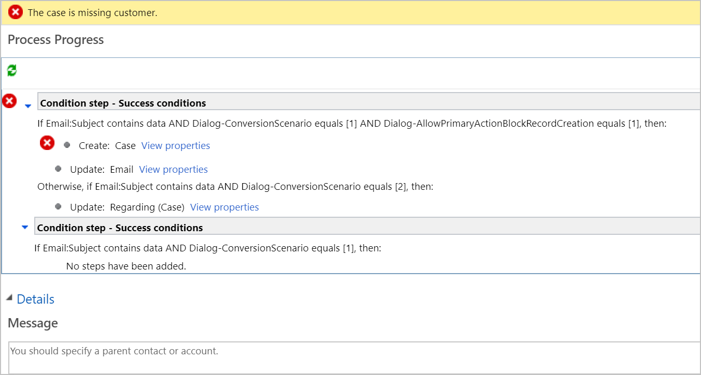
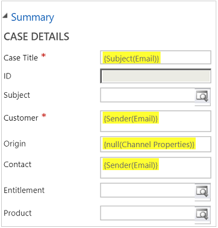
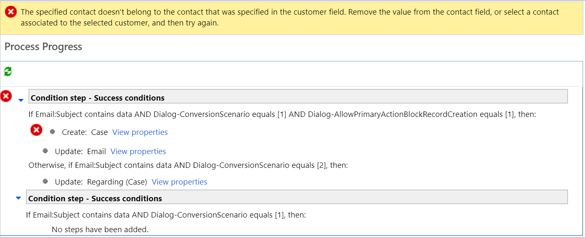

# Troubleshoot issues with automatic record creation

This article describes the troubleshooting steps to diagnose and fix issues with automatic record creation.

## Issue converting an email to a case

You can use the Activity monitor that is available on the **Record creation and update rules** page, and configure the options to view skipped scenarios, failed scenarios, or all scenarios for a time period. More information: [Manage activity monitor to review and track rules](automatically-create-update-records.md#manage-activity-monitor-to-review-and-track-rules)

### Case creation fails when mail is sent from queue address to same queue address on which automatic record creation rule is configured

#### Scenario

1. Configure an automatic record creation rule for a queue in the web client.
2. In the rule, set customer value as null (Channel properties).
3. Send mail from sender as queue mail address to recipient as queue mail address. The case creation fails with the following error message: "Case is missing customer"

#### Reason

The automatic record creation rule in the web client considers the queue as a known sender and doesn't create a contact. Subsequently, the case creation fails because no account or contact is associated with the email.

This is an expected behavior.

#### Resolution

Perform the following steps as a workaround:

1. Migrate your rule from the web client to Unified Interface. More information: [Migrate automatic record creation rules and service-level agreements](migrate-automatic-record-creation-and-sla-agreements.md).
2. Follow the information in [Configure advanced settings for rules](automatically-create-update-records.md#configure-advanced-settings-for-rules) to manage emails from unknown senders.

### Incoming email not converted to a case

#### Troubleshooting steps
 
If the email to case conversion isn't working, follow the below troubleshooting steps to diagnose and fix the issue:

**Step 1**. Check if the email is syncing with the system.  
- **Action**: Navigate to **Activities** and look for Email activity. 
- **Comment**: If email isn't syncing with the system, there may be an issue with the email router or server-side sync configuration.

**Step 2**.  Notice that an email activity is created but a related QueueItem isn't found.   

- **Comment**: If an active Automatic Record Creation and Update Rule exists for a specific queue, QueueItem is marked as inactive, and hence it disappears from the QueueItem View. 

**Step 3**. If the email is coming from an unknown sender,  check for the **Create contact for unknown sender** option. 
- **Action**: Go to **Automatic Record Creation and Update Rule** configuration and check if the **Create contact for unknown sender** box is checked.  

- **Comment**: If **Create contact for unknown sender** check box is unchecked, incoming email from unknown sender won't be converted to a case.

**Step 4**: Check if **Automatic Record Creation and Update Rule** is configured properly. 

- **Action**: Go to system jobs and check for any failure message. 
 
For more information about configuration failure scenarios and resolution for sample configuration failure, see [Configuration failure scenarios and resolutions](#configuration-failure-scenarios-and-resolutions).

> [!NOTE]
> The Customer field in the case entity can be a contact or an account. If a matching incoming email address isn't found for a contact or an account, and **Create contact for unknown sender** box is checked, the system creates contact for incoming email address and links it to the case's customer field.

**Step 5**: Check if the contact and account exist with the same incoming email address. 
- **Comment**: Case created from incoming email will resolve customer field on case as Account.

**Step 6**: Ensure that the queue email address is in the **To** or **Cc** fields of incoming mails. Emails sent with the queue address in the **Bcc** field won't be processed.

#### Configuration failure scenarios and resolutions

Given below is a list of some common issue scenarios and their resolutions.
 
**Sample**: Configuration on Automatic Record Creation and Update Rule
- **Create contact for unknown sender** box should be checked.
- Set condition criteria to **Any incoming email**.
- Add action to create case, select **View properties** and set the case fields as per business use case.

#### Scenario 1

In the Customer field of the Case Details section, **Senders Account (Email)** is set as below value.

This results in the following error in system jobs:

To resolve this issue, keep the Customer field blank or set it to **{Sender(Email)}**. This allows the system to automatically create contact for the unknown sender and link it to the case.

#### Scenario 2

The Customer field is set as **{Senders Account(Email)}** and Contact field as **{Sender(Email)}**.

This results in the following error in system jobs:

To resolve this issue, keep the Customer field blank or set it to **{Sender(Email)}**. This allows the system to automatically create contact for the unknown sender and link it to the case.

#### Scenario 3

The Customer field and Contact field are set as **{Sender(Email)}**.

This results in the following error in system jobs:

To resolve this issue, leave contact field blank and set Customer field either to blank or to **{Sender(Email)}**.

#### Validation steps

You must validate the configuration and validation steps given in the following table to understand the main cause of the issue, and resolve it:

|Option in Automatic Record Creation and Update Rule in Service Management  |If selected as  |Validation steps  |Outcome  |
|---------|---------|---------|---------|
|Create a case if a valid entitlement exists for the customer     |  Yes     |  Validate that an active entitlement exists for the customer. Valid active entitlement is evaluated as below:    - If the sender of the email is a contact with a parent account, then Dynamics 365 Customer Service creates a case if the contact’s parent account has a valid entitlement, and the contact is listed in the Contacts section of the entitlement   OR   - If the Contacts section is empty (which means that the entitlement is applicable to all contacts for the customer) |   A case is created      |
|Create a case from an email sent by unknown senders     |   Yes       |        For any incoming email from an unknown sender |     - A case is created    - A contact is also created for the unknown sender|
|     |   Yes      |    For an incoming email with email address of inactive account or contact     |   - A case is created   - An inactive account or contact is activated|
|     |   No      |     For an incoming email with email address of active account or contact   |  A case is created       |
|    |     No    |      For an incoming email sent by record type other than account or contact   |    No case is created     |
|  |   No      |     For an incoming email with email address of inactive account or contact    |  No case is created           |
|Create a case for activities associated with a resolved case     |    Yes     |   For an incoming email related to a resolved case      |    A case is created     |
|   |    Yes      |   For an incoming email related to an active case         |   No case is created      |
|  |         |         |         |

## Use of {Regarding(Email)} in legacy experience doesn't give the correct data in flow

In legacy ARC rule items in Customer Service, to look up the entity (either contact or account) that sent an email, you can use the  **Sender (Email)** polymorphic lookup, which automatically fetches the appropriate entity and displays the entity's name. Polymorphic lookups are lookups where the target of the lookup is more than one kind of entity. For example, it can point to either a contact or an account. However, in modern ARC, this automatic display isn't supported, so you'll need to specify the type of entity you want to retrieve along with the fields to display from that entity.

### Reason

Flow doesn't use the **{Regarding(Email)}** value like legacy workflow because flow expressions reference a data value from one of the previous flow steps payload. For example, if the **{Regarding(Email)}** value is empty when the flow begins, the value in the trigger step payload for **{Regarding(Email)}** will remain empty. Even if the **{Regarding(Email)}** value gets updated after a case is created, the email record data gets updated but the payload in flow doesn't. So, when the value from the payload is referenced in the subsequent flow steps, it remains empty.

### Resolution

If the **{Regarding(Email)}** value is used in legacy rule items, you need to manually update the migrated flow to use the IncidentId or OData Id. Use the OData Id for fields that require entity reference or lookups. Use the Case unique identifier for fields that require GUID.

## Issues with rendering polymorphic lookups on non-lookup fields during migration from legacy to modern ARC

A legacy ARC rule item using polymorphic lookups such as **Sender** results in an invalid lookup when assigned to a text field. 

In legacy ARC rule items in Customer Service, to look up the entity (either contact or account) that sent an email, you can use the  **Sender (Email)** polymorphic lookup, which automatically fetches the appropriate entity and displays the entity's name. Polymorphic lookups are lookups where the target of the lookup is more than one kind of entity, for example, it can point to either a contact or an account. However, in modern ARC, this automatic display isn't supported. So, you'll need to specify the type of entity you want to retrieve along with the fields to display from that entity.

### Reason

The classic workflow behavior used by legacy ARC has many hidden behaviors. For example, automatically determining the type of entity and fetching a field as the display name if the parameter is used in a string, but returning the ID if assigned to a lookup field. The platform migration code that ARC uses when converting from legacy to modern workflows doesn't add the required steps and fields.

### Resolution

- Update the lookup to a specific type.
- Use a different field on the incoming entity that contains the desired text.

## See also

[Automatically create or update records in Customer Service Hub](automatically-create-update-records.md)  
[Automatically create a case from an email](automatically-create-case-from-email.md)  

[!INCLUDE[footer-include](../includes/footer-banner.md)]
