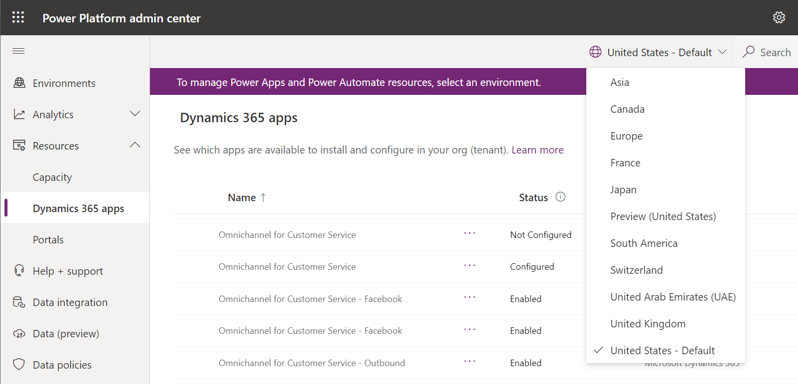
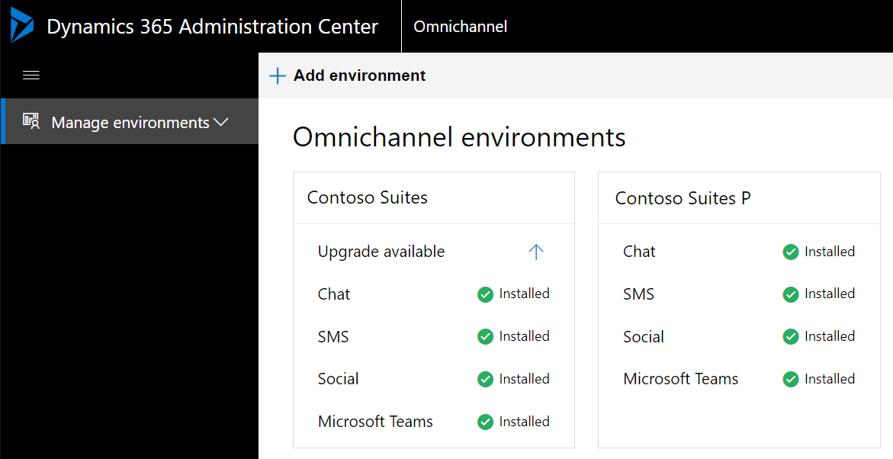
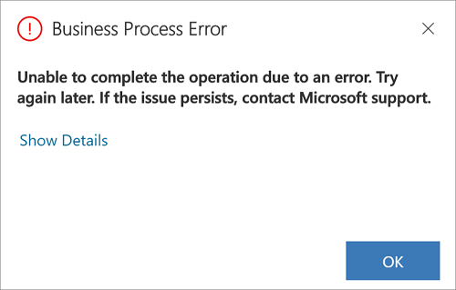
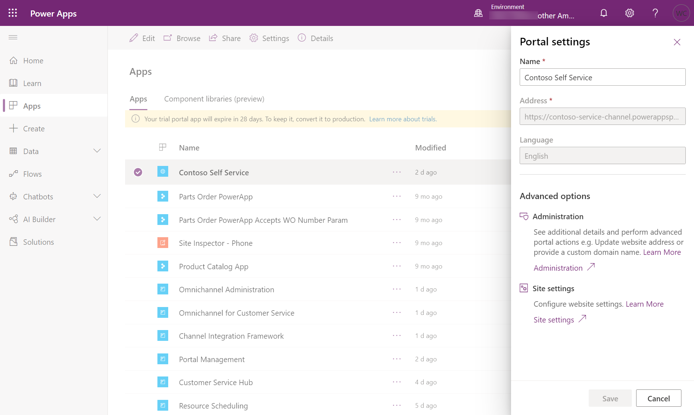
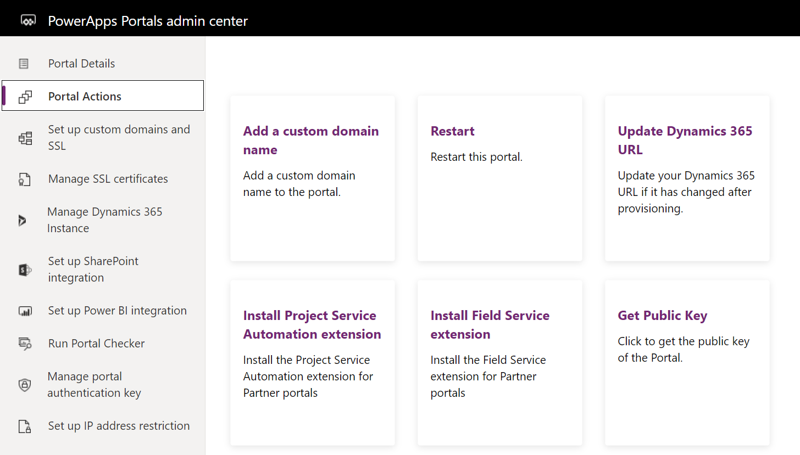
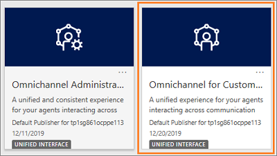

# Troubleshoot Omnichannel for Customer Service

[!INCLUDE[cc-data-platform-banner](../includes/cc-data-platform-banner.md)]

[!INCLUDE[cc-use-with-omnichannel](../includes/cc-use-with-omnichannel.md)]

Use the following list of troubleshooting topics to quickly find information to solve your issue.

## The instance is not available to select on the provisioning application 

### Issue

For security, reliability, and performance reasons, Omnichannel is separated by geographical locations known as regions. The provisioning web page only displays instances in the same region, so you might experience issues that you don’t see all the instances from the Organization selector if you have instances in more than one region and provision Omnichannel without selecting the correct region.

### Resolution

Perform the following:

From the admin portal, select the desired region from the drop-down menu. 

   > [!div class=mx-imgBorder]
   > 

Changing the region causes the portal to reload. When it has finished reloading, proceed to **Applications** > **Omnichannel for Customer Service**, and then proceed with the usual provisioning steps.

The provisioning application you are directed to is associated with the region you chose, and all instances located in that region are displayed as options for provisioning.

   > [!div class=mx-imgBorder]
   > 

## Omnichannel provisioning fails due to expired Teams Service Principal

### Issue

If your tenant has an expired Microsoft 365 license, then the provisioning of Omnichannel for Customer Service fails in your organization.

### Resolution

To avoid the provisioning failure, you must remove the Teams Service Principal and Skype Teams Calling API Service in Azure Active Directory. Follow the steps to remove the services.

[Step 1: Identify the services in Azure Active Directory](#step-1-identify-the-services-in-azure-active-directory)

[Step 2: Use PowerShell to remove Microsoft Teams and Skype Teams Calling API Service](#step-2-use-powershell-to-remove-microsoft-teams-and-skype-teams-calling-api-service)

#### Step 1: Identify the services in Azure Active Directory

1. Sign in to the [Azure portal](https://portal.azure.com/).
2. Select **Azure Active Directory** in the left pane.
3. Select **Enterprise Applications**.
4. In the search criteria, select **All Applications** and **Disabled** in **Application Type** and **Application Status**.
5. In the search box, enter the application ID `cc15fd57-2c6c-4117-a88c-83b1d56b4bbe` for Microsoft Teams.

   > [!div class=mx-imgBorder]
   > 

6. In the result that appears, copy the **Object ID**, and save it. Ensure that the application ID is  `cc15fd57-2c6c-4117-a88c-83b1d56b4bbe` as this ID is same for every tenant.

7. Now, search for Skype Teams Calling API Service by entering its application ID `26a18ebc-cdf7-4a6a-91cb-beb352805e81` in the search box.

   > [!div class=mx-imgBorder]
   > 

8. In the result that appears, copy the **Object ID**. Make sure that the application ID is `26a18ebc-cdf7-4a6a-91cb-beb352805e81`.

#### Step 2: Use PowerShell to remove Microsoft Teams and Skype Teams Calling API Service

1. Select **Start**, type **PowerShell**, and right-click **Windows PowerShell** and select **Run as administrator**.   

2. Select **Yes** on the **User Control** dialog to allow the application to make changes.
3. Type the `Install-Module AzureAD` command in the Powershell window, and press **Enter**. This command installs the PowerShell commands for interacting with Azure Active Directory.  

4. PowerShell prompts whether to trust the repository. Type **Y** for yes and press **Enter**.   

5. Type the `Connect-AzureAD` command in the PowerShell window, and press **Enter**.
This establishes a connection with the tenant's Azure Active Directory, so you can manage it using Powershell.
6. Sign in to your organization as a tenant admin.
7. Run the `Remove-AzureADServicePrincipal -ObjectID <ObjectID>` command in the PowerShell window twice, one each for Microsoft Teams and Skype Teams Calling API Service. Replace **<ObjectID>** with the object ID you had stored earlier. This command deletes the expired Teams service and Skype Teams Calling API Service from Azure Active Directory.

   > [!Note]
   > Right click in the PowerShell window to paste the Object ID.

The Microsoft Teams Service and Skype Teams Calling API Service are removed from your organization. You can try to provision Omnichannel for Customer Service again.

## Errors occur when I try to open Omnichannel for Customer Service or Customer Service workspace with Omnichannel enabled  

### Issue

As an agent, when you log in to the Omnichannel for Customer Service application or when you log in on Customer Service Workspace with Omnichannel enabled, you see error messages.

### Resolution

When you open the Omnichannel for Customer Service application or Customer Service workspace with Omnichannel enabled, the system performs a variety of tasks including logging in to Omnichannel, preparing for notifications, and setting your presence. If the system encounters any errors while performing these operations, they are displayed on the user interface.

If you get any of the errors listed below, check if Security Defaults is turned on. If it is turned on, the agent should have the right authentication set up. Alternatively, Security Defaults can be switched off if it is not required.

To learn more about Security Defaults, see the topic [What are security defaults?](/azure/active-directory/fundamentals/concept-fundamentals-security-defaults)

### Error messages 

  - Something went wrong while authenticating—please try again. If this continues, have your administrator contact Microsoft Support with the client session ID.

  - We couldn't get your authentication token—please try again. If this continues, have your administrator contact Microsoft Support with the client session ID.

  - We couldn't set up notifications—please try again. If this continues, have your administrator contact Microsoft Support with the client session ID.

  - We couldn't set up presences—please try again. If this continues, have your administrator contact Microsoft Support with the client session ID.

  - Something went wrong while setting up your workspace—please try again. If this continues, have your administrator contact Microsoft Support with the client session ID.

  - We couldn't set up presences due to missing roles — Ask your administrator to grant you Omnichannel roles. If this continues, have your administrator contact Microsoft Support with the client session ID. To learn more about security roles, see [Assign roles and enable users for Omnichannel for Customer Service](add-users-assign-roles.md). 

  - We couldn't get your authentication token — Your Teams subscription has expired, please contact your admin to renew it. If this continues, have your admin contact Microsoft Support with the Client Session ID:{0}. To resolve the issue, follow the steps in [Omnichannel provisioning fails due to expired Teams Service Principal](#omnichannel-provisioning-fails-due-to-expired-teams-service-principal).

## Error occurs when I try to create a chat widget or social channel 

### Issue

Omnichannel solutions are installed in your environment when you receive a new trial organization. However, when you try to create a chat widget, Facebook page, or social channel in the Omnichannel Administration app, error messages similar to the following might be displayed:

- An error occurred in the PreLiveChatConfigCreatePlugin plug-in.
- An error occurred in the PostOperationFacebookCreatePlugin plug-in.

### Resolution

These errors occur because though the solutions are already installed in your environment, they need to be activated before you can start using them. To provision the solutions, perform the steps outlined in [Provision Omnichannel for Customer Service](omnichannel-provision-license.md).

## Entity routing configuration fails

### Issue 1

One of issues is that **Entity Records Distribution Flow** connection is not authorized. Due to this issue, you can see a business process error.

**Unable to complete the operation due to an error. Try again later. If the issue persists, contact Microsoft support.**

   > [!div class=mx-imgBorder]
   > 

### Resolution

Go to Entity Records Distribution Flow and authenticate the connection.

To resolve the issue, perform steps 1 through 9 in the [Update entity records work distribution flow](multiple-ws-entity-record-routing.md#step-2-update-entity-records-distribution-flow) topic.

### Issue 2

**Entity Records Distribution Flow** is not updated automatically. Due to this issue, you can't create an entity records channel and the system shows a business process error.

**The operation failed due to an incorrect configuration in Entity Records Distribution Flow. Ensure the Entity Records Distribution Flow isn't deleted or renamed.**

   > [!div class=mx-imgBorder]
   > 

In Power Automate, you might see either **Cases Work Distribution Flow** or **Entity Records Distribution Flow**.

### Resolution

To workaround the issue, you need to reset the Flow. To reset the Flow, follow these steps.

1. Sign in to the Omnichannel Administration app.

2. Select **Entity Records** under **Channels**.

3. Select the **New** to create a new entity record channel.

4. Select **Flow** menu in the command bar, and then select **See your flows**. Power Automate opens in a new browser window.

5. Select **Solutions** in the sitemap, and then select **Default Solution** from the list.

6. Select **New**. and then select **Flow**. A new **Flow** is displayed.

7. Type **Manually trigger a flow** in the search box, and then select the option. The flow component is added.

8. Select **New step**. The **Choose an action** flow component is added.

9. Type **Common Data Service (current environment)** in the search box, and then select the option. The flow component is added.

10. Select **Perform an unbound action** from the **Actions** tab. The action is added in the component.

11. Type **msdyn_ResetWorkDistributionFlow** in the **Action Name** field.

    > [!Note]
    > Don't change the **ShouldMaintainCustomizations** value from **No**.

12. Select **Save**.

13. Select back arrow button in the Flow page.

    > [!Note]
    > Do not select browser window back button.

14. Select **Run** from the command bar. The **Run flow** pane is displayed.

15. Select **Run Flow** and then select **Done**. You can see the flow will run and succeeds.

After you reset the flow, go to Omnichannel Administration, where you saw the error message. Select **OK**, and then save the record. The entity record channel is saved.

Even though the Flow is reset, it doesn't update the name if it is **Case Work Distribution Flow**.

To rename the Flow, select **Edit**, type the name of the flow as **Entity Record Distribution Flow** in the **Flow name** field, and select **Save**.

### Issue 3

There may be an issue with customizations in the **Entity Records Distribution Flow**.

### Resolution

Go to **Entity Records Distribution Flow** and review your customization made to the flow. 

Review and resolve the error that is due to your customizations. For more information, see [Update entity records work distribution flow](multiple-ws-entity-record-routing.md#update-entity-records-work-distribution-flow).

## Unable to deploy custom solution containing Agentscript solution

### Issue

When you try to deploy a custom solution, it fails on account of a dependency on the Agentscript solution, which is part of Omnichannel for Customer Service.

### Cause

The Agentscript solution has been deprecated and was not present in the target environment. It has been replaced by the msdyn_Agentscripts solution.

### Resolution

 We recommend that you remove all references of the Agentscript solution from the custom solution, and then reimport the solution.

## Power Virtual Agents bot conversations appear as active on dashboard even after customer has ended chat

### Issue

Conversations for Power Virtual Agents bot cannot be ended in Omnichannel for Customer Service and therefore will be seen as active on the supervisor dashboard even after they have been closed.

### Resolution 

You can configure a context variable that will explicitly end the bot conversation in Omnichannel for Customer Service after customers close the chat window. In Power Virtual Agents, create a standalone topic for CloseOmnichannelConversation context variable with the variable property set to global. Invoke the topic in another topic that you've configured for the bot.

Though the conversation will be closed in Omnichannel for Customer Service, it will not be closed in Power Virtual Agents and appear in the **Escalation rate drivers** KPI in **Power Virtual Agents Analytics** dashboard.

> [!IMPORTANT]
> Make sure that you have access to Power Automate to configure a flow so that the bot conversation in Omnichannel for Customer Service can be ended.

To configure ending a bot conversation, perform the following steps:

1. In Power Virtual Agents, for the selected bot, configure a new topic.
2. Select **Go to authoring canvas**, and in **Add node**, select **Call an action**, and then select **Create a flow**.
3. On the Power Automate window that opens on a new tab, do the following:
   1. In the **Return value(s) to Power Virtual Agents** box, select **Add an input**, and then select **Yes/No**.
   2. In the **Enter title** box, enter CloseOmnichannelConversation, which is the Omnichannel for Customer Service context variable name.
   3. In the **Enter a value to respond** box, select the **Expression** tab, and then enter **bool(true)** to build the expression, and select **OK**.
   4. Save the changes, and then exit Power Automate.
4. In the topic that you were editing, select **Call an action** again, and then in the list, select the flow that you created. 
5.  In **Add node**, select **End the conversation**, and then select **Transfer to agent**.
        > 
6. Go to the topic in which you need to invoke the topic for ending the bot conversation in Omnichannel for Customer Service, and use the **Go to another topic** option in **Add a node**.
7. Select the topic that you created for ending the bot conversation.
8. Save and publish the changes.

Additionally, you can configure automated messages in Omnichannel for Customer Service that will be displayed to the customer after the conversation ends.

## Entity Records are not routed and distributed to agents

Entity Records routing and distribution may not work due to certain reasons. Validate the following issues and resolutions in the order given below.

### Issue 1

The routing rule is configured incorrectly or not activated.

### Resolution

Verify the routing rule set is configured correctly and ensure to activate it. To learn more, see [Create routing rules](entity-channel.md#step-4-create-routing-rules).

### Issue 2

The Entity Records Distribution Flow is not updated with latest workstream information.

### Resolution

If you create or edit (update the name of the workstream) an entity record workstream, you must update Entity records Distribution Flow. To learn more, see [Update entity records distribution flow](multiple-ws-entity-record-routing.md#step-2-update-entity-records-distribution-flow).

### Issue 3

There is an error and due to which Entity Records Distribution Flow was not triggered.

### Resolution

Check if the flow has triggered or if there was any error in the trigger of the Flow. You can get this information from the Power Automate home page or Entity Records Distribution Flow's run history.

To work around the issue, reset the flow. To learn more, see [Reset the flow](#resolution-1).

If resetting the flow doesn't resolve the issue, contact Microsoft support.

### Issue 4

The flow triggered successfully but the action was not executed successfully.

### Resolution

Reach out to Microsoft support for further investigation.

## Chat widget icon does not load on the portal

### Issue

Chat icon doesn't load on the portal. The chat icon URL which was configured as default doesn't load.

### Resolution

Open Chat Settings, navigate to Design tab and change **Logo** field and use an icon URL of your choice.

1. Sign in to the **Omnichannel Administration** app.
2. Go to **Administration** > **Chat**.
3. Select a chat widget from the list.
4. Select the **Design** tab.
5. Specify the URL of the icon you want to use in the **Logo** field.
6. Select **Save** to save the record.

## Chat not getting initiated on starting a new chat from portal

### Issue

A message stating **Sorry, we're not able to serve you at the moment** is shown to the customers when they start a chart on the portal. The possible issues might be: 
- Agents not configured in the Queue.
- Allowed Presence is not updated in the work stream: The default work streams that are shipped out-of-the-box, does not have **Allowed Presence** values in the work stream.

   > [!div class=mx-imgBorder]
   > 

### Resolution

 To configure agents in the queue, follow these steps:

 1. Sign in to the **Omnichannel Administration** app.
 2. Go to **Queues & Users** > **Queues**
 3. Select the queue from the list.
 4. In the **Users (Agents)** section, select **Add Existing User** to add existing agents to the queue.
 5. On the **Lookup Records** pane, select the agents to add, and then select **Add**.
 6. Select **Save** to save the record.

To Update default **Allowed Presence** in the Live Work Stream, follow these steps:

1. Sign in to the **Omnichannel Administration** app.
2. Go to **Work Distribution Management** > **Work Streams**.
3. Select a record from the list.
4. In the Work Distribution tab, under the Work Distribution section, type **Available**. Select the check box to add it. Similarly, type **Busy** and then select the check box to add it.
5. Select **Save** to save the record.

## Chat widget does not load on the portal

### Issue

Chat widget does not load on the portal. There are multiple reasons this may happen. This section includes five possible resolutions.

> [!div class="mx-imgBorder"]
> 

### Resolution 1: Location option

The Location option for the chat widget might be configured incorrectly.

Delete the location in **Widget location**, and then recreate it.

To delete and add **Widget location** for the chat widget, do the following:

1. Sign in to the **Omnichannel Administration** app.
2. Go to **Administration** > **Chat**.
3. Select a chat widget from the list.
4. Select the **Location** tab.
5. Select a record in the **Widget Location** section, and then select **Delete**.
6. Select **Save**.
7. Select **Add** in the **Widget Location** section to add a record. The quick create pane of the chat widget location appears.
8. Specify the following.

   | Field | Value |
   |---------------------------|-----------------------------------------|
   | Title | Type the title of record. |
   | Value | The website domain where the chat widget must be displayed. The domain format should not include the protocol (http or https). For example, the website is  `https://contoso.microsoftcrmportals.com. Now, the value is  `contoso.microsoftcrmportals.com. | 
10. Select **Save** to save the record.
11. Go to the website and check whether the chat widget loads.

> [!Note]
> The chat widget requires session storage and local storage to be functional in your browser. Make sure you have cookies enabled in your browser so these services can work properly.

### Resolution 2: Remove location

Alternatively, try removing the chat widget location.

> [!div class="mx-imgBorder"]
> 

### Resolution 3: Clear portal cache

Clear the portal cache by doing the following:

1. Go to your portal and sign in as a portal administrator.

    > [!div class="mx-imgBorder"]
    > 

2. Add the following to the end of your portal URL:

      /_services/about

    For example: 

      https://contoso.powerappsportals.com/_services/about

3. Select **Clear cache**.

    > [!div class="mx-imgBorder"]
    > 

4. Reload the portal.

   Also, make sure that your web browser allows third-party cookies. 

### Resolution 4: Sync portal configurations

To sync portal configurations, do the following: 

1. Go to [https://make.powerapps.com](https://make.powerapps.com).

2. Find and select your portal, and then choose **Edit**.

    > [!div class="mx-imgBorder"]
    > 

3. Select **Sync Configuration**.

    > [!div class="mx-imgBorder"]
    > 

### Resolution 5: Restart portal

Restart the portal by doing the following:

1. Go to [https://make.powerapps.com](https://make.powerapps.com).

2. Select your portal, and then under **Advanced options**, choose **Settings > Administration**. 

    > [!div class="mx-imgBorder"]
    > 

3. Select **Restart**.

    > [!div class="mx-imgBorder"]
    > 

## Agents not receiving chat in Omnichannel for Customer Service

### Issue

As an agent, you aren't receiving chat in the Omnichannel for Customer Service app. The issue is caused when you receive the chats in Customer Service Hub app.

### Resolution

You must remove the Customer Service Hub app from the channel provider configuration in the Channel Integration Framework app.

1. Sign in to **Channel Integration Framework**.
2. Select the record that is related to omnichannel.
3. Remove **Customer Service Hub** from the **Select Unified Interface Apps for the Channel** section.
4. Select **Save** to save the record.

## Conversation is stuck in wrap-up state

### Issue

As an agent or a supervisor, you see that some conversations are stuck in the wrap-up state in your Omnichannel Agent Dashboard or Omnichannel Ongoing Conversations Dashboard. 

### Resolution

When conversations are ended by the agent or customer, they transition to the wrap-up state. In order to close the conversation, the primary agent assigned to the conversation needs to close the conversation in the session panel. To learn more about closing sessions, see [Manage sessions in Omnichannel for Customer Service](https://docs.microsoft.com/dynamics365/omnichannel/agent/agent-oc/oc-manage-sessions#close-a-session). To learn more about the wrap-up conversation state, see [Understand conversation states in Omnichannel for Customer Service](https://docs.microsoft.com/dynamics365/omnichannel/agent/agent-oc/oc-conversation-state#wrap-up).

## Dashboards do not appear in Omnichannel for Customer Service active dashboards view

### Issue

When you use the Omnichannel for Customer Service app on Unified Service Desk or on web, the **Active Omnichannel Agent Dashboard** view doesn't show certain dashboards like Tier 1 Dashboard, Tier 2 Dashboard, Knowledge Manager, and My Knowledge Dashboard.

### Resolution

As a system customizer or administrator, you must manually add these dashboards using app designer.

To add the dashboards using app designer, follow these steps:

1. Go to `https://<orgURL>.dynamics.com/apps`.
2. Select the ellipsis (**...**) button in the **Omnichannel for Customer Service** app tile.  
    
3. Select **OPEN IN APP DESIGNER**. The App Designer opens in a new tab.
4. Select **Dashboards** in the canvas area. The **Components** pane in the right side shows the list of **Classic Dashboards** and **Interactive Dashboards**.
5. Select the following dashboards under **Interactive Dashboards**. 
    - Knowledge Manager
    - My Knowledge Dashboard
    - Tier 1 Dashboard
    - Tier 2 Dashboard  
    
6. Select **Save** and then select **Publish**.

## Agent dashboard isn’t loading or is giving an authorization error

### Issue

The issue might happen due to the following reasons:

- Azure Active Directory consent is not available for Omnichannel for Customer Service app.
- Agent doesn't the Omnichannel agent role privileges.
- Agent is not assigned to any queue.

### Resolution

Perform the following:

- Contact your administrator to verify Azure Active Directory consent is given to the Omnichannel for Customer Service application on your tenant. Go to [Authorize access](https://go.microsoft.com/fwlink/p/?linkid=2070932) to get access. To learn more, see [Provide data access consent](omnichannel-provision-license.md#provide-data-access-consent).
- Ensure the agent account has the role **Omnichannel Agent**. For more information about the relevant roles, see [Understand roles and their privileges](add-users-assign-roles.md#understand-roles-and-their-privileges). 
- Ensure the agent account is assigned to at least one queue in the Omnichannel Administration app. To learn more, see [Manage users in Omnichannel for Customer Service](users-user-profiles.md).

## An error occurred in the communication panel

### Issue

After you sign in to the Unified Service Desk client application, you see the following error message.

**An error occurred in the Communication panel. Restart Unified Service Desk and try again. (Error Code - AAD_ID_MISMATCH - Azure ADID mismatched with logged-in user id)**

   > [!div class=mx-imgBorder]
   > 

While signing in to Unified Service Desk you must enter the Customer Service app credentials and sign in, and again, you are shown a dialog to enter credentials to connect to Dataverse server.
When you enter different credentials, this issue occurs. 

### Resolution

If you use **Chrome process** to host applications, go to `C:\Users\<USER_NAME>\AppData\Roaming\Microsoft\USD` and delete the **CEF** folder. Now, sign in to Unified Service Desk client application and try again.

## Communication panel doesn't load in Omnichannel for Customer Service app

### Issue

Communication panel doesn't load in Omnichannel for Customer Service app:

- When a record doesn't exist in the Channel Integration Framework app.
- When configurations don't sync.

### Resolution

- Create a Channel Integration Framework record with the following values. 

   | Field | value |
   |-------------------------------------------|--------------------------------------------------|
   | Name | Omnichannel |
   | Label | Omnichannel |
   | Channel URL | \<Chat control cdn url>?uci=true&env=<env>&ocBaseUrl=\<oc endpoint\>&ucilib=\<crm org url\>/webresources/Widget/msdyn_ciLibrary.js |
   | Enable Outbound Communication | No |
   | Channel Order | 0 |
   | API Version | 1.0 |
   | Select Unified Interface Apps for the Channel | Omnichannel for Customer Service |
   | Select the Roles for the Channel | <li>Omnichannel administrator</li>  <li>Omnichannel agent</li> <li>Omnichannel supervisor</li> |

   To learn how to create a record, see [Configure a channel provider for your Dynamics 365 organization](/dynamics365/customer-engagement/developer/channel-integration-framework/configure-channel-provider-channel-integration-framework).

- To sync the configurations, remove the channel and roles, add them again and save the record.

   1. Sign in to the Dynamics 365 apps.
   2. Select the drop-down button on Dynamics 365 and select **Channel Integration Framework**.
   3. Select the **Omnichannel** record from the list.
   4. Remove **Omnichannel for Customer Service** from the **Select Unified Interface Apps for the Channel** section.
   5. Add **Omnichannel for Customer Service** again in the **Select Unified Interface Apps for the Channel** section.
   6. Remove **Omnichannel agent**, **Omnichannel supervisor**, and **Omnichannel administrator** from the **Select the Roles for the Channel** section.
   7. Add **Omnichannel agent**, **Omnichannel supervisor**, and **Omnichannel administrator** again in the **Select the Roles for the Channel** section.
   8. Select **Save** to save the record.
   9. Sign in to Omnichannel for Customer Service app and check if the communication panel loads.

## User presence isn’t loading or it’s showing unknown 

### Issue

The issue might happen due to the following reasons:

- Cookies are blocked in the browser.
- Azure Active Directory consent is not available for Omnichannel for Customer Service app.
- Agent doesn't have the Omnichannel agent role privileges.
- Capacity and default presence are not set.

### Resolution

Perform the following:

- Ensure that cookies are not blocked in the browser in any mode so that agent and supervisor presence can work properly.
- Contact your administrator to verify Azure Active Directory consent has been given to the Omnichannel for Customer Service application on your tenant. For more information, see [Provision for Omnichannel for Customer Service](omnichannel-provision-license.md). 
- Ensure the agent account has the **Omnichannel Agent** role assigned. For more information, see [Assign roles and enable users for Omnichannel](add-users-assign-roles.md).
- Ensure the agent account has values set for **Capacity** and **Default presence** within the Omnichannel Administration app. To learn more, see [Create and manage users and user profiles](users-user-profiles.md).

## Pre-imported Unified Service Desk configurations in Customer Service organization

### Issue

Dynamics 365 Customer Service organization that you create from **demos.microsoft.com** have pre-imported sample Unified Service Desk configuration.

If you import the Unified Service Desk - Omnichannel for Customer Service package without deleting the existing configuration in the new demo org, you see an error after signing in to Unified Service Desk client application. The reason for the issue is multiple sample Unified Service Desk configurations cannot exist in a Customer Service instance.

   > [!div class=mx-imgBorder]
   > 

### Resolution

You must delete the existing sample solutions before importing the Omnichannel for Customer Service - Unified Service Desk package. The pre-imported sample solutions are as follows:

- USDISHCustomization or USDWebClientCustomization (one of these solutions would be present depending on the org template)
- USDUnifiedInterfaceCustomization
- DynamicsUnifiedServiceDesk
- UiiForMicrosoftDynamicsCRM

After you delete the solutions, import the Unified Service Desk - Omnichannel for Customer Service package.

To delete the solutions, follow these steps:

1. Sign in to the Dynamics 365 instance.
2. Choose **Settings** > **Solutions** on the nav bar.
3. Select one of the solutions on the **Solutions** page by selecting the check box, and then choose **Delete**. You are prompted to confirm uninstalling a managed solution. Choose **OK** to proceed.  
   - USDISHCustomization or USDWebClientCustomization (one of these solutions would be present depending on the org template)
   - USDUnifiedInterfaceCustomization
   - DynamicsUnifiedServiceDesk
   - UiiForMicrosoftDynamicsCRM
      > [!NOTE]
      > You must delete the solutions in the following order:
      > 1. USDISHCustomization or USDWebClientCustomization
      > 2. USDUnifiedInterfaceCustomization
      > 3. DynamicsUnifiedServiceDesk
      > 4. UiiForMicrosoftDynamicsCRM2011
      > 
      >  You must follow the order to remove the solutions because some of the components in the solution depend on the components in the other solution.
4. After the solution is removed, repeat the steps to delete the other solutions.

## Unable to launch Unified Service Desk client application

### Issue

When you sign in to Unified Service Desk, you see the following error. 

**APPLICATION_HOST_ERR_NO_CONFIGURED_APPS: applications are configured for your use.**

   > [!div class=mx-imgBorder]
   > 

The issue is due to the package deployment failure.

### Resolution

You must deploy the Unified Service Desk - Omnichannel for Customer Service package again. To learn more, see [Deploy Unified Service Desk – Omnichannel for Customer Service package](../unified-service-desk/oc-usd/omnichannel-customer-service-package.md#deploy-unified-service-desk---omnichannel-for-customer-service-package).

## Conversation control becomes blank

### Issue

Conversation widget becomes blank while swapping between browser tabs in Google Chrome or Chromium-based Microsoft Edge.

### Resolution

Upgrade your browser version as per the system requirements of Dynamics 365 Channel Integration Framework version 2.0. To learn more, see [System requirements](channel-integration-framework/v2/system-requirements-channel-integration-framework-v2.md).

[!INCLUDE[footer-include](../includes/footer-banner.md)]