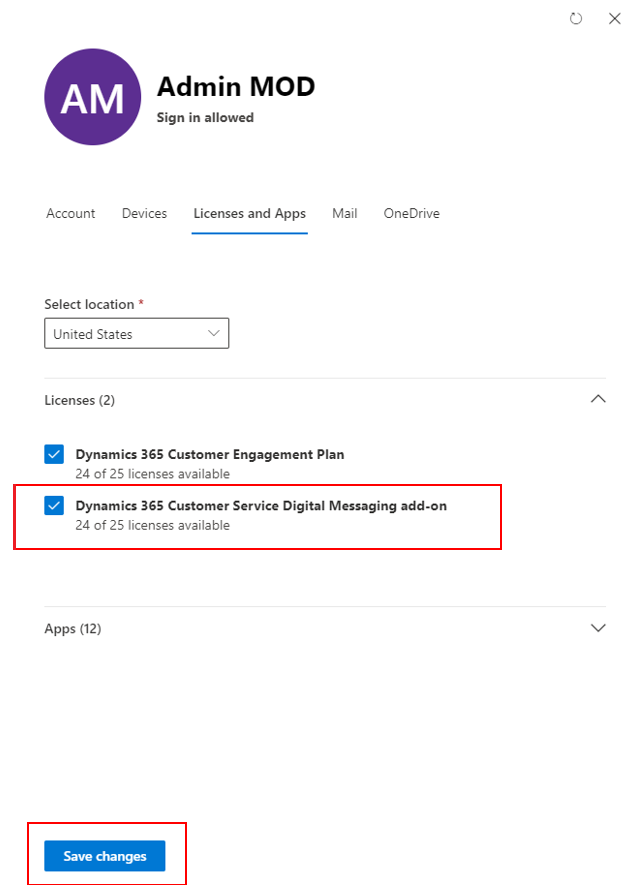

# Try channels in Omnichannel for Customer Service

[!INCLUDE[cc-use-with-omnichannel](../includes/cc-use-with-omnichannel.md)]

## Introduction

Channels, for example Live Chat and SMS, are the engagement channels that enable your agents to connect with customers in real time and provide quick personalized help.

You can perform the following steps to try channels in Omnichannel for Customer Service:

1. Sign up for a free 30-day trial of channels using one of the following options:
   - [Channels trial through trials.dynamics.com](#channels-trial-through-trialsdynamicscom)
   - [Channels trial through Microsoft 365 admin center](#channels-trial-through-microsoft-365-admin-center)
2. [Provision Omnichannel for Customer Service](#provision-channels-in-your-organization)

## Channels trial through trials.dynamics.com

With this option, you can get a free 30-day trial of Omnichannel for Customer Service including Chat, SMS, Microsoft Teams, and social channels through [https://trials.dynamics.com](https://trials.dynamics.com).

Use this option if you've obtained the subscription for Dynamics 365 Customer Service Enterprise or Dynamics 365 Customer Engagement in your tenant through volume licensing, cloud solution provider, or reseller or partner programs.

### Prerequisites

- You must have an existing tenant and not sign up for creating a trial tenant.
- You must have an existing organization account with the global administrator role to enable the trial. If you do not use global administrator credentials, you can join as an existing trial organization with approval of the organization owner.

> [!NOTE]
> To know the geographic location availability, see [International availability](international-availability.md).

### Get a Dynamics 365 trial instance

1. Go to <https://trials.dynamics.com/Dynamics365/Signup/service>.

2. Select **Customer Service**. If you select any other option, Omnichannel for Customer Service will not be enabled in your tenant.

3. Enter your work email and phone number, and then select **Get started**.

    > [!div class=mx-imgBorder]
    > 

4. Sign in with your global administrator credentials and accept the terms and privacy policy. If you already have trial instances (Dynamics 365 instances with Instance Type set to Trial), you'll be asked to create your own trial.

5. Select **Create your own trial**, and then select **Create New Trial**.
6. Select **Customer service** and then select **Complete Setup**.

    > [!NOTE]
    > A tenant can have a maximum of five trial instances. If you already have five trial instances in your tenant, you must delete one instance before creating another trial.

You will now be able to see the new trial instance in Power Platform admin center, and can provision channels in your organization.

### Get a Power BI (free) subscription

If you already have a subscription of Dynamics 365 Customer Service Enterprise or a subscription of Power BI in your tenant, you can skip this step. Otherwise, you must get a Power BI (free) subscription.

1. Sign in to [Microsoft 365 admin center](https://admin.microsoft.com) with the global administrator credentials.

2. Go to **Billing** > **Purchase services**.

3. Search for Power BI (free) and complete the purchase of Power BI (free) subscription.

    > [!div class=mx-imgBorder]
    >  subscription")

## Channels trial through Microsoft 365 admin center

The Dynamics 365 Customer Service Digital Messaging Add-on Trial is a free 30-day trial of Chat, SMS, and social channels that you can download from the Microsoft 365 admin center.

### Prerequisites for trial through Microsoft 365 admin center

You must have obtained one of the following subscriptions through the Microsoft 365 admin center (that is, Web Direct):

- Paid or trial subscription of Dynamics 365 Customer Service Enterprise
- Paid or trial subscription of Dynamics 365 Customer Engagement

If you do not have one of these subscriptions, or if you purchased your subscription somewhere other than Web Direct, then the option to try channels will not be available in the Microsoft 365 admin center.

> [!IMPORTANT]
> If you've obtained the subscription for Dynamics 365 Customer Service Enterprise or Dynamics 365 Customer Engagement in your tenant through Volume Licensing Service Center, use the trial option specified in [Channels trial through trials.dynamics.com](#channels-trial-through-trialsdynamicscom).

For information about the Digital Messaging license, pricing, and prerequisites, refer to the Dynamics 365 licensing guide [here](https://go.microsoft.com/fwlink/p/?LinkId=866544).

### Get a trial subscription of channels

1. Sign in to [Microsoft 365 admin center](https://admin.microsoft.com) with the global administrator credentials.

2. Go to **Billing** > **Purchase Services**, scroll down, and select **Add-ons**.

3. Select **Dynamics 365 Customer Service Digital Messaging add-on Trial**.

4. You can start a 30-day trial of Digital Messaging with 25 user licenses.

5. After signing up for a trial, you must assign licenses of Digital Messaging to the users who need to engage with customers and provide support via Omnichannel for Customer Service. Select one or more active users and edit their product licenses. After you're done, select **Save**.

    > [!div class=mx-imgBorder]
    > 

## Provision channels in your organization

Perform the tasks in [Provision Omnichannel for Customer Service](omnichannel-provision-license.md) to set up Omnichannel for Customer Service and enable Chat, SMS, and social channels in your organization.

After a channel is enabled in your organization, you can sign in to the Dynamics 365 organization, and select the Customer Service admin center or Omnichannel admin center app to start configuring the channel. More information on configuring channels in Omnichannel for Customer Service: [Configure a chat channel](set-up-chat-widget.md), [Configure an SMS channel](configure-sms-channel.md), and [Configure a Facebook channel](configure-facebook-channel.md).

### Videos

[Try channels in Omnichannel for Customer Service](https://go.microsoft.com/fwlink/p/?linkid=2114715)

To view more videos on Omnichannel for Customer Service, see [Videos](videos.md).

### See also

[Provision Omnichannel for Customer Service](omnichannel-provision-license.md)  
[Configure a chat channel](set-up-chat-widget.md)  
[Configure an SMS channel](configure-sms-channel.md)  
[Configure a Facebook channel](configure-facebook-channel.md)  
[Try Customer Service](try-customer-service.md)  

[!INCLUDE[footer-include](../includes/footer-banner.md)]
