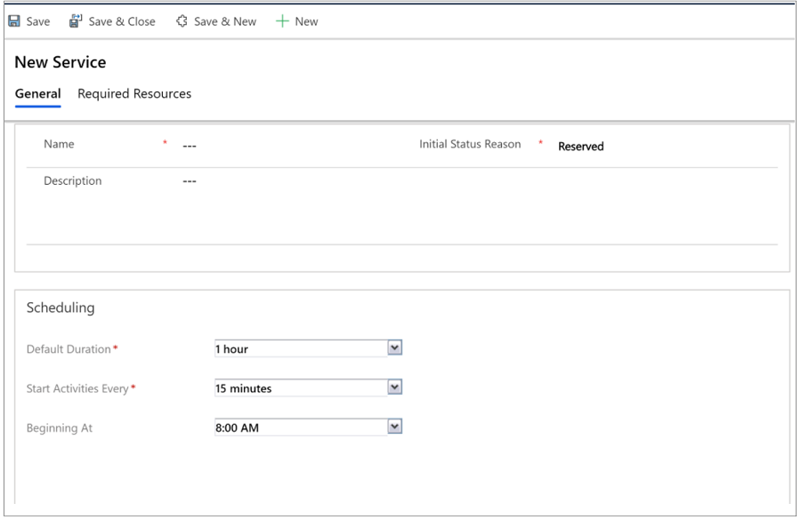
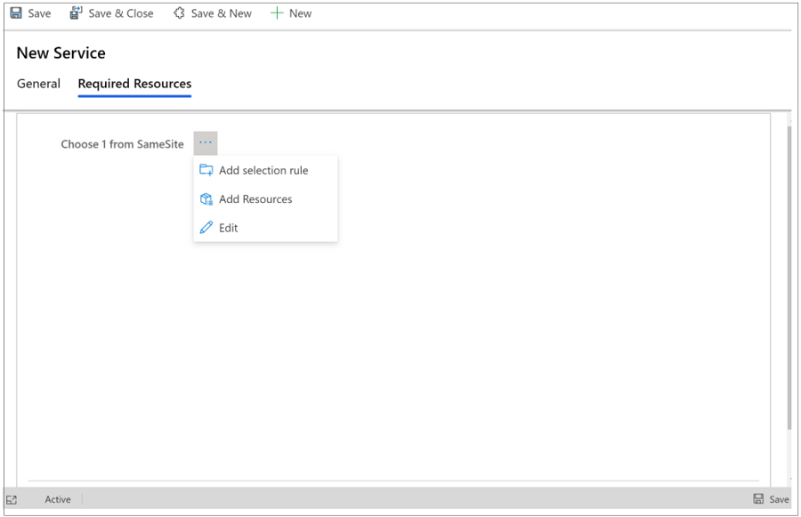
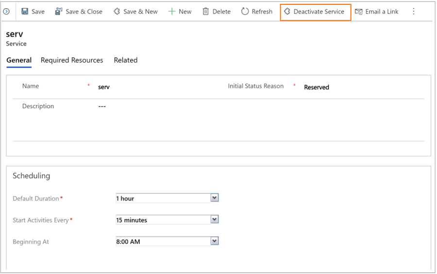

# Create or edit a service

To make scheduling services quick and easy, it’s helpful to predefine the specifics of the services you’d provide to customers. By using the service records in Dynamics 365 Customer Service, you can define: 

- How long a service activity lasts 

- What resources are available for the service activity, like users, facilities, or equipment 

A service requires at least one selection rule and one or more resources, resource groups, or teams before the service can be scheduled with a service activity.

## Create or change a service

1. Make sure that you have the Manager, Vice President, CEO-Business Manager, System Administrator, or System Customizer security role or equivalent permissions. 

2. Navigate to the Customer Service admin center or Customer Service Hub app, and perform the following steps:

   ### [Customer Service admin center](#tab/customerserviceadmincenter)

    1. In the site map, select **Service Scheduling** in **Operations**. The **Service Scheduling** page appears.
    1. In the **Service** section, select **Manage**.
        
        The **Active Services** view is displayed. You can switch between various system views using the drop-down list.  

   ### [Customer Service Hub](#tab/customerservicehub)

    1. In the site map, go to **Scheduling**.
    1. From the list of entity records, select **Services** in **Scheduling**.
       
       The **Active Services** view is displayed. You can switch between various system views using the drop-down list.
    
3. Do one of the following:
   - To create a new service, select **New**.
   - To edit a service, open a service from the list.

4. Type or modify information in the text boxes. 

    a. Under **General**, enter a name and description to reflect the specifics of the service and describes what the service is. Also, specify the initial status of the service activity when it is created. If your organization prefers to approve all service activities before committing them to the schedule, you can select **Requested** or **Tentative**.
    
    b. Under **Scheduling**, in **Default Duration**, select how long the service lasts. This can be changed when the service activity is created. The maximum duration of an appointment or service activity is 10 days. 

    c. In **Start Activities Every**, select how often service activities can start. This allows the start times of service activities to be staggered.
    
    d. In **Beginning At**, select the time when the service activities must begin.
  
   
   
5. On the **Required Resources** tab, define a selection rule.
  
    
   
    |Option  |Description|
    |---------|---------|
    | Add a Selection Rule  | You can add complexity to a rule by adding a subrule to it. |
    | Add Resources | Add users, facilities, equipment, or teams as resources to a selection rule. |
    | Add Resource Groups | Resource groups are users, facilities, or equipment that can be scheduled interchangeably. |
    
    > [!Note]
    > You can save a service without defining a selection rule, but you won’t be able to schedule that service.
    
6. When you're ready to save your data, select **Save**.

## Activate or deactivate a service

You can make a service available or unavailable for scheduling by activating or deactivating it.
  
   

### See also  

[Unified Interface-based service scheduling overview](uci-scheduling-overview.md)

[Add facilities and equipment](uci-add-facilities-equipment.md)

[Schedule a service activity](uci-schedule-service-activity.md)

[Create resource groups](uci-create-resource-groups.md)

[Use sites to manage your service locations](uci-create-sites.md)

[Navigate the service calendar](uci-navigate-service-calendar.md)

    
    

[!INCLUDE[footer-include](../includes/footer-banner.md)]
