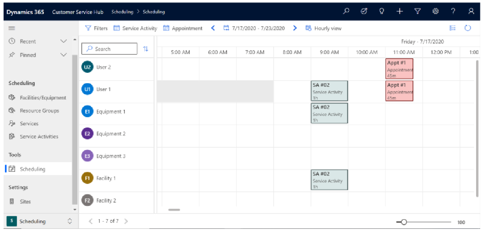
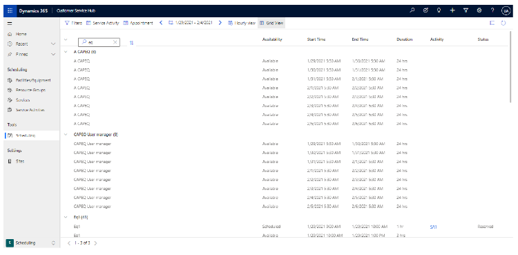
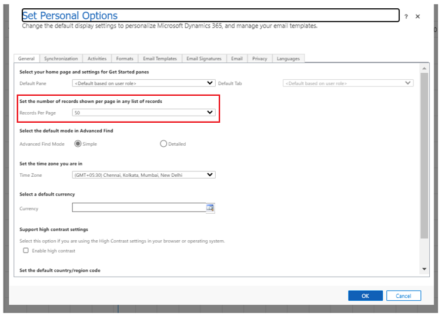
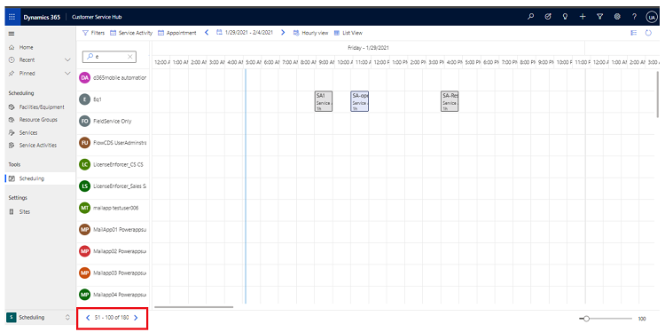

# Navigate the service calendar

In the Service calendar, you can do the following tasks and activities: 

- View your organization's hourly schedule of appointments and service activities. 

- View work schedules and service activity schedules for a variety of resources. 

- Create new appointments and schedule service activities. 

- Change the status of an existing service activity. 

- Search for conflicts in the schedule. 

You can’t customize the service calendar or change the default view with the application. However, you can ask your system administrator to change the colors of the time blocks.

## View resources in the service calendar

1. Navigate to **Customer Service Hub** > **Scheduling** tab.

   

2. Under the Tools section, select the service calendar.
    A list of resources opens in alphabetical order on the left side of the calendar.

3. To view the resources, appointments, and service activities for anyone in your organization, in the **Type** list, select **Resource**, and then in the **View** list, select the resource view.

4. To find a specific resource, in the **Search** field, enter the first few letters of a name.

5. To change how much of the calendar is available to view, use the **Zoom** scale.

   

## Calendar legend of colors and statuses

   
   
## Preview: View resources in a list view
[!include[cc-beta-prerelease-disclaimer](../includes/cc-beta-prerelease-disclaimer.md)]

> [!IMPORTANT]
>
> - A preview is a feature that is not complete, as it may employ reduced privacy, security, and/or compliance commitments, but is made available before it is officially released for general availability so customers can get early access and provide feedback. Previews are provided "as-is," "with all faults," "as available," and without warranty.
> - This preview feature does not come with technical support and Microsoft Dynamics 365 Technical Support won't be able to help you with issues or questions.  If Microsoft does elect to provide any type of support, such support is provided "as is," "with all faults," and without warranty, and may be discontinued at any time.
> - Previews are not meant for production use, especially to process Personal Data or other data that is subject to heightened compliance requirements, and any use of "live" or production data is at your sole risk. All previews are subject to separate [Terms and Conditions](../legal/supp-dynamics365-preview.md).

You can view the number of records in a list by selecting **List view**.

  

## Preview: Configure the number of records shown

[!include[cc-beta-prerelease-disclaimer](../includes/cc-beta-prerelease-disclaimer.md)]

> [!IMPORTANT]
>
> - A preview is a feature that is not complete, as it may employ reduced privacy, security, and/or compliance commitments, but is made available before it is officially released for general availability so customers can get early access and provide feedback. Previews are provided "as-is," "with all faults," "as available," and without warranty.
> - This preview feature does not come with technical support and Microsoft Dynamics 365 Technical Support won't be able to help you with issues or questions.  If Microsoft does elect to provide any type of support, such support is provided "as is," "with all faults," and without warranty, and may be discontinued at any time.
> - Previews are not meant for production use, especially to process Personal Data or other data that is subject to heightened compliance requirements, and any use of "live" or production data is at your sole risk. All previews are subject to separate [Terms and Conditions](../legal/supp-dynamics365-preview.md).

Administrators can configure the number of records that are listed in the resources view as follows:

1. In Dynamics 365 Customer Service, select the **Settings** icon  in the upper-right corner of the page.

2. Select **Options**, and then on the **General** tab, set **Records per page** to the maximum value you want to show on the page. The value can be set from 50 to 250 records.

   
  
3. When you're done, select **OK**.

   The selected number of records is listed for the user.
  
   
    
### See also  

[UCI-based service scheduling overview](uci-scheduling-overview.md)

[Create or edit a service](uci-create-edit-service.md)

[Add facilities and equipment](uci-add-facilities-equipment.md)

[Schedule a service activity](uci-schedule-service-activity.md)

[Create resource groups](uci-create-resource-groups.md)

[Use sites to manage your service locations](uci-create-sites.md)
