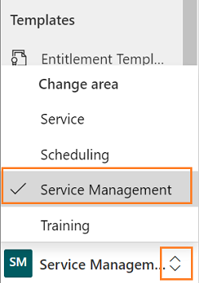
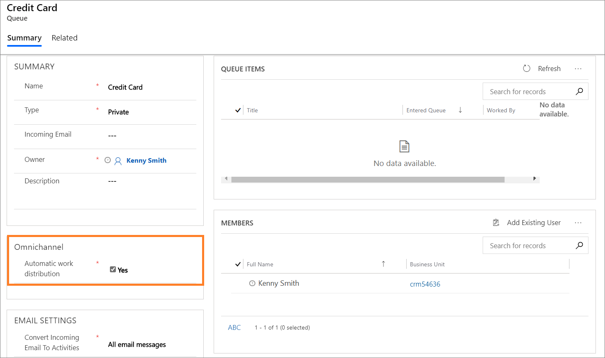

# Understand Omnichannel for Customer Service with Customer Service Hub

[!INCLUDE[cc-data-platform-banner](../includes/cc-data-platform-banner.md)]

[!INCLUDE[cc-use-with-omnichannel](../includes/cc-use-with-omnichannel.md)]

## Overview 

As a Customer Service Hub administrator, if you want to use Omnichannel for Customer Service to enable support on other channels, with unified queues and unified routing (entity routing), you can adopt to Omnichannel for Customer Service at a minimal cost.

To learn more, see [Unified routing](#unified-queues) and [Unified routing for cases](#unified-routing-for-cases).

## Unified queues

Similar to the Customer Service Hub app, Omnichannel for Customer Service uses the existing Microsoft Dataverse queues for routing and distributing the conversations (work item). You can use the existing queues for Customer Service Hub and enable them for Omnichannel for Customer Service, to perform an automatic work-distribution, thus reducing the effort you require to configure new queues for your support organization.

### Enable automatic work distribution

1. Sign in to the Customer Service Hub app.

2. Select **Service Management**.

    > [!div class=mx-imgBorder]
    > 

3. Select **Queues** under **Case Settings**.

4. Select an existing queue from the list or select **+ New** to create a new queue and fill the required details. To learn more, [Create and manage queues](../../customer-service/set-up-queues-manage-activities-cases.md).

5. Select the checkbox to enable the queue for automatic distribution of work items.

    > [!div class=mx-imgBorder]
    > 

6. Select **Save**.
 
## Unified routing for cases

With Omnichannel for Customer Service, you can enable automatic distribution of cases to the best available agents based on their skill, capacity, and presence. The automatic distribution of cases seamlessly integrates with Dynamics 365 Customer Service case routing, as the routing is unified across applications.

If your organization have a mix of Omnichannel for Customer Service agents and Customer Service Hub agents, you can get a unified and single view of routing rules for all the cases.

You can define routing rules (example: high and low priority) based on which the work distribution system automatically distributes the cases to the Omnichannel for Customer Service agents, and other cases remain in the queues for the Customer Service Hub agents to pick manually.

**For example:** High priority cases are automatically distributed to the Omnichannel for Customer Service agents and low priority cases that remain in the queue are manually picked by the Customer Service Hub agents.

As an administrator, perform the steps: 

1. Identify the cases that you want to distribute automatically to the Omnichannel for Customer Service agents.

2. Define routing rules to send the cases to Omnichannel for Customer Service automatic distribution enabled queues. To learn more, see [Create routing rules](entity-channel.md#step-4-create-routing-rules).

3. Add Omnichannel for Customer Service agents to the automatic distribution enabled queues. To learn more, see [Assign roles and enable users](add-users-assign-roles.md).

If you've set up case routing in Customer Service Hub, then identify the queues for which you want to enable automatic distribution of cases based on the existing routing rules and turn on the **Enable automatic distribution** option, and then add assign the agents Omnichannel for Customer Service privileges. To learn more, see [Assign roles and enable users](add-users-assign-roles.md).

## Routing for Omnichannel for Customer Service conversations

Along with cases, the unified queue extends to other conversations (work item) that originate from channels like Chat for Dynamics 365 Customer Service, SMS, Facebook. You can route these conversations to the queues that are enabled for automatic distribution. After routing, the work distribution system automatically distributes and assigns the conversation to the best available agents based on their skill, capacity, and presence.

This allows organizations to tightly define the work profile that their agents are supposed to handle across channels, and organizations can automate the work flow assignment across channels and assign the conversations.

## See also

[Entity routing](entity-channel.md)

[Assign roles and enable users](add-users-assign-roles.md)
