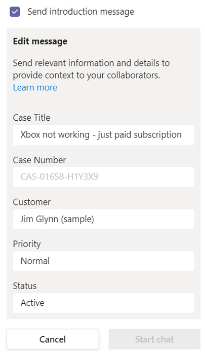
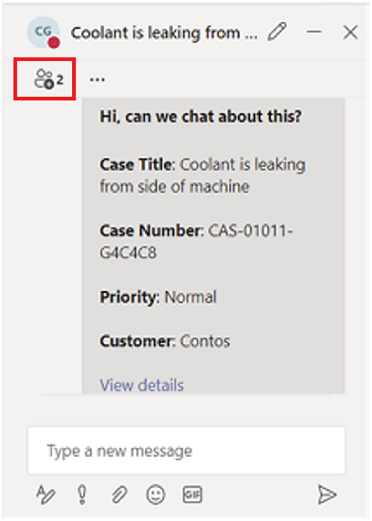
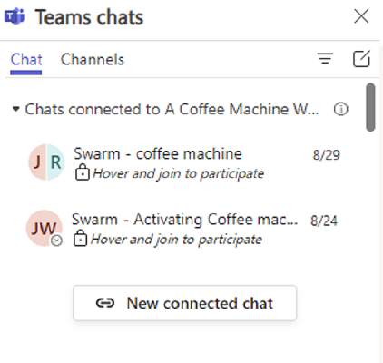
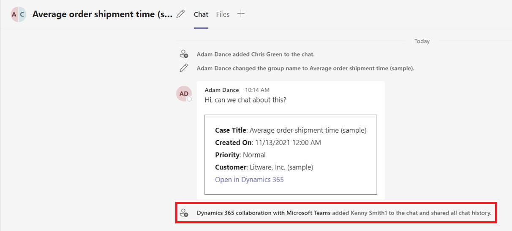
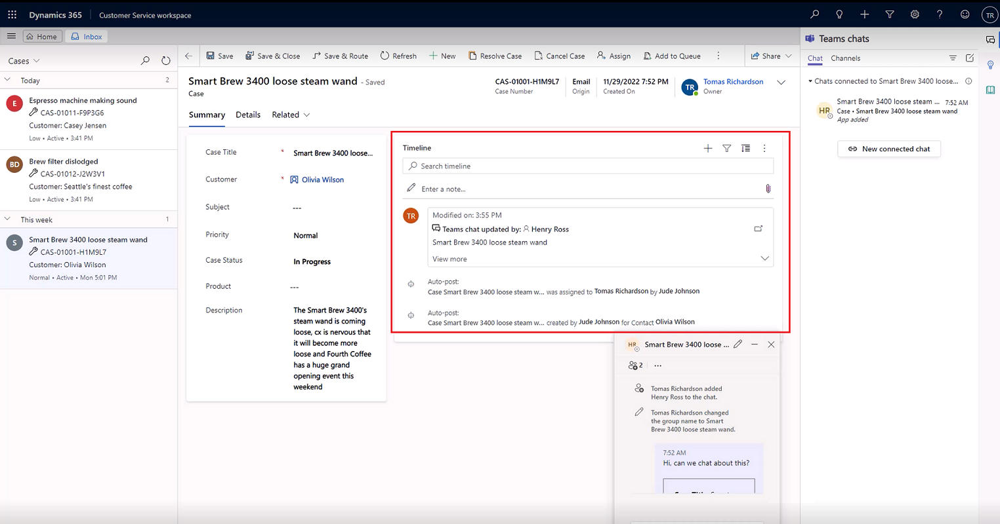
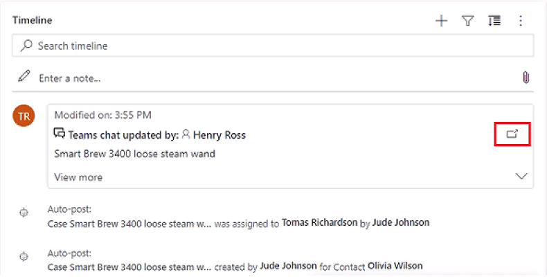

# Use Teams chat in Customer Service

As an agent, you can chat in Microsoft Teams from within Dynamics 365 Customer Service Hub, Customer Service workspace, and any custom app. While working on customer records, you can start a new chat or connect an existing chat to a record, and thus collaborate efficiently without switching context or leaving the application. Connecting all the associated chats to a record can help you maintain all the conversations related to the record in one place. 

> [!NOTE]
> This feature must first be enabled by an administrator, and you must have certain permissions to access Teams data. More information: [Configure Teams chat in Customer Service](configure-teams-chat.md)

## Agent overview of key features for Teams chat

The following image displays the key features of the agent Teams chat experience.

 > [!div class="mx-imgBorder"] 
 > 

The following legend describes the numbered callouts in the above image.

|Number |Feature | Description |
|-------|-----------|-----------|
| 1 | New chat | Create chats that aren't associated with any Dynamics 365 records.  |
| 2 | Filter |  Filter chats by name. |
| 3 | Chats connected to other records | Chats that are associated with other Dynamics 365 records that the current user is a part of. Users can prioritize responses to these chats over other chats. |
| 4 | New connected chat | Start a new chat that is connected with the record. These chats can only be viewed in Dynamics 365 by the chat participants. |
| 5 | Other chats | Chats that aren't connected to any records or started from Teams. |
| 6 | Chat control | Allows users to multi-task across chats. |
| 7 | Basic Teams functions | Format, use emojis or .GIFs, set delivery options, and attach files. |
| 8 | Add/remove participants | Select who participates in the chat and who doesn't. |

## Open Teams chats that are related to a record

You can open any Dynamics 365 Customer Service record and select the **Teams chats and channels integration** icon. The **Teams chats** panel opens with the following sections in the **Chat** tab:  
- Chats connected to the record: Lists Teams chats that either you’ve connected to the selected record or someone else has connected a chat with you as a participant. 
- Suggested contacts: Lists suggested contacts depending on the users who are working on the record. For more information, see [Use suggested contacts to collaborate with the right coworkers](teams-use-suggested-contacts.md).  
- Other chats/All recents: Lists your top 50 chat conversations on Teams. You can select any existing conversation and connect it to a record. 

## Start a new connected chat

You can start a new connected chat or convert an existing Teams chat into a connected chat to associate the chat with a Dynamics 365 record. Standard record types, including case, conversation, account, contacts, knowledge article, and email, are available out-of-the-box, or your administrator can add your desired record type.

Your administrator can configure an optional message that you can send when using the chat to start a collaboration. This message helps you to share succinct, read-only context with your collaborators on Teams.
 
If you're using Teams for the first time within Customer Service Hub or Customer Service workspace, you can select the blue bubble, and then follow the interface guidance.

1.	Open any Dynamics 365 Customer engagement record, and then select the **Teams chats and channels integration** icon.
    The **Teams chats** panel opens.
    - You can access the embedded chat from in Customer Service Hub and custom apps. When you select the Teams chat :::image type="icon" source="media/teams-icon.png" border="false"::: icon, the chat pane opens as an app in the right-side pane.
    - If you're in a multisession app, such as Customer Service workspace, you can access the chat pane directly from the productivity pane.
       > [!NOTE]
       > You can also access the chat pane from the home session in Customer Service workspace. When using the chat pane from the home session, you'll see two sections: Chats connected to records and Other chats (if enabled by your administrator).
    
2.	Use one of the following methods: 
    a.	To start a new connected chat with a participant, select **New connected chat** in the **Chats connected to record** section. Type the name(s) of the participant(s) you want to chat with. You can start with just one collaborator and then progressively add more as needed (see step 6). Every new connected chat starts fresh, without bringing context from one-to-one chats or other chats you may have had with the participants. Therefore, it's important to name your chats appropriately to match the context of the record and conversation. For more information, see step 3.   
    b.	To start a connected chat with a suggested contact directly on the chat list, select the contact with whom you want to chat.  
    
     > [!NOTE]
     > You can only connect group chats to records. Direct, one-to-one chats can't be connected, and will instead display an option to start a new connected chat with that contact.
       
3. The chat name uses the record name or the participants’ name, depending on the configuration that your administrator has set up. To set the chat name as the record name, you can ask your administrator to turn on the **Auto-name chats** setting. You can modify the chat name. Provide a meaningful name to the chat so that you can identify the chat, even on Teams. The name also helps your collaborators on Teams to easily identify chats that are associated with Dynamics 365 records.  
4. Your administrator can configure an optional note that you can send when using the chat to start a collaboration. The introduction note uses selected data fields from the associated record. This note helps you to share succinct, read-only context with your collaborators on Teams. The note also includes a link to view the associated record in Dynamics 365. If your collaborators have a Dynamics 365 license and access to the record, they can view the full record details in a browser tab.
    
     > [!div class="mx-imgBorder"] 
     > 
     
5. To convert an existing group chat into a connected chat, select a chat from the **All recents** section. Select the **More Commands** ellipsis (…), and then select **Connect chats to record**.   
    
6. (Optional) You can add more participants to the chat directly from the chat control by selecting the **View and add participants**.
    
     > [!div class="mx-imgBorder"] 
     > 

        
## Connect or disconnect an existing chat from a record

You can connect a chat to a single record or multiple records. For example, if you have a chat about a case that turns into a work order, you can also connect the chat to the work order. If you decide later that you don't want the chat to be connected to the case, you could disconnect it if you administrator grants you permission to do so.

- To connect a chat to a record, select ellipses next to the chat, and then select **Connect to this case**.

- To disconnect a chat from a record, select ellipses next to the chat, and then select **Disconnect from this case**. 
    
### Understand how disconnected chat rights are assigned

As an agent, you have the following three options for getting rights to disconnect chats, all of which your administrator controls.

- You're the record owner, and your administrator enables this capability.
- You're the most recent user to connect the chat to the record, and your administrator enables this capability.
- Your administrator assigns the right to disconnect chats to you if you need the ability to disconnect chats from records.

If your administrator hasn't assigned any of the above rights to you or your role, you aren't able to disconnect any chat that you or other users have connected to records. If you need the ability to disconnect chats from records, ask your administrator to assign the rights to you.

## Use suggested contacts

The suggested contacts list displays users who are connected or have interacted with the record. Suggested contacts might include a team administrator or members who have logged an activity in the record timeline, and so forth. There are two different types of suggestions: AI-based and rules-based. For more information, see [Use suggested contacts to collaborate with the right coworkers](/dynamics365/customer-service/teams-use-suggested-contacts).

## Connect a Teams channel to a record

The **Channels** tab lists the channels that either you’ve connected to the selected record or someone else has connected a channel where you’re a participant. If you've connected a record to a channel using basic or enhanced collaboration experience, that channel is also listed in this tab. 

You can connect relevant Teams channels to a record so that all the members can easily access the connected channels from the record and follow the conversation. 

1. Open any Dynamics 365 Customer Service record, and select the Teams chat :::image type="icon" source="media/teams-icon.png" border="false"::: icon. 
   The **Teams chats** pane opens.
2. Select the **Channel** tab. The tab lists the channels that are already connected to a record.
3. Select the **Connect a channel** icon in the upper-right corner of the Teams chats pane. 
   The **Collaborate with Microsoft Teams** dialog opens.
4. To start a new connected channel, select **Create a new connection**.
5. To connect an existing channel, select the channel from the list, and then select **Start collaboration**.

## Join a chat

As an agent, you can view and easily join chats that are connected to a record you have write access to, even if you weren’t originally a participant in the chat. Some scenarios where this feature can be useful include:

- **Case transfers**: If you’ve onboarded to a case that another agent previously handled, you can join the chat to better understand the context of the case, and then continue to collaborate with your relevant colleagues.
- **Case escalations**: If a case needs attention from someone with specific knowledge, the subject-matter expert who reviews it can participate in the relevant conversations.

 > [!NOTE]
 > You can only join connected chats, and to do so, you must have write access to the record and your administrator must have turned on the Join Chat capability for the record type for which you want to join an existing connected chat.

**To join a connected chat**:

1. Open the record for which you want to join the chat.
2. In the **Teams chats** page, go to any of the connected chats you want to join. A lock icon is displayed with text that says "Hover and join to participate." When you hover over the lock icon, if you have write access to the associated record, a **Join** button is displayed.

    > [!div class="mx-imgBorder"] 
    > 

  > [!NOTE]
  > If you don't see the text that allows you to hover and join a chat, there are three possible reasons for this:  1. Your administrator hasn’t enabled Join chat capability for the entity.  2. You have read-only access to the record.  3. Both scenarios in 1 and 2 apply.  In any of these scenarios, you can ask a member of the chat to manually add you, or you can ask your administrator to turn on the Join chat setting for that record type. 

3. Select **Join**. 

    > [!div class="mx-imgBorder"] 
    > 

   The Teams popup chat shows that you’ve been added to the chat, and you have access to the entire chat history. Other chat members also receive the system message that you've been added to the chat.
 
  > [!NOTE]
  > When a user is added using Join chat, any users who are chatting directly from Dynamics 365 apps will see a system message that says an unknown user added the new user to the chat and shared all of the chat history. This is a known issue that is specific to the embedded chat experience, and we're working to resolve it. 
  
   > [!div class="mx-imgBorder"] 
   > 

If you're using the Microsoft Teams app, when joining a chat, the following message is displayed: Dynamics 365 collaboration with Microsoft Teams added &lt;user name&gt; to the chat and shared all chat history.

   > [!div class="mx-imgBorder"] 
   > 
    
## View Teams chats in the timeline for a record (preview)

As an agent, when you start a connected chat or connect an existing chat to a record, you can see the chat appear as a new activity in the timeline. The timeline entry shows details about who connected the chat and when they connected it. It also shows the last person to send a message in the chat, and when they sent it. If the Join chat setting is turned on in your organization, agents can also directly join the chat or be added as a chat participant and see the full exchange.

 > [!NOTE]
 > Your administrator must enable this feature before you can use it.

1. Go to the record for which you want to view the timeline or start a chat. In the timeline, you can view all chats that are associated with the record.

   > [!div class="mx-imgBorder"] 
   > 
   
1. Do any of the following actions:
   - To view changes you've made in a Teams chat, manually refresh the timeline: Select the ellipsis in the right-hand corner, and then select **Refresh timeline**.
   - To view details about who initially connected the chat, select **View more** in the timeline post.
   - If you aren't a participant in a chat and your administrator has turned on the **Join chat** setting for the record, you can join the chat from the timeline by selecting the join icon.
   
     > [!div class="mx-imgBorder"] 
     > 

## Dynamics 365 links are unfurled in Teams chat

When you paste a link to a Dynamics 365 Customer Service or Power Apps record into a Microsoft Teams chat, meeting, or channel, participants see an adaptive card with details about the shared link. Links to canvas apps show the app name and record name. Model-driven app links to records show the table type. When you paste the link, you can delete the card in the message compose window before sending the message if you don’t want to send the link as a card.

> [!NOTE]
> If you don't have access to the app or record for which you paste a link, no app or record details will be shown in the unfurled card.

### See also

[Configure Teams chat in Customer Service](configure-teams-chat.md) 

[!INCLUDE[footer-include](../includes/footer-banner.md)]
