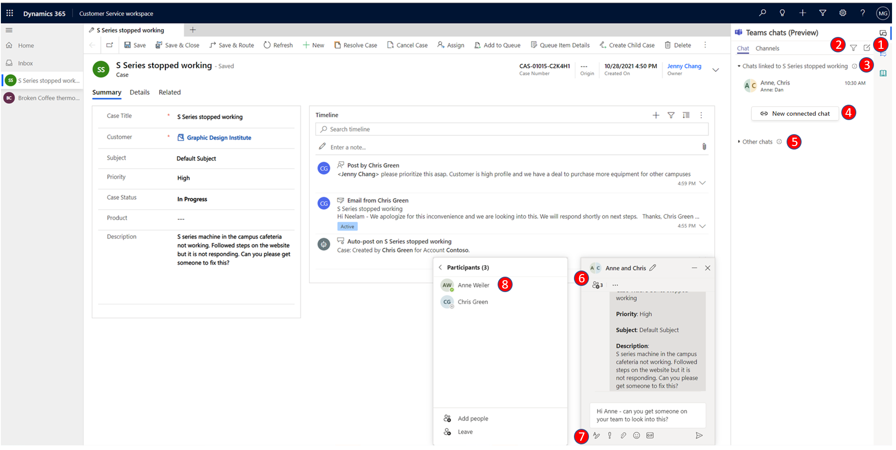

# (Preview) Use Teams chat in Customer Service

> [!IMPORTANT]
> [!INCLUDE[cc-preview-feature](../includes/cc-preview-feature.md)]
>
> [!INCLUDE[cc-preview-features-definition](../includes/cc-preview-features-definition.md)]
>
> [!INCLUDE[cc-preview-features-expect-changes](../includes/cc-preview-features-expect-changes.md)]
>
> [!INCLUDE[cc-preview-features-no-ms-support](../includes/cc-preview-features-no-ms-support.md)]

As an agent, you can chat in Teams from within Dynamics 365 Customer Service Hub and Customer Service workspace. While working on customer records, you can start a new chat or link an existing chat to a record, and thus collaborate efficiently without switching context or leaving the application. Linking all the associated chats to a record can help you maintain all the conversations related to the record in one place. 

> ![NOTE]
> This feature must first be enabled by an administrator, and you must have certain permissions to access Teams data. More information: [Configure Teams chat in Customer Service](/configure-teams-chat)

## Agent overview of key features for Teams chat

The following image displays the key features of the agent Teams chat experience.

 > [!div class="mx-imgBorder"] 
 > 

The following legend describes the numbered callouts in the above image.

|Number |Feature | Description |
|-------|-----------|-----------|
| 1 | New chat | Create chats that aren't associated with any Dynamics 365 records.  |
| 2 | Filter |  Filter chats by name. |
| 3 | Linked chats | Chats that are associated with a Dynamics 365 record. These chats can only be viewed in Dynamics 365 by the chat participants. |
| 4 | Chats linked to other records | Chats that are associated with other Dynamics 365 records that the current user is a part of. Users can prioritize responses to these chats over other chats. |
| 5 | Other chats | Chats that aren't linked to any records or started from Microsoft Teams. |
| 6 | Chat control | Allows users to multi-task across chats. |
| 7 | Basic Teams functions | Format, use emojis, use gifs, set delivery options, attach files. |
| 8 | Add/Remove participants | Select who participates in the chat and who doesn't. |

## Start a new linked chat

You can start a new linked chat or convert an existing Teams chat into a linked chat to associate the chat with a Dynamics 365 record. Standard record types, including case, conversation, account, contacts, knowledge article, and email, are available out of the box, or your administrator can add your desired record type.

You can use the chat to do the following:
- Send an introduction message to start a collaboration
- Use suggested contacts to help ensure collaboration with the right contact, including the use of:
  - AI suggestions: Uses an AI-based model of similarly solved cases by other agents.
  - Rules-based contacts: Uses pre-defined logic to suggests other users who are related to the case.
 
If you're using Teams for the first time within Customer Service Hub or Customer Service workspace, you can select the blue bubble, and then follow the interface guidance.

1.	Open any Dynamics 365 Customer engagement record, and then select the **Teams chats and channels** integration icon.
    The Teams chats (preview) panel opens.
2.	Use one of the following methods: 
    a.	To start a new linked chat with a participant, select **New linked chat** in the **Linked to this record section**. 
    b.	To start a linked chat with a **Suggested chat & contact**, select the **More** icon (…), and then select **Start a linked chat**. 
    c.	To convert an existing chat into a linked chat, select a chat from the **All recents** section. Select the **More Commands** ellipsis (…), and then select **Start a linked chat**.  
    The chat name uses the record name or the participants’ name, depending on the configuration that your administrator has set up. To set the chat name as the record name, you can ask your administrator to turn on the **Use record title as the default chat name for linked chats** setting. You can modify the chat name. Provide a meaningful name to the chat so that you can identify the chat even on Teams.
3.	Add more participants to the chat if you want to.
    All of the participants in the linked chat will see the chat when they open the record in Dynamics 365.

## Link an existing chat to a record
You can link relevant Teams chats to a record so that all the members can easily access the linked chat from the record and follow the conversation. 
1.	Open any Dynamics 365 Customer engagement record, and then select the **Teams chats and channels integration** icon. .  
    The Teams chats (preview) panel opens.
2.	Select the **Channel** tab. 
    The tab lists the channels that are already linked to the opportunity. 
3.	Select the **Link** icon at the top-right corner.
    The **Collaborate with Microsoft Teams** dialog opens.
4.	To start a new linked channel, select **Create a new connection**.
5.	To link an existing channel, select the channel from the list, and then select **Start collaboration**.

## Unlink a chat from a record

## Start a linked chat with a contact from an existing unlinked chat

  
