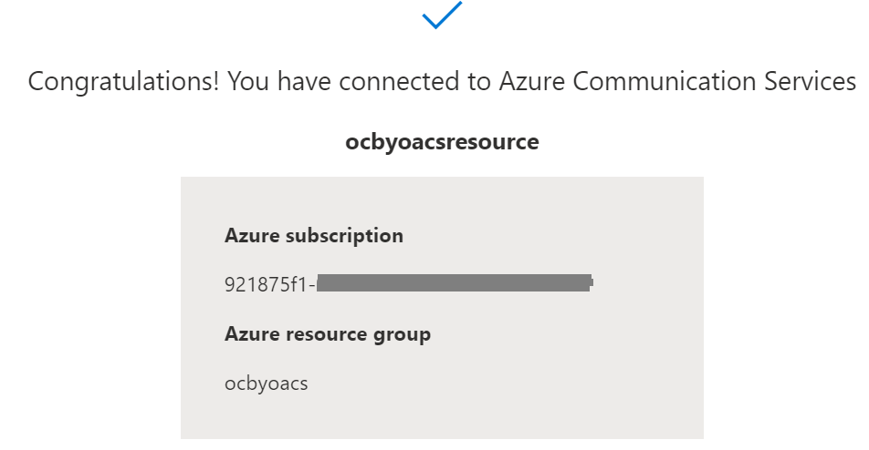
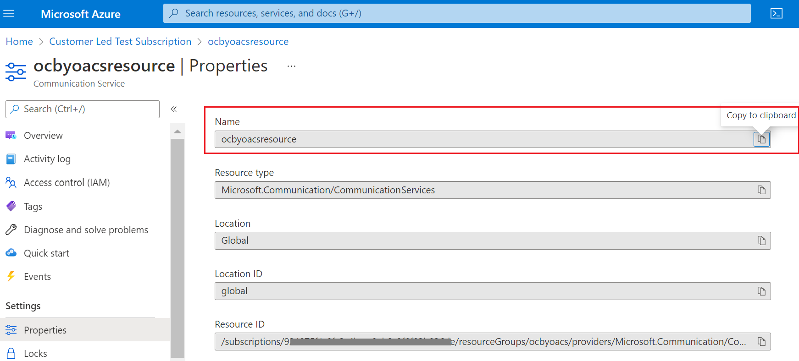
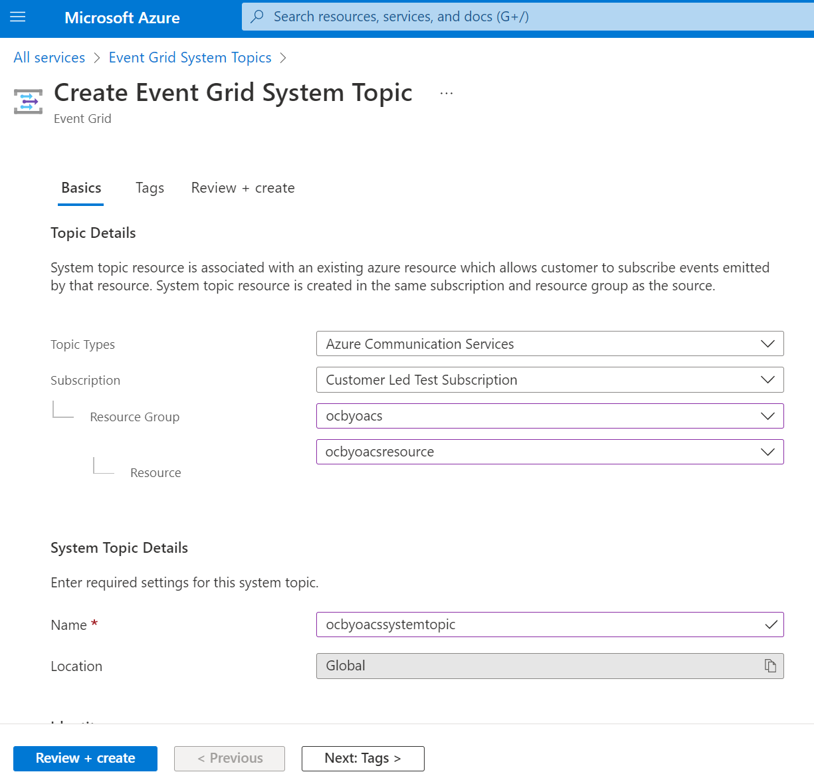
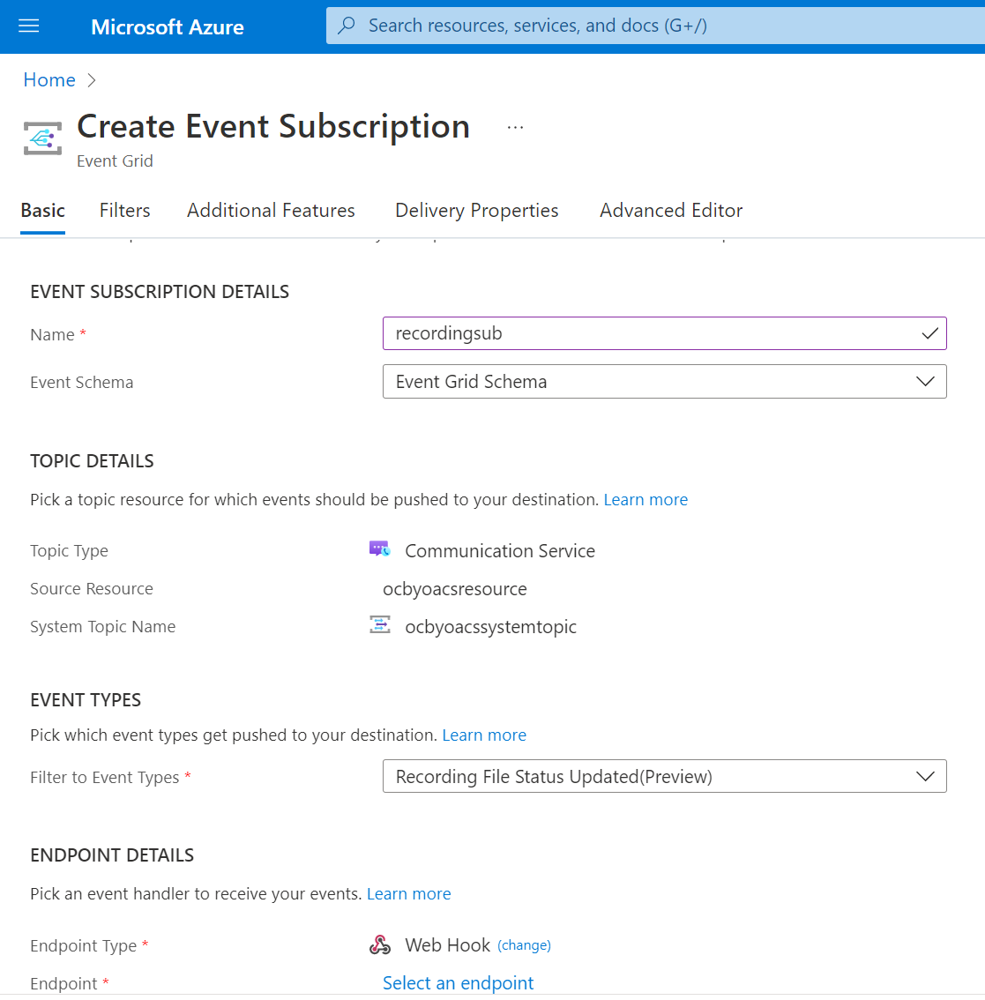
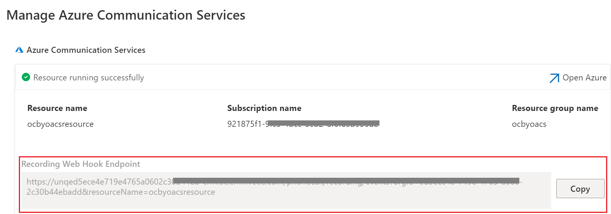
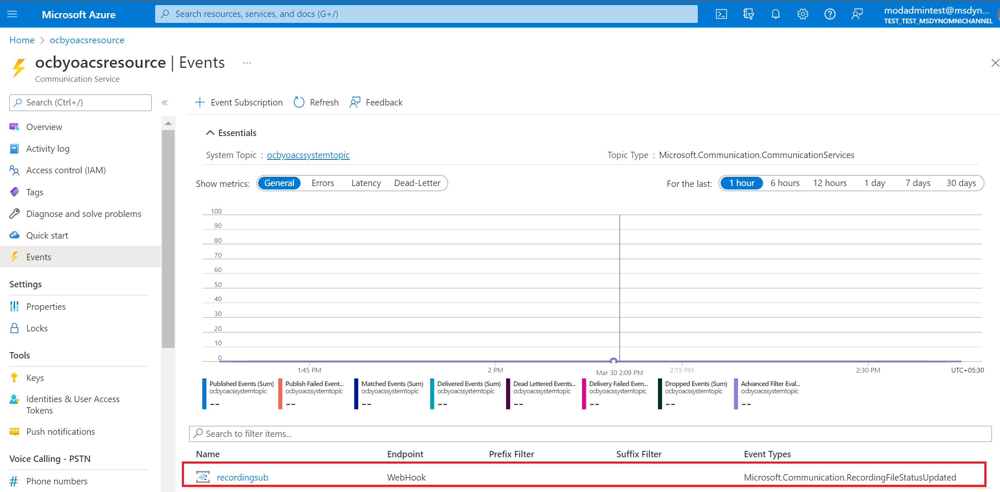
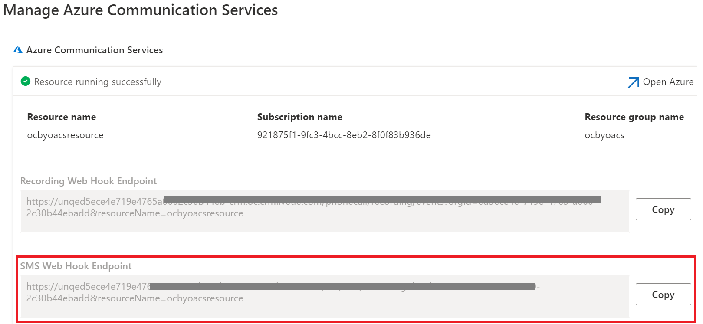

# Connect to Azure Communication Services

[!INCLUDE[cc-use-with-omnichannel](../includes/cc-use-with-omnichannel.md)]

## Introduction

To provision phone numbers for your business in Omnichannel for Customer Service, you must first establish connection with Azure Communication Services. You can connect to a new Azure resource or use an existing one, and then deploy the resource through Dynamics 365.

## Quickstart: Connect to a new Azure resource

### Prerequisites

Before you connect to an Azure resource, ensure you have the following details:

- An Azure subscription that's in the same tenant as your Dynamics 365 account. Ensure that your Azure subscription meets the [Azure Subscriptions eligibility](/azure/communication-services/concepts/telephony-sms/plan-solution#azure-subscriptions-eligibility) requirements.
- At least contributor-level permissions to the Azure subscription. To check your role, open your subscription and view the **My role** column of your subscription on the Azure portal. You'll be able to deploy your Azure resource only if you have contributor-level permissions.

### Connect to a new Azure resource

**To create a new Azure resource**

1. In the site map of Omnichannel admin center, under **General settings**, select **Phone numbers**, and then select **Get started**. The **Connect to Azure Communication Services** dialog opens.

2. Select **Create new resource** and enter the following details:
   - **Azure subscription**: Select a subscription from the dropdown list.
   - **Azure resource group**: Select an existing resource group or select **Create new**, and enter a name for a new resource group.
      > [!NOTE]
      > The resource group name should be unique within a subscription.
   - **Resource name**: Enter a name for the resource.
3. Select **Deploy** to create and deploy the resource.
    > [!div class="mx-imgBorder"]
    > 
You're now connected to Azure Communication Services.

## Advanced: Connect to an existing Azure resource

You can also use an existing Azure Communication Services resource to connect with voice or SMS channels. You can use a resource from any of your Azure subscriptions, available under any tenant. If you had previously unlinked a resource and want to use it now, you can do so using this option.

Before you proceed with adding an existing resource to Azure Communication Services, you must have the following information:

- The resource name and ID from the Azure portal.
- The connection string from the Azure portal.
- The application ID and tenant ID from the App registrations page on the Azure portal.

**To connect to an existing Azure resource**

1. In the site map of Omnichannel admin center and in **General settings**, select **Phone numbers**, and then select **Get started**. The **Connect to Azure Communication Services** dialog opens.

2. Select **Use existing resource**.

3. Enter the following details, based on the values available on the Azure portal.
   - **ACS Resource Name**: [Enter the resource name](#get-resource-name-and-id).
   - **ACS Resource ID**: [Enter the resource ID](#get-resource-name-and-id).
   - **Connection string**: [Enter the connection string](#get-connection-string).
   - **Event grip app ID**: [Enter the application ID](#get-application-and-tenant-ids).
   - **Event grip app tenant ID**: [Enter the tenant ID](#get-application-and-tenant-ids).

4. Select **Connect**.
    > [!div class="mx-imgBorder"]
    > 

   Your existing Azure resource is now connected to Azure Communication Services. You'll be able to provision or acquire new phone numbers for your organization. However, to acquire or purchase phone numbers, you'll need to contact or wait to be contacted by a Microsoft voice program manager to be added to the Azure Communication Services allow list.

5. Select **Add number**. The **Add phone number** page is displayed.

6. [Add a new phone number](voice-channel-manage-phone-numbers.md#acquire-new-phone-numbers).

7. [Create, deploy, and register event grid system topics](#create-deploy-and-register-event-grid-system-topics).

8. [Create event subscription endpoint for recording](#create-event-subscription-endpoint-for-recording).

9. [Create event subscription endpoint for SMS](#create-event-subscription-endpoint-for-sms).

You can now configure the voice workstream settings for the phone number, and also configure outbound and inbound calling to make and or receive customer calls.

## Additional information

The following sections include short procedures that explain how you can get resource name, resource ID, connection string, application ID, tenant ID, and other details from the Azure portal.

### Get resource name and ID

**To get the resource name and ID from the Azure portal**

1. Open your existing resource on the Azure portal in a separate window or tab, and go to **Settings** > **Properties**.
2. Select the value of the **Name** field, select the **Copy to clipboard** button, and then paste the value in the **ACS Resource Name** field of the **Use existing resource** dialog.
   > [!div class="mx-imgBorder"]
   > 
3. Select the value of the **Resource ID** field, then select the **Copy to clipboard** button, and paste the value in the **ACS Resource ID** field of the **Use existing resource** dialog.

   > [!div class="mx-imgBorder"]
   > 

### Get connection string

**To get the connection string from the Azure portal**

1. Open your existing resource on the Azure portal in a separate window or tab, and go to **Tools** > **Keys** > **Primary key**. 
2. Select the value of the **Connection string** field, then select the **Copy to clipboard** button, and paste the value in the **Connection string** field of the **Use existing resource** dialog.

   > [!div class="mx-imgBorder"]
   > 

### Get application and tenant IDs

**To get the application and tenant IDs from the Azure portal**

1. Open the **App registrations** page on the Azure portal in a separate window or tab.

    If you're registering your app on the Azure portal for the first time, then do the following:
    1. On the **Register an application** page, enter the following details:
        - **Name**: Enter a name for your application.
        - **Supported account types**: Select **Accounts in any organizational directory (Any Azure AD directory - Multitenant)**.
    2. Select **Register**.
       > [!div class="mx-imgBorder"]
       > 

2. Select the value of the **Application (client) ID** field, select the **Copy to clipboard** button, and then paste the value in the **Application ID** field of the **Use existing resource** dialog.
   > [!div class="mx-imgBorder"]
   >  ID.")

3. Select the value of the **Directory (tenant) ID** field, then select the **Copy to clipboard** button, and paste the value in the **Tenant ID** field of the **Use existing resource** dialog.
   > [!div class="mx-imgBorder"]
   >  ID.")

### Create, deploy, and register event grid system topics

**To create, deploy, and register event grid system topics**

1. Open the Azure portal in a separate window or tab, and open the **Event Grid System Topics** service. 
2. Select **Create** and in the **Create Event Grid System Topic** page, enter the following details.
    - **Topic Types**: Select **Azure Communication Services** from the dropdown list.
    - **Subscription**: Select the subscription from the dropdown list.
    - **Resource Group**: Select the resource group from the dropdown list.
    - **Resource**: Select the Azure resource from the dropdown list.
    - **Name**: Enter a name for the system topic.
    > [!div class="mx-imgBorder"]
    > 
3. Select **Review + create**. The system topic is validated and deployed.  
    > [!div class="mx-imgBorder"]
    > 
4. Select **Go to resource**.
5. In the resource details page that opens, select the **Subscription** link.
    > [!div class="mx-imgBorder"]
    > 
6. In the resource subscription page, select **Settings** > **Resource providers**, and then check if the **Microsoft.EventGrid** provider is listed as **Registered**.
   If the event grid is not registered, you can select the record and then select **Re-register** to register it.
    > [!div class="mx-imgBorder"]
    > 

### Create event subscription endpoint for recording

**To create event subscription endpoint for recording**

1. Open the resource on the Azure portal, go to **Events**, and select **Event Subscription**.

2. In the **Create Event Subscription** dialog, enter the following details in the **Basic** tab.
    > [!div class="mx-imgBorder"]
    > 
    - **Name**: Enter a name for the recording event subscription.
    - **Event Schema**: Select **Event Grid Schema** from the dropdown list.
    - **System Topic Name**: This field is automatically populated with the system topic name you created. However, if you see multiple values, select the specific system topic name from the dropdown.
    - **Filter to Event Types**: Select **Recording File Status Updated (Preview)** from the dropdown list.
    - **Endpoint Type**: Select **Web Hook** from the dropdown list.
    - **Endpoint**: Select **Select an endpoint** and in the **Select Web Hook** dialog that opens, you need to enter the **Subscriber Endpoint**.
      To get the subscriber endpoint:

         a. In the site map of Omnichannel admin center, under **General settings**, select **Phone numbers**.

         b. Select a phone number, and then select **Advanced**.

         c. In the **Manage Azure Communication Services** page that opens, select **Copy** next to **Recording Web Hook Endpoint**.
         > [!div class="mx-imgBorder"]
         > 
          
         d. Paste the web hook endpoint value in the **Subscriber Endpoint** field and select **Confirm Selection**.

3. Go to the **Additional Features** tab, select the **Use AAD authentication** checkbox, and enter the following details.
    > [!div class="mx-imgBorder"]
    > 
   - **AAD Tenant ID**: Copy-paste the **Directory (tenant) ID** field value from your Azure resource here.
   > [!div class="mx-imgBorder"]
   >  ID.")
   - **AAD Application ID or URI**: Copy-paste the **Application (client) ID** field value from your Azure resource here.
   > [!div class="mx-imgBorder"]
   >  ID.")

4. Select **Create** to create the event subscription endpoints for recording. This might take some time, so if you get an sync error, try refreshing after some time.

    > [!div class="mx-imgBorder"]
    > 

### Create event subscription endpoint for SMS

**To create event subscription endpoint for SMS**

1. Open the resource on the Azure portal, go to **Events**, and select **Event Subscription**.

2. In the **Create Event Subscription** dialog, enter the following details in the **Basic** tab.
    - **Name**: Enter a name for the recording event subscription.
    - **Event Schema**: Select **Event Grid Schema** from the dropdown list.
    - **System Topic Name**: This field is automatically populated with the system topic name you created. However, if you see multiple values, select the specific system topic name from the dropdown.
    - **Filter to Event Types**: Select both **SMS Received** and **SMS Delivery Report Received** from the dropdown list.
       > [!div class="mx-imgBorder"]
    > 
    - **Endpoint Type**: Select **Web Hook** from the dropdown list.
    - **Endpoint**: Select **Select an endpoint** and in the **Select Web Hook** dialog that opens, you need to enter the **Subscriber Endpoint**.

      To get the subscriber endpoint:

      a. In the site map of Omnichannel admin center, in **General settings**, select **Phone numbers**.
         
      b. Select a phone number, and then select **Advanced**.
        
      c. In the **Manage Azure Communication Services** page that opens, select **Copy** next to **SMS Web Hook Endpoint**.
         > [!div class="mx-imgBorder"]
         > 

      d. Paste the web hook endpoint value in the **Subscriber Endpoint** field and select **Confirm Selection**.

3. Go to the **Additional Features** tab, select the **Use AAD authentication** checkbox, and enter the following details.
    > [!div class="mx-imgBorder"]
    > 
   - **AAD Tenant ID**: Copy-paste the **Directory (tenant) ID** field value from your Azure resource here.
   > [!div class="mx-imgBorder"]
   >  ID.") 
   - **AAD Application ID or URI**: Copy-paste the **Application (client) ID** field value from your Azure resource here.
   > [!div class="mx-imgBorder"]
   >  ID.")

4. Select **Create** to create the event subscription endpoints for SMS. This might take some time, so if you get an sync error, try refreshing after some time.
    > [!div class="mx-imgBorder"]
    > 

### See also

[Overview of the voice channel](voice-channel.md)  
[Manage phone numbers](voice-channel-manage-phone-numbers.md)  
[Set up outbound calling](voice-channel-outbound-calling.md)  
[Bring your own carrier](voice-channel-bring-your-own-number.md)  
[Integrate third-party IVR systems with voice channel](voice-channel-contextual-transfer-external-ivr.md)  

[!INCLUDE[footer-include](../includes/footer-banner.md)]
