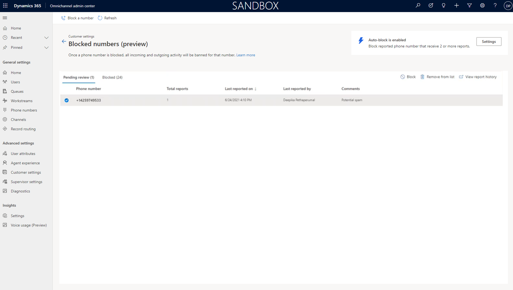

# Manage spam numbers

> [!INCLUDE[cc-use-with-omnichannel](../includes/cc-use-with-omnichannel.md)]

> [!IMPORTANT]
> [!INCLUDE[cc-preview-feature](../includes/cc-preview-feature.md)]
>
> [!INCLUDE[cc-preview-features-definition](../includes/cc-preview-features-definition.md)]
>
> [!INCLUDE[cc-preview-features-expect-changes](../includes/cc-preview-features-expect-changes.md)]
>
> [!INCLUDE[cc-preview-features-no-ms-support](../includes/cc-preview-features-no-ms-support.md)]
>
> [!INCLUDE[cc-preview-features-send-us-feedback](../includes/cc-preview-features-send-us-feedback.md)]

In Omnichannel for Customer Service, you can block phone numbers that your agents receive as part of their incoming customer calls. As an administrator, you can mark phone numbers as spam so your agents can engage with actual customers​, instead of unsolicited or irrelevant calls that don't correspond to your line of business. This capability for admins to control which calls can be received by your agents helps improve efficiency of agents​. It also helps to prevent long waits of actual customers in queues​. Your agents and supervisors can also flag incoming phone calls as spam, that you can later review and mark as spam. 

## Review phone numbers marked as spam

The admin can review the record by clicking view report history​
Look at all spam reports by looking through the call details, notes etc.​

They can choose to visit the conversation history page to review the conversation or even the recordings.​

Then they choose to either block the number or remove the number from pending review aka. Potential spam number​

Once they click on block number, it gets added to blocked list​

Anyone calling from that number will no longer reach the queue thereby the agents. Thereby improving agent’s productivity ​

1. In the site map of Omnichannel admin center, select **Customer settings** under the **Advanced settings** menu.
   
2. In the **Customer experience** area, select **Blocked numbers (preview)**, and then select **Manage**.
    On the **Blocked numbers (preview) page**, you can do the following:
    - **Pending review** tab - Shows the list of numbers that have been flagged off as spam by your agents and supervisors. You can view the report for each phone number, and then block the specific number as spam. 
    - **Blocked** tab - Shows the list of phone numbers that have been blocked as spam.

3. On the **Blocked numbers 

- click on a pending block request to see basic details and the ability to view the related call. 

## Manually block a phone number

1. In the site map of Omnichannel admin center, select **Customer settings** under the **Advanced settings** menu.
   
2. In the **Customer experience** area, select **Blocked numbers (preview)**, and then select **Manage**.
Select **Block a number**.

## Automatically block phone numbers

You can also automatically block numbers if they are reported as spam two or more times. This not only saves time needed to review every blocked call report received from your agents, it also helps remove the any delay from the administrator's end when there are too many spam numbers to be reviewed. The auto-block option also helps in situations or instances where there might be a surge in spam calls from different numbers. You can also set conditions such that some numbers get directly added to the blocked numbers list, if they match certain conditions based on number of reports.

<!--

> [!div class="mx-imgBorder"]
> 

> [!div class="mx-imgBorder"]
> 

> [!div class="mx-imgBorder"]
> 

> [!div class="mx-imgBorder"]
> 

-->
[!INCLUDE[footer-include](../includes/footer-banner.md)]