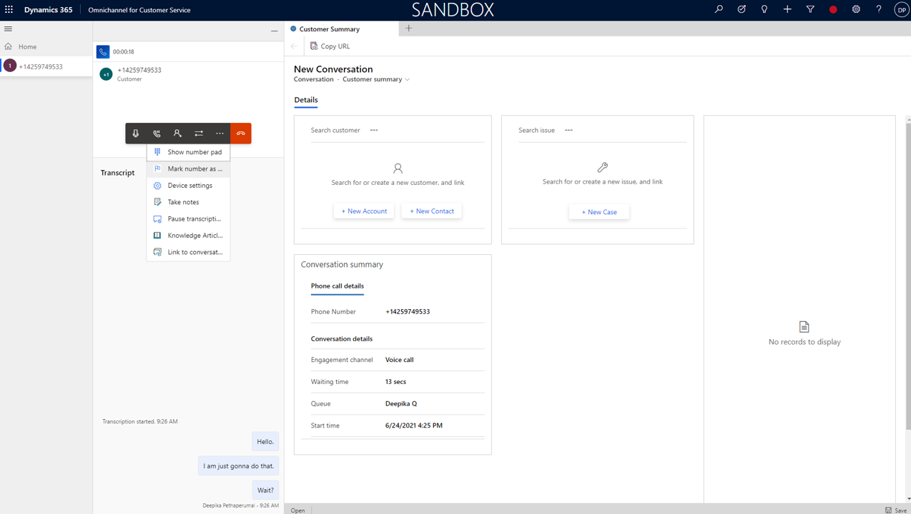
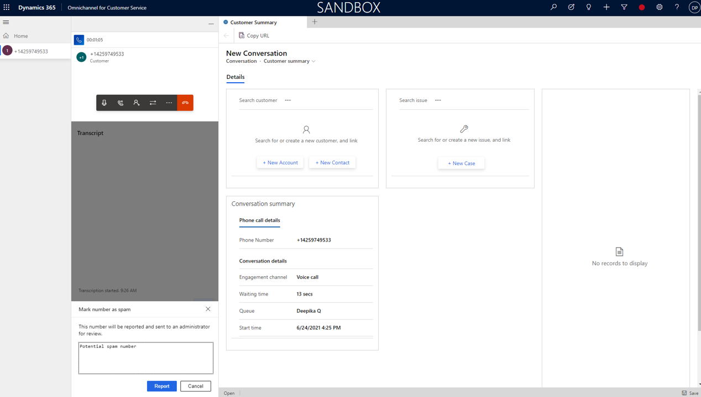
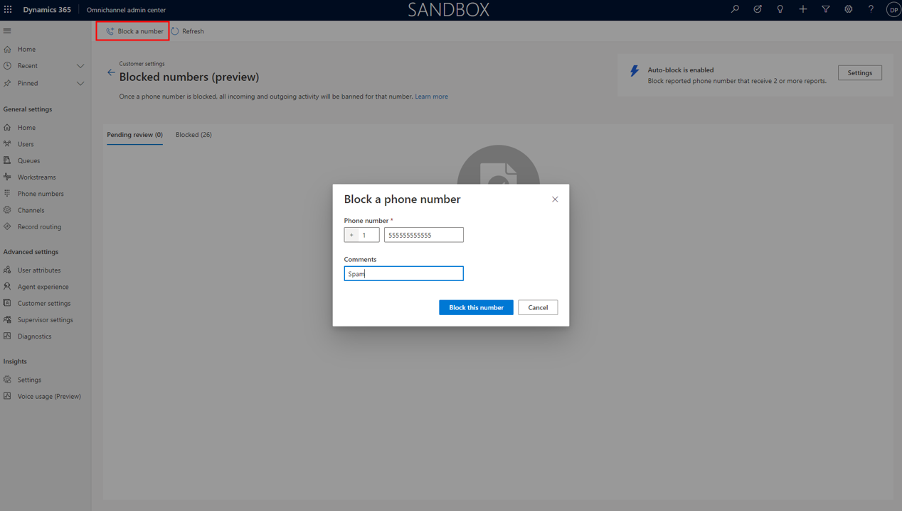

# How to Block a SPAM Number

// powerpoint: https://microsoft-my.sharepoint-df.com/:p:/p/deepikap/EbZQUBgs6vlOlqVYPCpa4QgBcTfW7dKPaAakl5hApAqP0A

// video: https://msit.microsoftstream.com/video/5a970840-98dc-b561-c9ea-f1ebd507930f 

## Prerequisites
> [!Note]
>

>[!TIP] 
> 

## Mark number as SPAM (agent)

> [!div class="mx-imgBorder"]
> 

> [!div class="mx-imgBorder"]
> 

## Review phone numbers marked as SPAM

Customer Settings > blocked numbers

- click on a pending block request to see basic details and the ability to view the related call. 

> [!div class="mx-imgBorder"]
> 

> [!div class="mx-imgBorder"]
> 

## Manually block a phone number

> [!div class="mx-imgBorder"]
> 

## Auto block phone numbers

Block numbers based on number of reports

> [!div class="mx-imgBorder"]
> 

