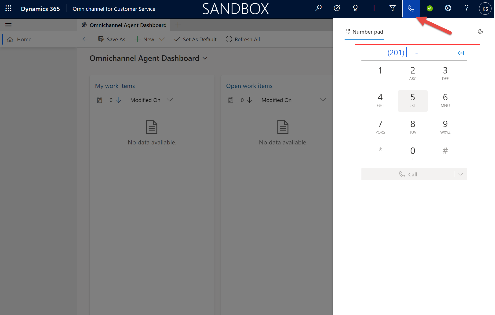
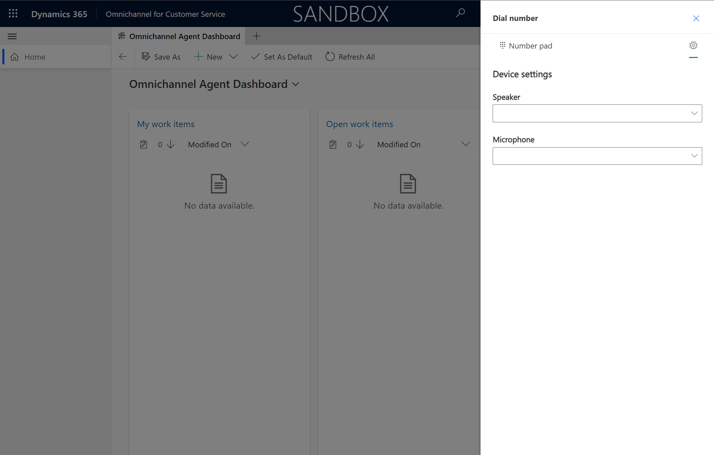

# Call a customer

## Prerequisites

To be able to call customers, your administrator must configure outbound calling and set up outbound profiles. For more information, see [Outbound calling](voice-channel-outbound-calling.md).

## Call a customer

You can call customers on their contact numbers via the Omnichannel Agent dashboard.

**To call a customer**

1. In Omnichannel for Customer Service, go to **Contacts**, and select a customer that you want to call to.

2. On the customer summary page, locate the **Mobile Phone** field and select the call icon to call the customer.
   The phone dialer opens with the phone number.

3. Select **Call** on the phone dialer.

> [!Note]
> In the dropdown list of the Call button, you'll see the phone number that you're making the call from. This is the outbound calling number that'll be displayed on the customer's phone when your agent makes the call.

When the call gets connected, you'll see the customer details on the conversation page. Based on your outbound calling profile, the transcription and recording starts. Again, if your capacity profile has a limit of one outbound call at a time, you won't be able to make another call when a call is in progress.

## Call from dialpad

> [!div class="mx-imgBorder"]
> 

## Call from contact

> [!div class="mx-imgBorder"]
> 

## Configuration considerations

### See number calling from

> [!div class="mx-imgBorder"]
> 

### Choose device settings

> [!div class="mx-imgBorder"]
> 
