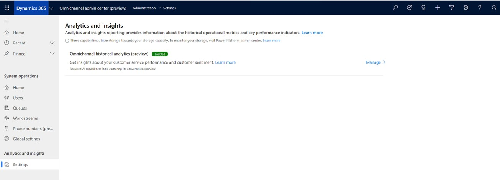
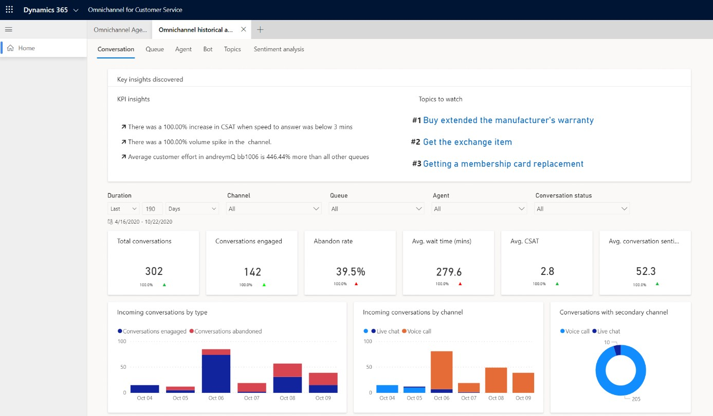
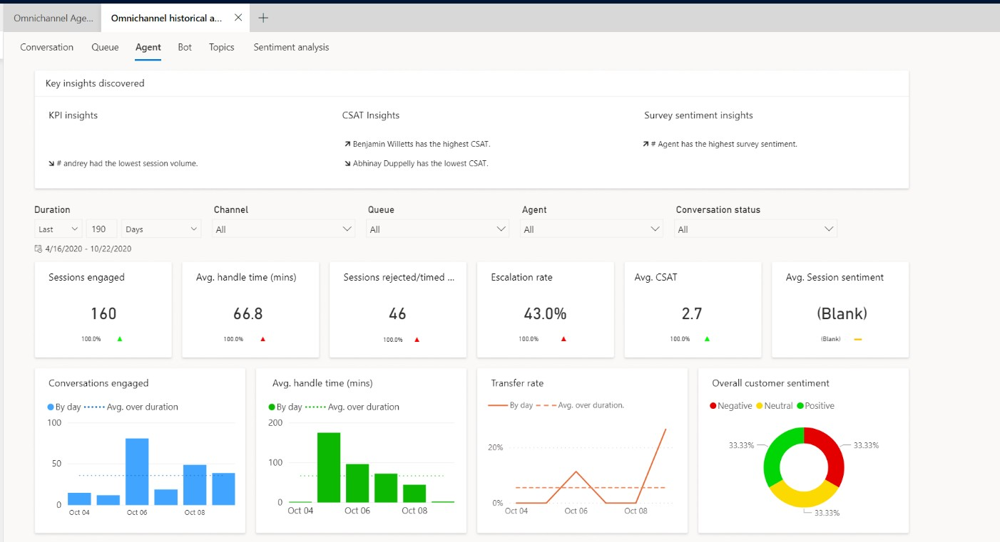
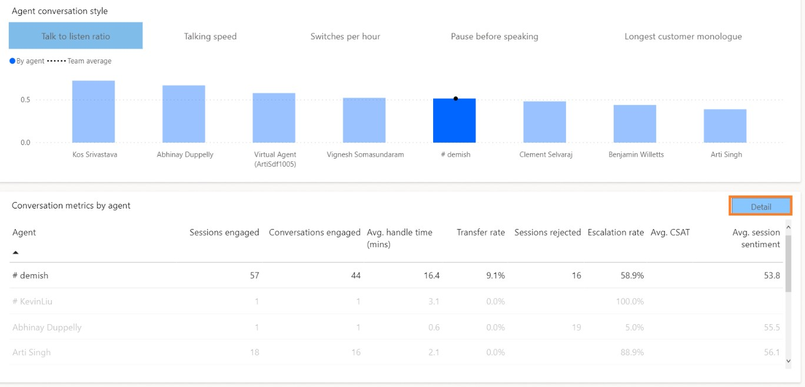
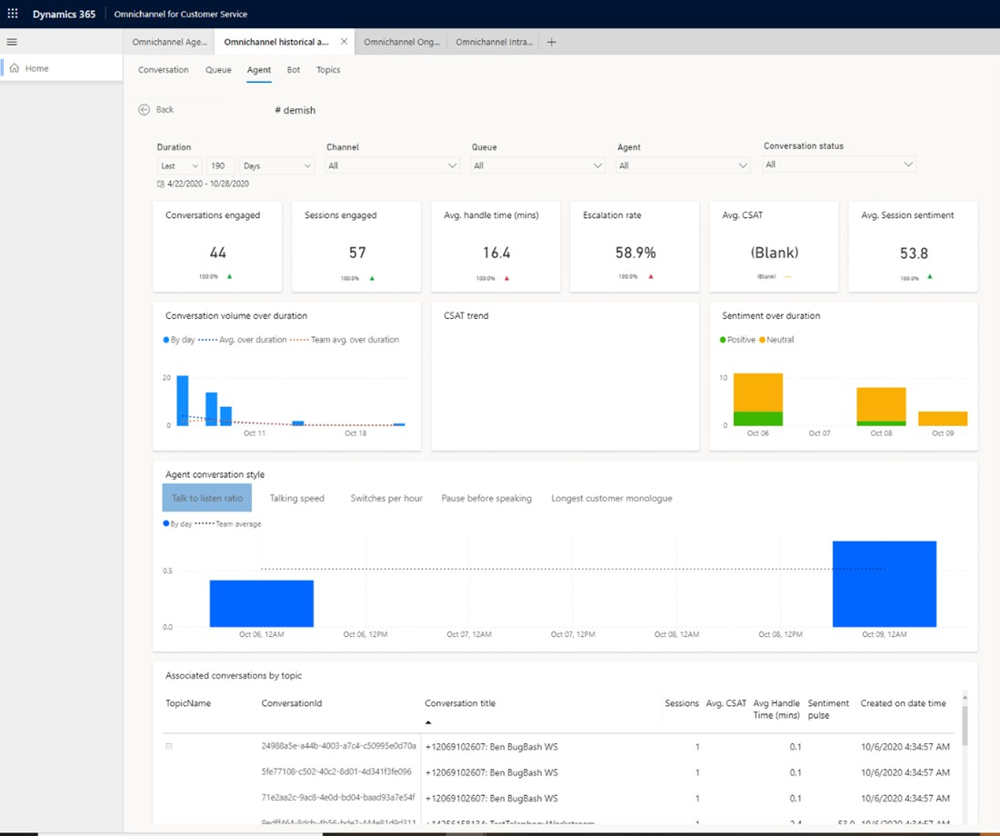
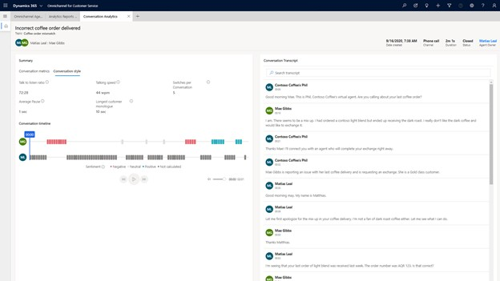
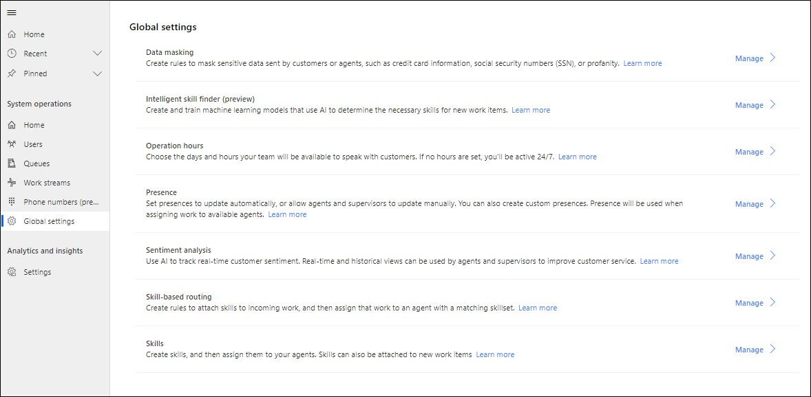

# Dashbaord for call insights

> [!Important]
> This feature is intended to help customer service managers or supervisors enhance their team's performance and improve customer satisfaction. This feature is not intended for use in making, and should not be used to make, decisions that affect the employment of an employee or group of employees, including compensation, rewards, seniority, or other rights or entitlements. Customers are solely responsible for using Dynamics 365 Customer Service, this feature, and any associated feature or service in compliance with all applicable laws, including laws relating to accessing individual employee analytics and monitoring, recording, and storing communications with end users. This also includes adequately notifying end users that their communications with agents may be monitored, recorded, or stored and, as required by applicable laws, obtaining consent from end users before using the feature with them. Customers are also encouraged to have a mechanism in place to inform their agents that their communications with end users may be monitored, recorded, or stored.

The Omnichannel historical analytics dashboard provides KPIs and trends for supervisors to understand the overall state of the Omnichannel for Customer Service support experience at a glance. It also provides insights on the customer sentiments derived using support-specific machine learning algorithms with an ability to slice through different levels in the organizational hierarchy, which supervisors can rely on to improve the overall customer support experience. Omnichannel historical analytics is currently in private preview as an embedded experience within Omnichannel for customer service app which helps supervisors to view the reports without leaving the Omnichannel app.

This section covers the following topics:

-   [*Admin experience: Opt-in to analytics and insights*](#_bookmark28)

-   [*Supervisor experience: Dashboard and metrics*](#_bookmark29)

Admin experience: Opt-in to analytics and insights

To view the rich analytics and insights for your organization, you must opt-in to this feature from the Omnichannel admin center.

1.  Open the Omnichannel admin center (preview).

2.  Under **Analytics and insights**, select **Settings**.

3.  To the right of **Omnichannel historical analytics (preview)**, select **Manage**.

1.  Under **Summary**, toggle **Status** to **Enabled**. This enables data to be synced to Azure from Dynamics CDS and provides rich analytics and insights on the data that is visualized int eh Power BI report. The refresh runs on a 24-hour schedule.

Supervisor experience: Dashboard and metrics

After your admin provisions analytics and insights in your organization, each Omnichannel supervisor will be able to see an Omnichannel Historical Analytics site map in the Omnichannel for Customer Service app. This helps supervisors to monitor the KPIs and metrics natively in the Omnichannel app.

Omnichannel historical analytics reports provide comprehensive information on how overall support is performing across channels. The reports provide administrators and supervisors with a rich visualization and ability to filter across channels, queues, agents, and date ranges to better understand performance and troubleshoot problem areas.

The reporting structure consists of the following sections:

1.  Conversation, Queue

2.  Agent

3.  Bot

4.  Topics

#### *Conversation:*

The Conversation report provides a summary of top KPIs that an organization will be interested in, along with key insights which a supervisor can investigate to immediately to take action on. The following are the metrics covered in this section:

| **Metric**                       | **Definition (historical)**                                                                                                                               |
|----------------------------------|-----------------------------------------------------------------------------------------------------------------------------------------------------------|
| Incoming conversation            | The number of conversations initiated by the customer and can be presented to a human agent.                                                              |
| Conversations engaged            | Offered conversations that are engaged by an agent. Customer-to-agent communication can begin at this point.                                              |
| Abandon Rate                     | The percentage of conversations that are not engaged by agents.                                                                                           |
| Average wait time                | The average time customers waited before connecting to agents. Similar to                                                                                 
  >                                                                                                                                                          
  > "speed to answer" but includes time waited on each session within a                                                                                      
  >                                                                                                                                                          
  > conversation.                                                                                                                                            |
| Average Speed to answer          | The average time customers waited in the queue before connecting to an agent. (time for acceptance)                                                       |
| Avg. CSAT                        | Average of customer satisfaction rating provided by customers. Only available if customer voice is being configured as a post conversation survey tool.   |
| Avg. Conversation sentiment      | Average sentiment score based on the verbatims provided in customer voice survey.                                                                         |
| Avg. handle time                 | Average time an agent spent on a conversation                                                                                                             |
| Transfer rate                    | Percentage of times a conversation was transferred from one agent to another agent.                                                                       |
| Avg. customer effort             | Time customer spent on a conversation to get their issue resolved.                                                                                        |
| Avg. sessions per conversation   | Average sessions created and engaged for each conversation engaged.                                                                                       |

This report also provides top topics based on the volume and emerging topics based on the volume changes occurred compared to the previous reporting period. Topic clustering leverages state of the art language understanding models in order to identify the problem statement from support cases and intelligently group them into Topics. It currently works across eight of the most common languages.

Several admin configs available to improve topic clustering for the organization – now including phrase exclusion.

#### *Agent:*

The agent report provides key metrics and insights a supervisor needs to look into to understand how their agents are performing and if there are any coaching opportunities to improve overall customer satisfaction.

This report includes conversation intelligence, which uses analytics and data science to gather data from agent call recordings and Dynamics 365 Omnichannel for Customer Service. Conversation intelligence analyzes the data to provide you with the information and insights to intelligently manage your support team and proactively coach agents.

| **Metrics**                  | **Definition**                                                                                                                                                                                                       |
|------------------------------|----------------------------------------------------------------------------------------------------------------------------------------------------------------------------------------------------------------------|
| Talk to listen ratio         | Specifies the average listen and talk ratio of agent in conversations with customers.                                                                                                                                |
| Talking speed                | Displays the average number of words used per minute by agent.                                                                                                                                                       |
| Switches per hour            | Displays the average switches between a agent and customer in a conversation, meaning the number of times the conversation switched from one person to another. This is a sign of engagement during conversations.   |
| Pause before speaking        | Displays how many milliseconds an agent paused before responding to customer queries; this is a signal of patience by the agent.                                                                                     |
| Longest customer monologue   | Displays the longest length of speech without a break by the customer with an agent in seconds; this is a signal that agent are asking good questions and showing understanding of customer needs.                   |

Supervisors can get agent-specific metrics by selecting an agent name and then selecting **Detail**, as shown:

This opens an agent drill-down page that shows metrics that are specific to the agent selected, and provides a trend of how that agent has performed over a period of time.

Supervisors can now look into each topic and the CSAT and sentiment across each of them to see if there are any coaching opportunities. Supervisors can view details of a conversation to see what happened by drilling through the topics and selecting a conversation title.

Supervisors will be able to see entire transcripts to further understand and get precise verbatims used and the conversation style so they can make more informed decisions if there are any training opportunities for the agent.

Known issue for call insights

-   The conversation topics functionality has a known issue where only one topic is currently shown that is labeled as "(blank)", which has all conversations tied to it. We are working to fix this issue.

Step 7: Give feedback

Use the following link to provide feedback on your experience in setting up and using the voice channel, unified routing, the new admin experience, and call insights:

[*Feedback on Dynamics 365 Customer Service voice channel preview program*](https://forms.office.com/Pages/ResponsePage.aspx?id=v4j5cvGGr0GRqy180BHbR9I2E8Iadx1Av2rvonlKicBURElMTlBMUVBKVVM1MFExSUpJTk40RlkyRC4u)

You can also report issues and give suggestions or other feedback using the **View Program Feedback** link in the Insider Program.

Configure global settings

In the Omnichannel admin center (preview) app, you can configure global settings by using the Global settings option. For other settings that are not available in this app, you can use the existing Omnichannel Administration app.

**Note:** The global settings needed for the voice channel are available in the new admin app. You can manage the following global settings:

-   Data masking. More information: [*Create and manage data-masking rules*](https://docs.microsoft.com/dynamics365/omnichannel/administrator/data-masking-settings).

-   Intelligent skill finder (preview)

-   Operation hours. More information: [*Create and manage operating hours*](https://docs.microsoft.com/dynamics365/omnichannel/administrator/create-operating-hours).

-   Presence. More information: [*Configure and manage custom presence*](https://docs.microsoft.com/dynamics365/omnichannel/administrator/presence-custom-presence).

-   Sentiment analysis: More information: [*Sentiment analysis*](https://docs.microsoft.com/dynamics365/omnichannel/administrator/enable-sentiment-analysis#sentiment-analysis).

-   Skill-based routing: More information: [*Skill-based routing*.](https://docs.microsoft.com/dynamics365/omnichannel/administrator/overview-skill-work-distribution)

-   Skills. More information: [*Create skills*](https://docs.microsoft.com/dynamics365/omnichannel/administrator/setup-skills-assign-agents#create-skills).

