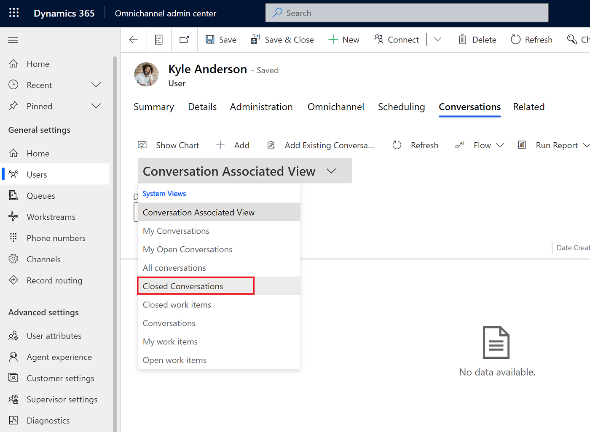
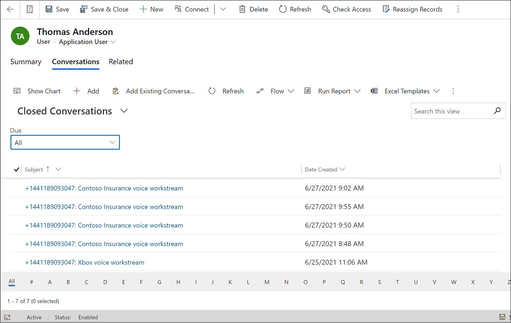

# Configure call recordings and transcripts in the voice channel

[!INCLUDE[cc-use-with-omnichannel](../includes/cc-use-with-omnichannel.md)]

As an administrator, you can enable live transcription and recording of calls, which allows agents and supervisors to view transcripts of customer calls.

> [!NOTE]
> Many countries and states have laws and regulations that apply to the recording of PSTN, voice, and video calls, and may require that users first consent to the recording of their communications. It is your responsibility to use the call recording capabilities in compliance with the law. Before using call recording features, you must obtain consent from the parties of recorded communications in a manner that complies with all applicable laws for each participant.

## Enable call recordings and transcripts for voice

1. In Customer Service admin center or Omnichannel admin center, select the workstream for which you want to enable recordings and transcripts.

1. In the **Phone number** section, next to the pencil icon, select **Edit**.

1. On the **Voice settings** page, select the **Behaviors** tab.
   > [!div class="mx-imgBorder"]
   > 

1. In the **Transcription and recording** section, select the **Transcript and recording** dropdown menu, select **Transcription** or **Transcription and recording**.

2. Under **Start setting**, set the toggle to **Automatic** if you want calls to be automatically recorded and transcribed when they begin, or **Manual** if you want agents to record and transcribe their calls.

3. Set **Allow agents to pause and resume** if you want to allow agents to control the portions of conversations that they record and transcribe.

4. Select **Save**.

## View call transcripts

You can view the call transcriptions in  Customer Service admin center or Omnichannel admin center.

1. In Customer Service admin center or Omnichannel admin center,  go to manage **Users**, and then select the user whose conversations you want to view.
2. Select the **Related** tab, and then select **Conversations** from the dropdown menu.
3. Select **Closed conversations** from the dashboard dropdown menu.

   > [!div class="mx-imgBorder"]
   > 

4. Select the conversation for which you want to access the recording and transcript.
  
   > [!div class="mx-imgBorder"]
   > 

## Delete call recordings

1. In the Dynamics 365 instance, go to the app and select the **Advanced Find** icon displayed on the menu.
1. On the **Advanced Find** page, select **Recordings** in the **Look for** dropdown list. More information: [Create, edit, or save an Advanced Find](/customerengagement/on-premises/basics/save-advanced-find-search).
1. Select the required recording.
1. Select the **Delete** icon.

### Storage location of your recordings and cost

The maximum file size of a recording can be 512 MB. The voice recordings and transcripts data resides in the following locations:

- **Data at rest**: Is stored in Dataverse wherever your Dynamics instance is located.
- **Data in transit**: For components within the Microsoft stack, we strive to ensure that data doesn’t cross geographical boundaries during transit. The bring your own carrier model has dependencies on third parties, and therefore, data needs to be reviewed end to end and will include components outside the Microsoft stack.

The data storage costs with two participants only is calculated approximately as follows and the cost can fluctuate:

- 20 minute call recording = 10240 KB
- 20 minute call transcript = 40 KB

### See also

[Overview of the voice channel](voice-channel.md)  
[Agent experience: View call recordings and transcripts](voice-channel-agent-experience.md)  
[Supported cloud locations, languages, and locale codes](voice-channel-region-availability.md)  
  
[!INCLUDE[footer-include](../includes/footer-banner.md)]
