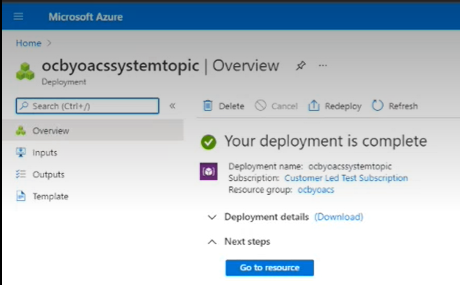
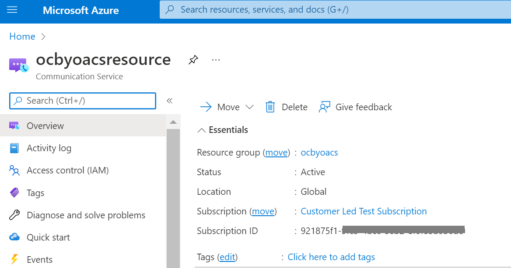

# Manage event grid system topics

[!INCLUDE[cc-use-with-omnichannel](../includes/cc-use-with-omnichannel.md)]

## Introduction

This topic explains how to create, deploy, and register event grid system topics for an existing Azure resource.

1. [Create, deploy, and register event grid system topics](#create-deploy-and-register-event-grid-system-topics).

2. [Create event subscription endpoint for recording](#create-event-subscription-endpoint-for-recording) to enable recording services in the voice channel.

3. [Create event subscription endpoint for SMS](#create-event-subscription-endpoint-for-sms) to enable SMS services.

## Create, deploy, and register event grid system topics

**To create, deploy, and register event grid system topics**

1. Open the Azure portal in a separate window or tab, and open the **Event Grid System Topics** service. 
2. Select **Create** and in the **Create Event Grid System Topic** page, enter the following details.
    - **Topic Types**: Select **Azure Communication Services** from the dropdown list.
    - **Subscription**: Select the subscription from the dropdown list.
    - **Resource Group**: Select the resource group from the dropdown list.
    - **Resource**: Select the Azure resource from the dropdown list.
    - **Name**: Enter a name for the system topic.
    > [!div class="mx-imgBorder"]
    > 
3. Select **Review + create**. The system topic is validated and deployed.  
    > [!div class="mx-imgBorder"]
    > 
4. Select **Go to resource**.
5. In the resource details page that opens, select the **Subscription** link.
    > [!div class="mx-imgBorder"]
    > 
6. In the resource subscription page, select **Settings** > **Resource providers**, and then check if the **Microsoft.EventGrid** provider is listed as **Registered**.
   If the event grid is not registered, you can select the record and then select **Re-register** to register it.
    > [!div class="mx-imgBorder"]
    > 

> [!Note]

> When you connect your event subscription, you must use the same app ID and directory ID for the app registration as you did when you first connected your Azure resource. To check which app ID and directory ID you used to connect your ACS resource, select the filter icon in the top right and search for communication provider setting entries.

### See also

[Manage phone numbers](voice-channel-manage-phone-numbers.md)  
[Connect to Azure Communication Services](voice-channel-acs-resource.md)  
[Connect to an existing Azure resource](voice-channel-connect-existing-resource.md)  
[Set up outbound calling](voice-channel-outbound-calling.md)  
[Get resource and app registration details from Azure portal](voice-channel-resource-app-details.md)  
[Register event grid system topics](voice-channel-event-grid.md)  
[Create event subscription endpoints](voice-channel-sub-endpoints.md)  
  
[!INCLUDE[footer-include](../includes/footer-banner.md)]