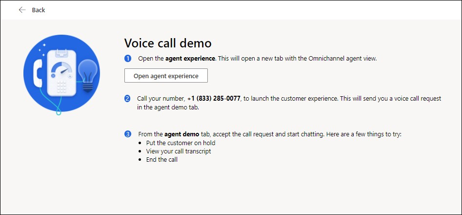

# Step 2: Get your first phone call

When you want to try the voice channel for the first time in your org, the system sets it up for you to have the first-run experience. The tasks in this section take you through the automatic setup steps.

**Note:** If you want to run the first phone call with a bot experience, the bot must be configured in Power Virtual Agents, published, and registered in Azure. The bot must be enabled for the environment in which you try the phone call. You might need to sign into [*Power Virtual Agents*](https://powerva.microsoft.com/environments) and select the right environment. More information: [*Working with environments in Power Virtual Agents*](https://docs.microsoft.com/power-virtual-agents/environments-first-run-experience).

## Set up voice demo

1.  In the **Omnichannel admin center (preview)** app, go to the Home page.

1.  On the **Try out live chat and voice calls** page, select **Set up voice demo**. You're directed to the setup page. The demo set up is automatic; however, you can watch the progress on the **We're setting up your voice demo** page.

**Note:** If someone in your org has already tried the first run experience, you'll see **Try voice** instead of **Set up voice demo**.

1.  After the demo is set up, the **Try out voice** page displays the option to **Open voice demo** and the settings that have been configured.

## Try out voice

1.  On the **Try out voice** page, select **Open voice demo**.

1.  On the **Voice call demo** page, select **Open agent experience**. The Omnichannel for Customer Service app opens on a new tab.

2.  Follow the instructions that appear on the **Voice call demo** page to try the agent and customer experience.

3.  Use a phone to initiate a call to the number listed on the **Voice call demo** page.

4. **IMPORTANT:** In the Omnichannel for Customer Service app, when the call comes in, you may be prompted for microphone permissions. Select **Allow** on the pop-up window.

1.  Select **Accept** on the incoming phone call to receive the call as an agent, and try the following through the call controls:

    -   Mute and hold

    -   See live call transcription and sentiment

    -   Take notes (in the overflow)

    -   Consult and transfer if other Omnichannel for Customer Service agents are signed in to the same environment

1.  Create a new contact with the **Mobile Number** field set to the phone number that you are calling from. On your next call, you'll automatically be identified as the contact.

## View the demo settings

Perform the following steps to see the settings that have been automatically configured by the system for the voice demo:

1.  On the **Try out live chat and voice calls** page, select **Try voice**.

2.  On the page that appears, select **View** for each step to see the settings that have been automatically configured as part of the demo.

3.  If you select **View** in the **Work stream, Phone number acquisition, or Voice channel** area, the work stream, routing rule, and work distribution settings that were configured as part of the demo setup are displayed.

1.  If you select **View** in the **Queue** area, the queue information is displayed.

