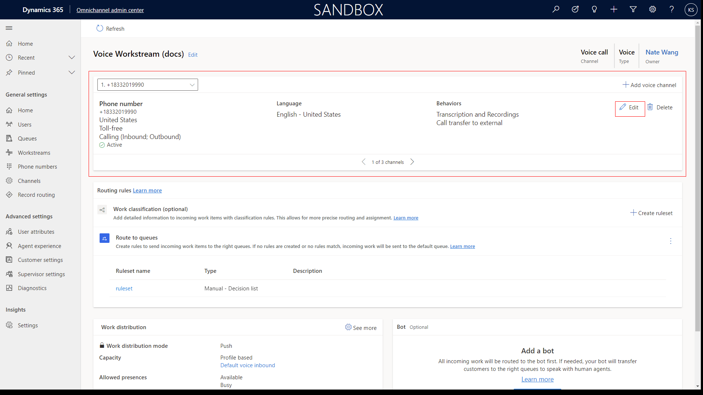
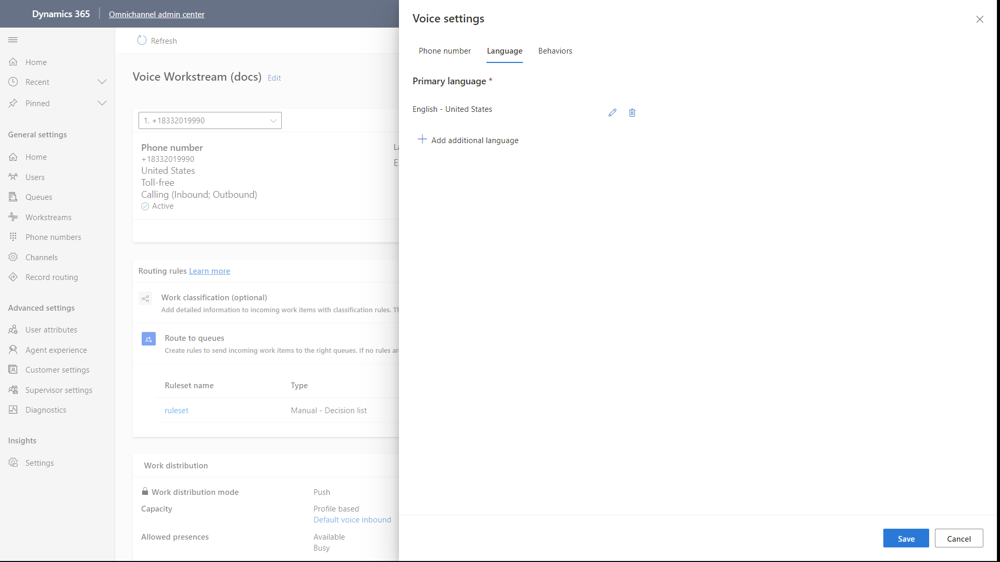
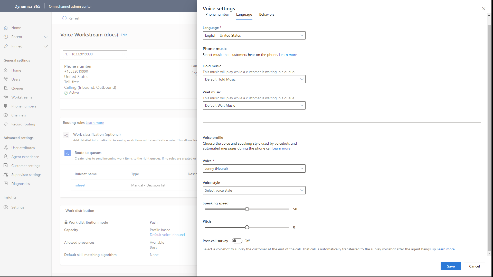
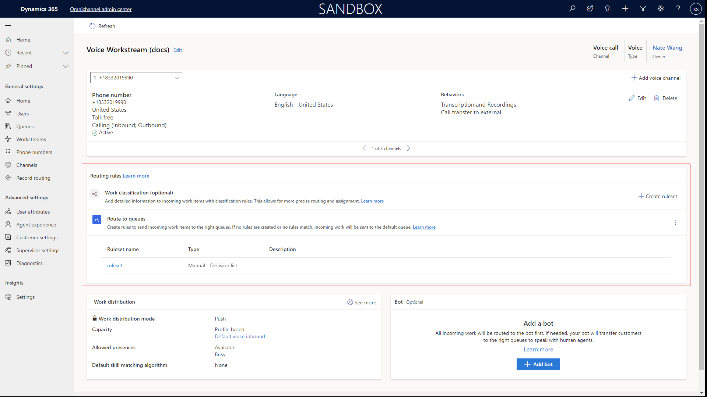
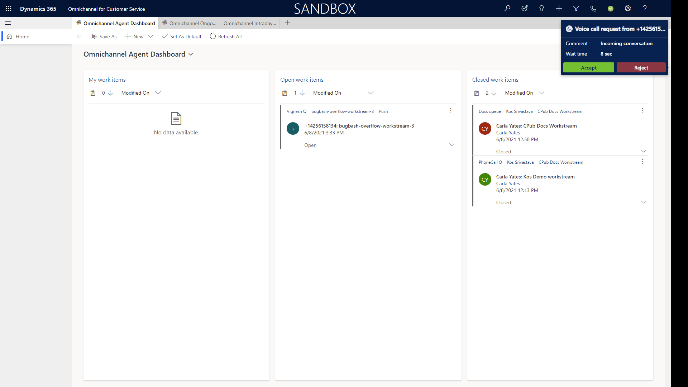

# Inbound calling

// Use the following videos for help in writing this doc
// Video references
// https://microsoft-my.sharepoint.com/:v:/p/kausri/EWPcqqb09OtKkN6_x5KhCy4B5WfyrPRN_yoU_Ez23Eswag?e=d3cseJ

// Use this for documentation -  https://msit.microsoftstream.com/video/9c970840-98dc-869d-c827-f1ebc890b85b
Agent exp
Admin exo

## Prerequisites

In order to receive inbound calls, you must have the following:

1. The Voice channel must be provisioned and set up
2. You must have an Agent set up
3. You must have a Queue set up

## Step 1: Create a phone number

### Phone Numbers

> [!div class="mx-imgBorder"]
> 

## Step 2: Configure phone number settings (Language, Behaviors, etc)

### Language

> [!div class="mx-imgBorder"]
> 

> [!div class="mx-imgBorder"]
> 

### Behaviors

> [!div class="mx-imgBorder"]
> 

## Step 3: Set up a workstream

### Routing Rules

> [!div class="mx-imgBorder"]
> 

> [!div class="mx-imgBorder"]
> 

## Step 4: Make and receive a call

### Make a call

A customer will call your support organization by simply calling the phone number you created. There are many ways a customer may find the phone number, like a website, portal, mobile app, via chat bot, etc.  

### Receive and accept a call

> [!div class="mx-imgBorder"]
> 

[Manage notification settings and templates](https://docs.microsoft.com/dynamics365/app-profile-manager/notification-templates)

## See also
- Add a Power Virtual Agent Bot
- Unified routing

