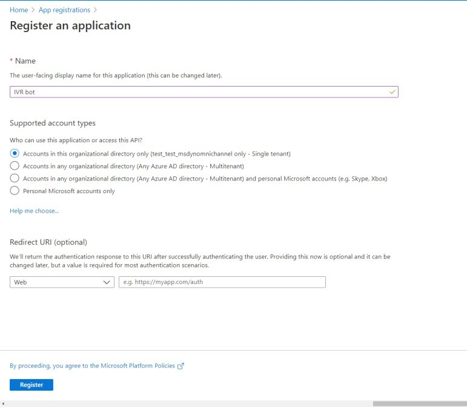

# Add conversational interactive voice response with Power Virtual Agents

[!INCLUDE[cc-use-with-omnichannel](../includes/cc-use-with-omnichannel.md)]

## Introduction

To route customers call to the best department, diagnose issues, collect information, and give recommendations, conversational IVR bots speak to customers when they call in. Power Virtual Agents makes it easy to author IVR bots and you can use the same bots for other channels, like chat and voice.

Some of the features of the Power Virtual Agents bots for voice are as follows:

- Customizable voices in the Omnichannel for Customer Service configuration experience.
- Questions in Power Virtual Agents using "Boolean" types do not prompt users with "Options are _Yes_ or _No_".
- All bot messages can be interrupted by the caller.

## Prerequisites

The following prerequisites must be met for the Power Virtual Agents bot:

- For the bot to have speech capabilities, it must be configured in Power Virtual Agents in the same Dynamics 365 environment in which you have configured the voice channel. More information: [Create a bot in an existing environment](/power-virtual-agents/environments-first-run-experience#create-a-bot-in-an-existing-environment).
- The bot is published, and the **Transfer to Agent** setting is configured by selecting Omnichannel for Customer Service. More information: [Configure seamless and contextual hand-off to Omnichannel for Customer Service](/power-virtual-agents/configuration-hand-off-omnichannel).
- The **Enable voice** option is selected in the **Omnichannel** section of the **Transfer to Agent** setting.

## Configure a bot for voice

Perform the following steps to add and configure a bot in Omnichannel for Customer Service.

1. In the **Omnichannel admin center** app, go to the workstream that you created for the voice channel, and then in the **Bot section,** select **Add Bot**.

1. On the **Add Bot** pane, select a bot from the **Name** box.

   > 

1. Select **Save and close**. The bot is added to the workstream.

   > 

More information:

- [Author template topics in Power Virtual Agents](/power-virtual-agents/authoring-template-topics)

- [Create topics and test your bot](https://go.microsoft.com/fwlink/?linkid=2062988)

### Configure handoff from Power Virtual Agents to Omnichannel for Customer Service

To configure the handoff between Power Virtual Agents bot to Omnichannel for Customer Service:

1. In Power Virtual Agents, go to **Settings** and select **Transfer to agent**.

1. Connect to **Dynamics 365 Omnichannel for Customer Service**.

1. Select **Azure App Registration**.

1. Select **New registration**.

    

1. Enter the name of your bot, and then select **Register**.

    

1. Copy the **Application ID** to the clipboard.

    

1. Return to Power Virtual Agents, paste the application ID into the field, and then select **Next**.

### See also

[Overview of the voice channel](voice-channel.md)  

[!INCLUDE[footer-include](../includes/footer-banner.md)]
