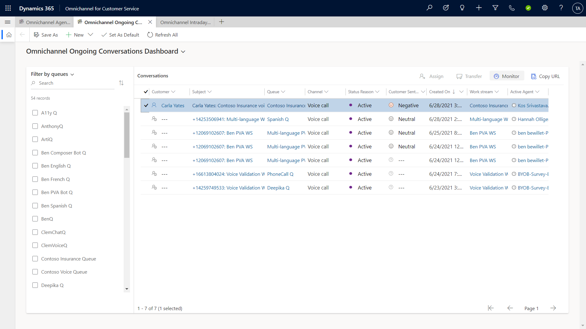
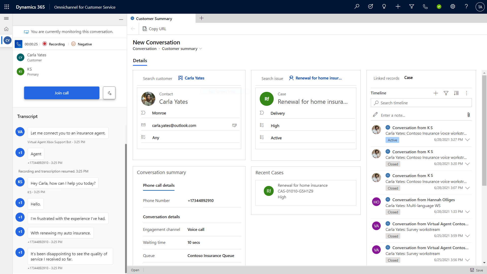

# Monitor calls

As a supervisor, it's useful to be able to monitor the calls between your agents and their customers without interrupting them to help identify which calls need attention. You can monitor the conversations without being seen as a participant by the agent or customer, as well as step into conversations when additional support is needed.

## Prerequisites
To monitor calls in the voice channel, you must have the **Omnichannel Supervisor** role. This role allows you to join and consult in ongoing conversations. 

## Monitor ongoing conversations 

On the **Omnichannel Ongoing Conversations** dashboard, you, as a supervisor, can view a list of active conversations, including customer sentiment analysis for each call.

> [!div class="mx-imgBorder"]
> 

To find out details about an individual conversation:
1. On the **Omnichannel Ongoing Conversations dashboard**, select it in the list of active conversations, and then select **Monitor**.

## Consult with an agent during a conversation

As a supervisor, you can privately consult with an agent by sending them messages that are hidden from the customer.

> [!div class="mx-imgBorder"]
> 

## Join a conversation (also known as barge)

If needed, you can select **Join call** to enter the conversation and speak with the agent, customer, or chat with the agent privately. When you join a conversation, the agent can see that you have joined.

> [!div class="mx-imgBorder"]
> 

By joining a conversation, you have access to call controls that allow you to capture details about the conversation, pause the conversation if needed, and engage with the agent and customer as needed.

### See also

[Introduction to the voice channel](voice-channel.md)
[Provision and set up the voice channel](voice-channel-install.md)
[Outbound calling](voice-channel-outbound-calling.md)  
[Route incoming calls to agents](voice-channel-route-queues.md)  
[Add Azure Bot Service for conversational IVR](voice-channel-azure-bot-service.md)  
[View voice calls usage](voice-channel-usage.md)  
[Configure post-call survey](voice-channel-survey.md)  

[!INCLUDE[footer-include](../includes/footer-banner.md)]
