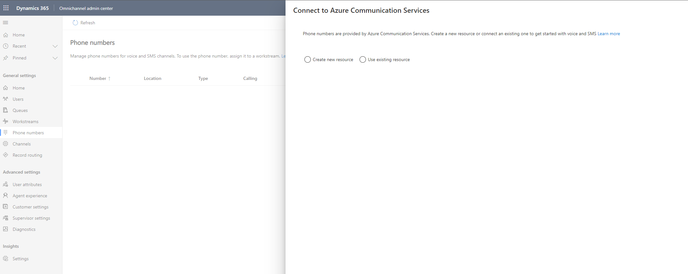
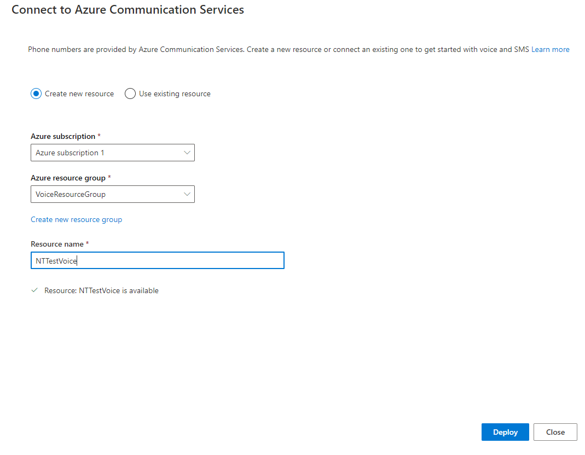
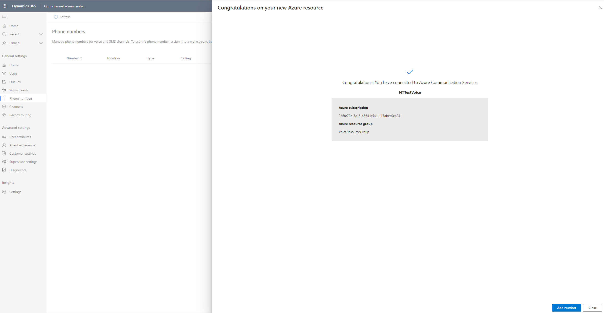

# Number management

//Video 1: https://msit.microsoftstream.com/video/08ba0840-98dc-b561-3805-f1ebd1855239

//Video 2: https://msit.microsoftstream.com/video/dd07a1ff-0400-b564-49f4-f1eb6cbe2392

## Use number included with the Voice Channel 

Free trial comes with 1 number and 60 minutes of free calling. There is no need to connect to Azure Communication Services.

After the 60 minutes, purchase a new number. You cannot purchase the trial number. 

## Create a new phone number

### Connect to Azure Communication Services

> [!div class="mx-imgBorder"]
> 
To be able to use voice and SMS services in Omnichannel for Customer Service, you must have a resource that connects to Azure Communication Services. You can either create a new resource or use an existing one to connect to Azure Communication Services. You can also use a resource that you previously disconnected or unlinked from Azure Communication Services.

### Prerequisite

To create a new phone number, you need the following:
- A valid Azure subscription that's in the same tenant as your Dynamics 365 account. 
- At least contributor-level permissions to the Azure subscription. To check your role, open your subscription and view the **My role** column of your subscription on the Azure portal.

<!--
Otherwise, select the [**Use existing resource**](#use-existing-resource) option and copy and paste the relevant information from your Azure subscription. 
-->

> [!div class="mx-imgBorder"]
> 

### Create a new resource

> [!div class="mx-imgBorder"]
> 

> [!div class="mx-imgBorder"]
> 

> [!NOTE]
> The resource group name should be unique within a given subscription.

### Use existing resource

Say, you already have an Azure Communication Services resource that you'd like to use to connect with voice or SMS, you can use the **Use existing resource** option to connect to Azure Communication Services. Also, if you had previously unlinked a resource and wish to use it now, you can do so using this option. You can use an existing resource from any of your Azure subscriptions, available under *any* tenant. 

Before you proceed with adding an existing resource to Azure Communication Services, open your existing resource from the Azure portal in a new window or tab.  Select **Settings** > **Properties**, and get ready to copy the resource values (using the Copy to clipboard button) from this resource to Omnichannel admin center.

**To use an existing resource**

1. Open Omnichannel admin center. Under **General Settings**, select **Phone numbers**, and then select **Get started**. 
   The **Connect to Azure Communication Services** dialog opens. 

2. Select **Use existing resource** and enter the following details:
   1. ACS Resource Name: Copy the name from your existing resource here.
   2. ACS Resource ID
   3. Connection String
   4. Event grip app ID
   5. Event grip app tenant ID

3.

4.

5.

### Add a number 

Features

> [!div class="mx-imgBorder"]
> 

You cannot remove feature once granted to a phone number, but you can upgrade phone number features.

Summary

> [!div class="mx-imgBorder"]
> 

Purchase Number

## Add a number to a workstream

## Edit a number

Select a number, click on Edit, upgrade a plan

Reasons to upgrade:
- enable Outbound
- enable SMS

You cannot remove feature once granted to a phone number, but you can upgrade phone number features.

## Release a number

Releasing a number will delete a number

## Configuration considerations

### Import existing numbers from Azure Communication Services

### Unlink resources

## Additional notes

You can only use 1 ACS resource for number management
