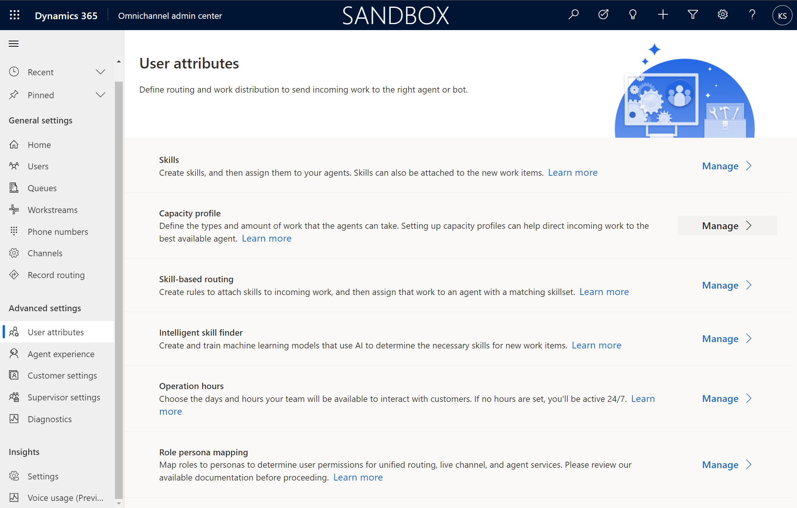
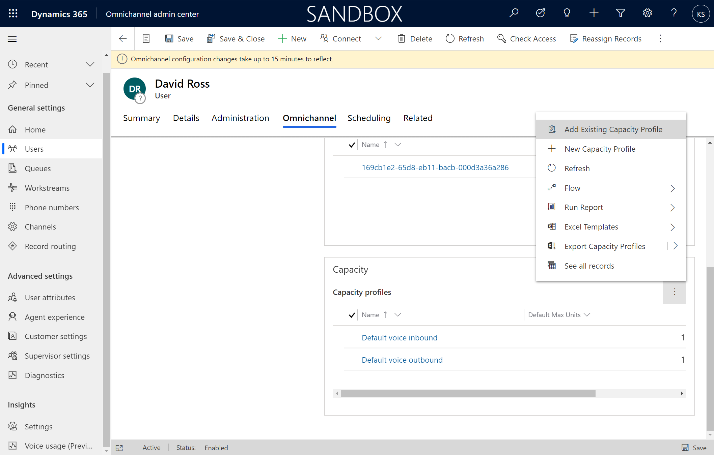
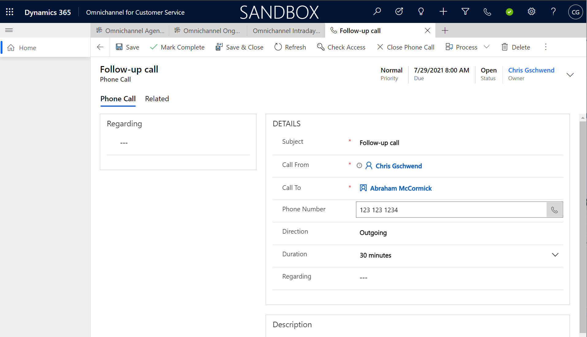

<!--
IT admin perspective by Chris
video: https://msit.microsoftstream.com/video/78a80840-98dc-b561-710e-f1ebd538f986
-->

# Outbound calling

> [!INCLUDE[cc-use-with-omnichannel](../includes/cc-use-with-omnichannel.md)]

> [!IMPORTANT]
> [!INCLUDE[cc-preview-feature](../includes/cc-preview-feature.md)]
>
> [!INCLUDE[cc-preview-features-definition](../includes/cc-preview-features-definition.md)]
>
> [!INCLUDE[cc-preview-features-expect-changes](../includes/cc-preview-features-expect-changes.md)]
>
> [!INCLUDE[cc-preview-features-no-ms-support](../includes/cc-preview-features-no-ms-support.md)]
>
> [!INCLUDE[cc-preview-features-send-us-feedback](../includes/cc-preview-features-send-us-feedback.md)]

This section describes how you as an IT administrator can set up outbound calling for phone numbers in your organization. After you set up outbound calling, your agents can make calls to customers via the Omnichannel Agent dashboard in Omnichannel for Customer Service.

If you do not have any phone numbers provisioned for your business, then see [Create a new phone number](voice-channel-number-management.md#create-a-new-phone-number) to learn how you can acquire new phone numbers.

## Prerequisites

Before you set up outbound voice calls for your business, you'll need the following:

- [Configure one or more phone numbers for outbound calling](#configure-a-phone-number-for-outbound-calling). 
- [Create a voice type queue](voice-channel-route-queues.md#create-queues-for-voice-channels) or use an existing voice queue to associate with the outbound profile.
- Add users to the voice queue and set their capacity profile.
- [Create an outbound profile](#create-an-outbound-profile)

## Configure a phone number for outbound calling

To check for phone numbers configured for outbound calling, go to **General settings** > **Phone numbers (preview)**, and check if you have numbers with **Make calls** mentioned in the **Calling** column.

**To configure a number for outbound calling**

1. In Omnichannel admin center, under **General settings**, select **Phone numbers (preview)**.
  
   The list of all available phone numbers for your business is displayed.

2. Select a phone number and select **Edit number**.

3. In the **Edit number** dialog, in the **Calling plans** area, select the **Make calls** option, and then select **Upgrade**.
   Your phone number is now upgraded for outbound calling.

This phone number will now be displayed to your customers when your agents call them.

> [!div class="mx-imgBorder"]
> 

> [!div class="mx-imgBorder"]
> 

>[!NOTE] 
> Though you can use the same queue for both inbound and outbound calling, we recommend that you create separate queues for inbound and outbound calling. This will help your supervisors monitor and report outbound specific traffic and sentiment. *Having a separate outbound queue...*

## Add a user to the voice queue

> [!div class="mx-imgBorder"]
> 

## Create a capacity profile

- number of outbound calls a person can make at one time

> [!div class="mx-imgBorder"]
> 

> [!div class="mx-imgBorder"]
> 

## Assign a user the capacity profile

> [!div class="mx-imgBorder"]
> 

> [!div class="mx-imgBorder"]
> 

## Create an outbound profile

You can define the way outbound calls are made and also who can make them. To create an outbound profile, you'll need a phone number that's enabled for outbound calling. This means that in your calling plan for that number, the **Make calls** checkbox must be selected. In private preview, only *one* outbound profile can be created. While you can edit the profile, you cannot delete it. *The first run experience creates an outbound profile by default.*

**To create an outbound profile**

1. In the site map of Omnichannel admin center, select **Agent experience** under the **Advanced settings** menu.

2. Select **Manage**, next to **Outbound profiles (preview)**.

3. If there are no available profiles, select **Create a profile**, else select **Add profile**.

4. In the **Create outbound profile** dialog, enter the following details:
   a. In the **Basic info** section, add the following details:
     - **Profile name**: Enter a profile name.
     - **Phone number**: Select a phone number from the dropdown list. Note that the list only shows those numbers enabled for outbound calling. If you don't see any numbers in the list, you'll need to [configure a number for outbound calling](#configure-a-phone-number-for-outbound-calling).
     - **Queue**: Select a queue from the dropdown list. Note that the list shows only voice type queues. If you don't see any queues in the list, you'll need to [create a voice type queue](voice-channel-route-queues.md#create-queues-for-voice-channels).
     - **Capacity**: Select one or more capacity profiles from the dropdown list.
     - **Hold music**: Select a music file that you want played when the customer is put on hold during a call.
     - **Wait music**: Select a music file that you want played when the customer is waiting to get into a call.
     - **Transcription and recording**: Select **None**, **Transcription only**, or **Transcription and recording**, based on your business scenarios and requirements. As an administrator, you may want to set the value to **None** for business transactions like customer billing where you don't want to record financial data.
     - **Start setting**: Indicates whether you want to start transcription and/or recording when the call begins. The default value is **Automatic**, which means transcription and recording will automatically begin at the start of the conversation.
     - **Allow agents to pause and resume**: Indicates whether you want to allow your agents to pause and resume call transcription and recording. The default value is **Yes** which means your agents can choose when to pause and resume call transcription and recording in the conversation panel.

5. Select **Save and close**.

**To edit an outbound profile**

1. In the site map of Omnichannel admin center, select **Agent experience** under the **Advanced settings** menu.

2. Select **Manage**, next to **Outbound profiles (preview)**. The list of outbound profiles is displayed.

3. Select a profile from the list and select **Edit**. In the **Edit outbound profile** dialog, update details in the **Basic info**, **Behaviors**, and **Advanced settings** sections. For more information on session and notification templates, see [Manage session templates](../app-profile-manager/session-templates) and [Manage notification settings and templates](../app-profile-manager/notification-templates).

4. Select **Save and close**.

> [!div class="mx-imgBorder"]
> 

> [!div class="mx-imgBorder"]
> 

> [!div class="mx-imgBorder"]
> 

> [!div class="mx-imgBorder"]
> 

## Configuration considerations

### Call backs

Oftentimes agents need to call customers back at a later time. It is recommended to create a phone call activity with direction set to Outbound as a reminder for the agent. 

> [!div class="mx-imgBorder"]
> 

> [!div class="mx-imgBorder"]
> 

> [!div class="mx-imgBorder"]
> 

> [!div class="mx-imgBorder"]
> 

> [!div class="mx-imgBorder"]
> 

> [!div class="mx-imgBorder"]
> 

### Understanding outbound queues

By creating an outbound queue, this allows managers to see outbound calls in the Omnichannel Ongoing Conversations Dashboard. Not used for capacity planning, used for monitoring and reporting.