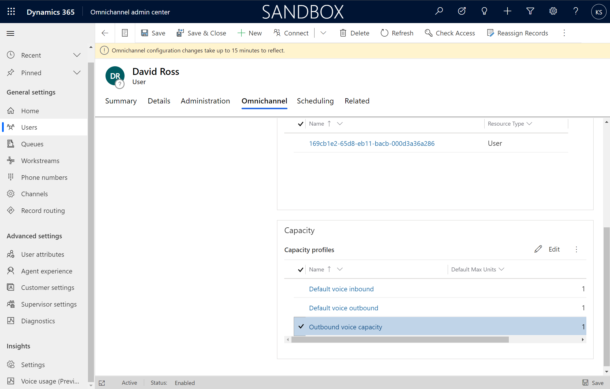
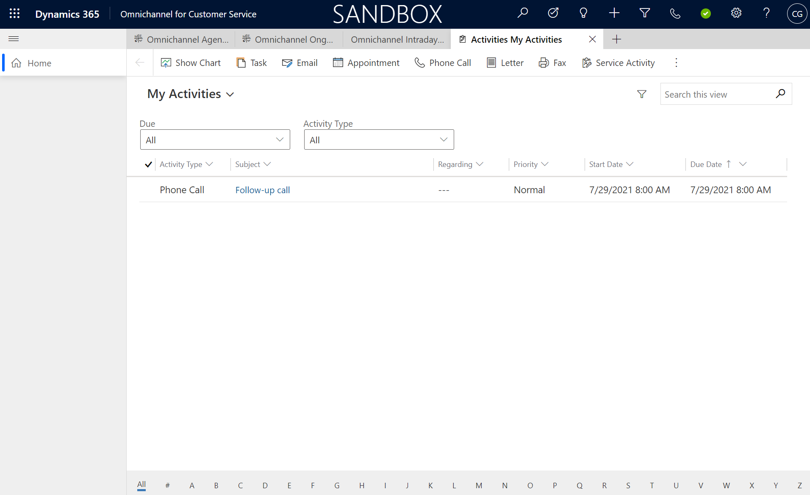

# Outbound calling

// Video: https://msit.microsoftstream.com/video/78a80840-98dc-b561-710e-f1ebd538f986
IT admin perspective

- You need a profile to set up an outbound profile
- outbound profile (Advanced Settings > Agent experience > Outbound profiles (preview)), you cannot delete it, you can only change it.
- Create an outbound profile - Select **Create a profile**

## Prerequisites

> [!Note]
>

## Configure a phone number for outbound calling

- Enable Make calls

> [!div class="mx-imgBorder"]
> 

## Create a queue

- must be "voice" type queue

> [!div class="mx-imgBorder"]
> 

>[!TIP] 
> It it recommended to create a queue specifically for outbound calling. This helps with monitoring and reporting like outbound specific sentiment. Though it is supported for a queue to be both inbound and outbound. 

## Add a user to the queue

> [!div class="mx-imgBorder"]
> 

## Create a capacity profile 
- number of outbound calls a person can make at one time

> [!div class="mx-imgBorder"]
> 

> [!div class="mx-imgBorder"]
> 

## Assign a user the capacity profile 

> [!div class="mx-imgBorder"]
> 

> [!div class="mx-imgBorder"]
> 

## Create an outbound profile

You can define the way outbound calls are made and also who can make them. In private preview, only *one* outbound profile can be created and it cannot be deleted. To create an outbound profile, you'll need a phone number that's enabled for outbound calling. This means that in your calling plan for that number, the **Make calls** checkbox must be selected.  should be able to make calls from the phone number.    

**To create an outbound profile**

1. In the site map of Omnichannel admin center, select **Agent experience** under the **Advanced settings** menu.

2. Select **Manage**, next to **Outbound profiles (preview)**.
   
   The list of outbound profiles is displayed.

3. Select **Add profile**. In the **Create outbound profile** dialog, enter the following details:
   a. In the **Basic info** section, add the following details:
     - Profile name:
     - Phone number:
     - Number label:
     - Queue:
     - Capacity:
   
   b. In the **Behaviors** section, add the following details:
     - Language:
     - Hold music:
     - Wait music:
     - Call transfer to external phone number:
     - Consult with teams
     - Transcription and recording
     - Start setting
        
   c. In the **Summary** section, add the following details:

     - Queue:
     - Capacity:

4. Select **Save and close**.

**To edit an outbound profile**

1. In the site map of Omnichannel admin center, select **Agent experience** under the **Advanced settings** menu.

2. Select **Manage**, next to **Outbound profiles (preview)**.
   
   The list of outbound profiles is displayed.

3. Select a profile from the list and select **Edit**. In the **Create outbound profile** dialog, enter the following details:
   a. In the **Basic info** section, add the following details:
     - Profile name:
     - Phone number:
     - Number label:
     - Queue:
     - Capacity:
   
   b. In the **Behaviors** section, add the following details:
     - Language:
     - Hold music:
     - Wait music:
     - Call transfer to external phone number:
     - Consult with teams
     - Transcription and recording
     - Start setting
        
   c. In the **Advanced settings** section, add the following details for the session and notification templates that are used for outbound voice calls:
     - Session - default:
     - Notification - consult:
     - Notification - transfer:

4. Select **Save and close**.

> [!div class="mx-imgBorder"]
> 

- The first run experience create an outbound profile by default.

> [!div class="mx-imgBorder"]
> 

Profile Name
Phone Number - use outbound calling phone number. shows in caller ID.
Queue
Capacity
Hold Music
Wait music
Transcription and recording
Start setting
Allow agents to pause and resume

Advanced Settings

Session-default

Notification-consult

Notification - transfer

See the topic on [Message session templates](https://docs.microsoft.com/dynamics365/app-profile-manager/session-templates) for more details.

## Call a customer

> [!div class="mx-imgBorder"]
> 

> [!div class="mx-imgBorder"]
> 

## Configuration considerations

### Call backs

Oftentimes agents need to call customers back at a later time. It is recommended to create a phone call activity with direction set to Outbound as a reminder for the agent. 

> [!div class="mx-imgBorder"]
> 

> [!div class="mx-imgBorder"]
> 

> [!div class="mx-imgBorder"]
> 

> [!div class="mx-imgBorder"]
> 

> [!div class="mx-imgBorder"]
> 

> [!div class="mx-imgBorder"]
> 

## Additional Notes

### Understanding outbound queues

By creating an outbound queue, this allows managers to see outbound calls in the Omnichannel Ongoing Conversations Dashboard. Not used for capacity planning, used for monitoring and reporting. 