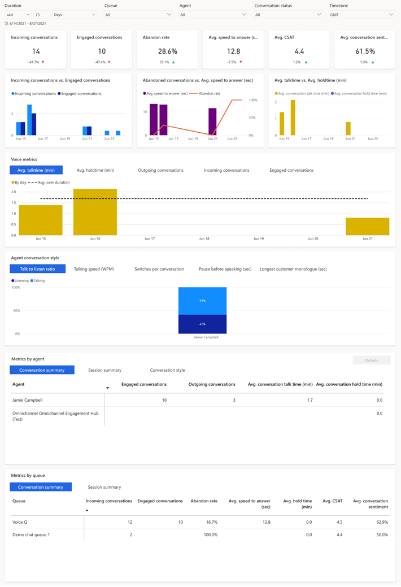
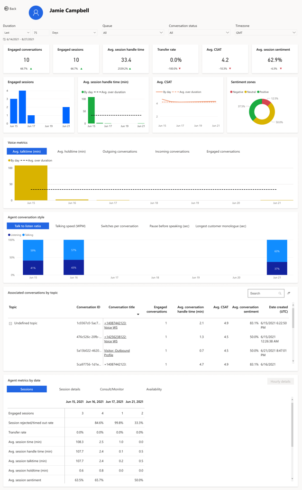

# Voice channel historical analytics, reports, and call insights

[!INCLUDE[cc-use-with-omnichannel](../includes/cc-use-with-omnichannel.md)]

> [!IMPORTANT]
> This feature is intended to help customer service managers or supervisors enhance their team's performance and improve customer satisfaction. This feature is not intended for use in making, and should not be used to make, decisions that affect the employment of an employee or group of employees, including compensation, rewards, seniority, or other rights or entitlements. Customers are solely responsible for using Dynamics 365 Customer Service, this feature, and any associated feature or service in compliance with all applicable laws, including laws relating to accessing individual employee analytics and monitoring, recording, and storing communications with end users. This also includes adequately notifying end users that their communications with agents may be monitored, recorded, or stored and, as required by applicable laws, obtaining consent from end users before using the feature with them. Customers are also encouraged to have a mechanism in place to inform their agents that their communications with end users may be monitored, recorded, or stored.

The Voice analytics report provides comprehensive information on the overall performance of customer support across the voice channel. The reports provide administrators and supervisors with a visualization and ability to filter across channels, queues, agents, and date ranges to help better understand performance and troubleshoot problem areas.

 

**Navigation**

You can view the Voice dashboard in the Customer Service workspace or Omnichannel for Customer Service app. You can navigate to the **Voice** dashboard as follows:

- In the default view, select the plus (**+**) icon, and then select **Omnichannel historical analytics**. On the page that appears, select **Voice**.
- If the enhanced multisession workspace view is enabled, select the site map and then select **Omnichannel historical analytics**. On the page that appears, select **Voice**.

## Report details 

The following KPIs are displayed in the Voice dashboard.

| Metric | Definition (historical)  |
|----------------|---------------------|
| Incoming conversation  | The number of conversations initiated by the customer and can be presented to a human agent. |
| Engaged conversations  | The conversations that the agent was engaged in. Customer-to-agent communication can begin at this point. |
| Abandon Rate | Percentage of conversations that are not engaged by agents.
| Average wait time | The average time customers waited before connecting to agents. Similar to "speed to answer", but includes time waited on each session within a conversation. |
| Average Speed to answer | The average time customers waited in the queue before connecting to an agent (the time for acceptance). |
| Avg. CSAT | The average of customer satisfaction ratings provided by customers. Only available if customer voice is being configured as a post-conversation survey tool. |
| Avg. Conversation sentiment | The average sentiment score based on the verbatim provided in customer voice survey. |
| Avg. handle time | The average time that an agent spent on a conversation.  |
| Transfer rate | The percentage of times a conversation was transferred from one agent to another agent. |
| Avg. customer effort | The time that a customer spent on a conversation to get their issue resolved. |
| Avg. sessions per conversation | The average sessions created and engaged for each conversation engaged. |

The following report includes conversation intelligence, which uses analytics and data science to gather data from agent call recordings and Omnichannel for Customer Service. Conversation intelligence analyzes the data to provide you with the information and insights to intelligently manage your support team and proactively coach agents.

 

| Metric  | Definition  |
|----------------|------------|
| Talk to listen ratio | The average listen and talk ratio of agent in conversations with customers.  |
| Talking speed (WPM) | The average number of words used per minute by agent. |
| Switches per conversation | The average exchanges between an agent and a customer in a conversation; the number of times the conversation switched from one person to another. This is a sign of engagement during conversations. |
| Pause before speaking (sec)  | The milliseconds the agent paused before responding to customer queries; indicates agent's patience. |
| Longest customer monologue (sec)  | The longest monologue by the customer with an agent; indicates that the agent is asking good questions and understanding customer needs. |

## View call insights

Supervisors can look into each topic, and view the CSAT and sentiment to see coaching opportunities. Supervisors can view details of a conversation to see what happened by drilling through the topics and selecting a conversation title.

Supervisors can see entire transcripts to understand the conversation style and get precise verbatim used so they can make informed decisions about training requirements for the agent.

> [!div class="mx-imgBorder"]
> 

### See also

[Introduction to the voice channel](voice-channel.md)  
[Provision and set up the voice channel](voice-channel-install.md)  
[View voice calls usage](voice-channel-usage.md)  

[!INCLUDE[footer-include](../includes/footer-banner.md)]

