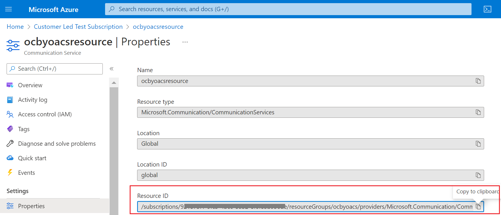
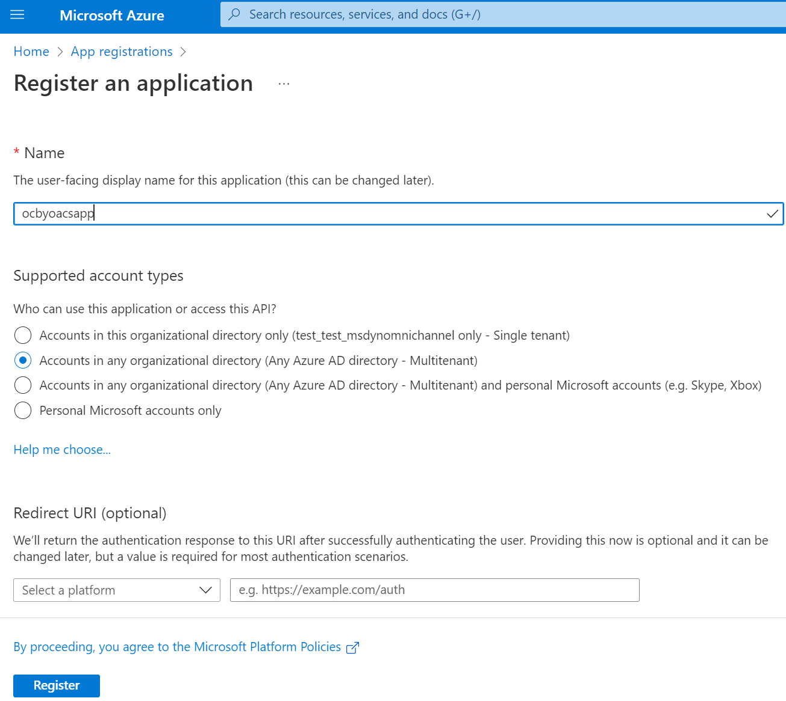

# Get resource and app details for an Azure resource

[!INCLUDE[cc-use-with-omnichannel](../includes/cc-use-with-omnichannel.md)]

## Introduction

This article includes short procedures to help you retrieve the resource name, resource ID, connection string, application ID, and tenant ID for an existing Azure resource from the Azure portal.

## Prerequisites

xx

### Get resource name and ID

**To get the resource name and ID from the Azure portal**

1. Open your existing resource on the Azure portal in a separate window or tab, and go to **Settings** > **Properties**.
2. Select the value of the **Name** field, select the **Copy to clipboard** button, and then paste the value in the **ACS Resource Name** field of the **Use existing resource** dialog.
   > [!div class="mx-imgBorder"]
   > 
3. Select the value of the **Resource ID** field, then select the **Copy to clipboard** button, and paste the value in the **ACS Resource ID** field of the **Use existing resource** dialog.

   > [!div class="mx-imgBorder"]
   > 

### Get connection string

**To get the connection string from the Azure portal**

1. Open your existing resource on the Azure portal in a separate window or tab, and go to **Tools** > **Keys** > **Primary key**. 
2. Select the value of the **Connection string** field, then select the **Copy to clipboard** button, and paste the value in the **Connection string** field of the **Use existing resource** dialog.

   > [!div class="mx-imgBorder"]
   > 

### Get application and tenant IDs

**To get the application and tenant IDs from the Azure portal**

1. Open the **App registrations** page on the Azure portal in a separate window or tab.

    If you're registering your app on the Azure portal for the first time, then do the following:
    1. On the **Register an application** page, enter the following details:
        - **Name**: Enter a name for your application.
        - **Supported account types**: Select **Accounts in any organizational directory (Any Azure AD directory - Multitenant)**.
    2. Select **Register**.
       > [!div class="mx-imgBorder"]
       > 

2. Select the value of the **Application (client) ID** field, select the **Copy to clipboard** button, and then paste the value in the **Application ID** field of the **Use existing resource** dialog.
   > [!div class="mx-imgBorder"]
   >  ID.")

3. Select the value of the **Directory (tenant) ID** field, then select the **Copy to clipboard** button, and paste the value in the **Tenant ID** field of the **Use existing resource** dialog.
   > [!div class="mx-imgBorder"]
   >  ID.")

### See also

[Overview of the voice channel](voice-channel.md)  
[Manage phone numbers](voice-channel-manage-phone-numbers.md)  
[Connect to Azure Communication Services](voice-channel-acs-resource.md)  
[Connect to a new Azure resource](voice-channel-connect-new-resource.md)  
[Get resource and app registration details from Azure portal](voice-channel-connect-existing-resource.md)  
[Register event grid system topics](voice-channel-event-grid.md)  
[Create event subscription endpoints](voice-channel-sub-endpoints.md)  
[Set up outbound calling](voice-channel-outbound-calling.md)  
[Bring your own carrier](voice-channel-bring-your-own-number.md)   
[Integrate third-party IVR systems with voice channel](voice-channel-contextual-transfer-external-ivr.md)  

[!INCLUDE[footer-include](../includes/footer-banner.md)]
