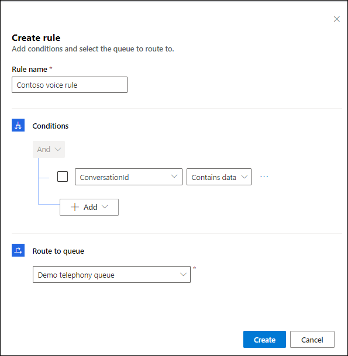
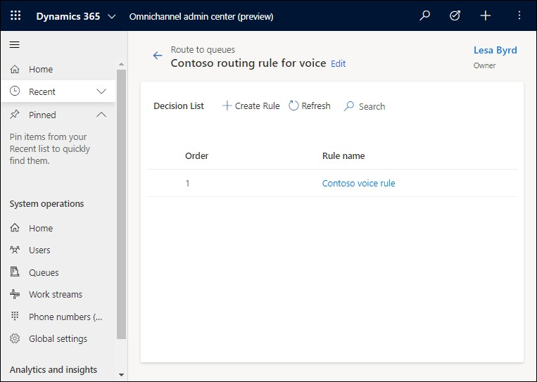
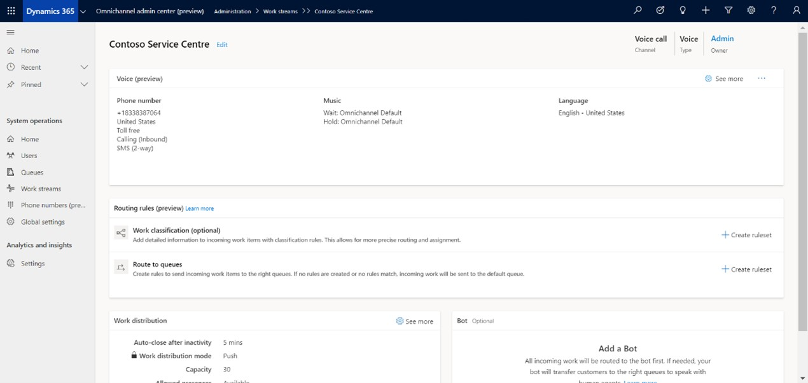
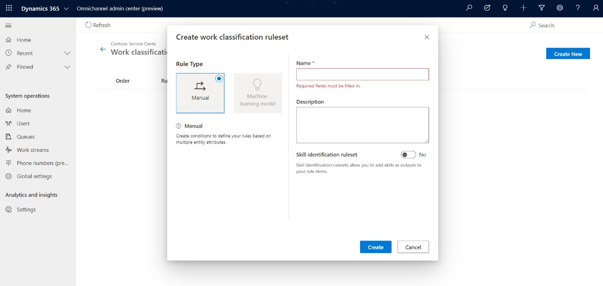
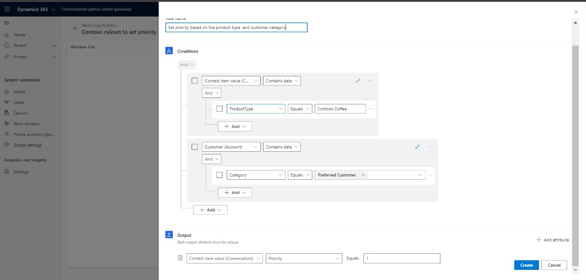
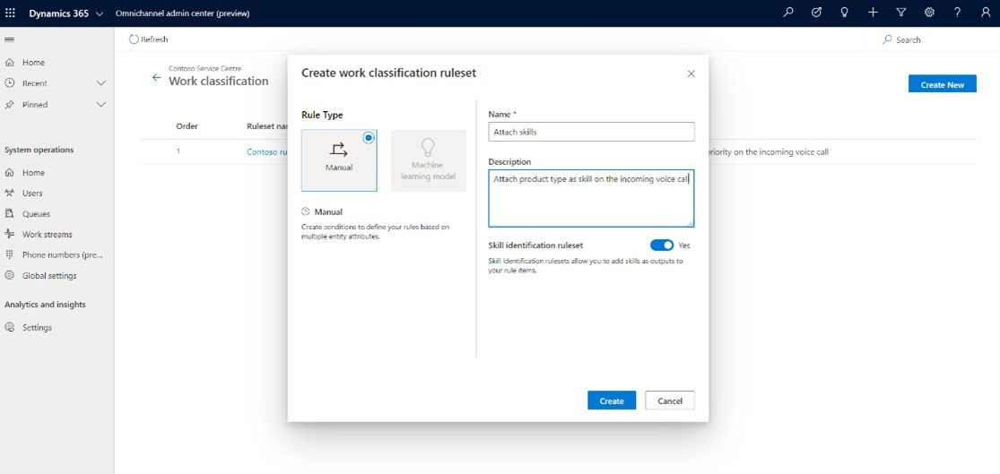
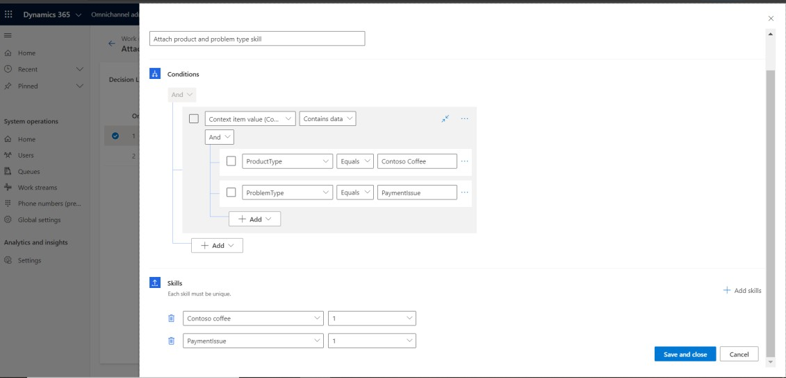
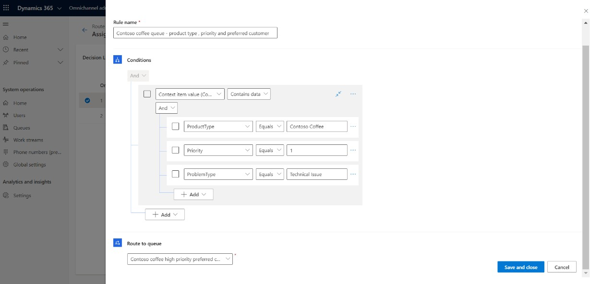
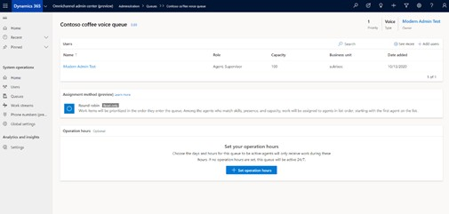

# Set up workstreams and queues for the voice channel

A workstream is a container to enrich, route, and assign work items. The workstream can be associated with a channel, such as live chat and voice.

You'll perform the steps mentioned in this article in the Omnichannel admin center app.

## Set up a voice workstream

Do the following to configure a workstream for voice:

1. On the left pane, select **Workstreams**, and then on the **Create a workstream** dialog, enter the following.

2. Enter the following details for the work stream:

    - **Name:** An intuitive name, such as Contoso voice workstream.
    - **Type:** Select **Voice**.

    > [!Note]
    > By default, **Owner** and **Channel** are predefined and unavailable, and only push is available for work distribution mode.

3. Select **Create**. The workstream that you created is displayed.

    

## Configure a voice channel

To configure the voice channel, you'll need to associate the workstream with a phone number for routing the calls. You can view the list of available phone numbers by selecting **Phone numbers** in the left pane. To acquire a new number, you can select **Add number** on the **Phone numbers** page. More information: [Acquire a phone number](#acquire-a-phone-number).

To configure the voice channel:

1. Go to the workstream that you created, and on the page that appears, select **Set up voice**.

2. On the **Phone number** page, select a number from the list, and select **Next**.

> [!NOTE]
> Only those numbers are displayed that have inbound calls enabled and are not already associated with any other workstream. Use the steps in [Acquire a phone number](#acquire-a-phone-number) if you want to configure a new number.

1. On the **Music** page, select **Next** again. In private preview, the option to select the audio for ring tone is not available.

2. On the **Language** page, select **Next**. In private preview, only English is supported.

3. On the **Summary** page, select **Save and close**.

The phone number is associated with the workstream.

## Acquire a phone number

You can acquire additional phone numbers on the **Phone numbers** page. The following conditions are applicable:

- Only three phone numbers are available in one org.

- Only U.S. numbers, and toll-free numbers.

- Inbound calling must be enabled on the phone number.

- If you are adding a number, before you can use it, it must be in the **Ready** state.

> [!Note]
> If you acquire new numbers in private preview, you will not be charged for the new phone numbers. After preview, you will be charged per phone number. All rates are subject to change.

To acquire a phone number:

1. Select **Add number**.

    

2. Select **Next**.

3. On the page that appears, select United States in **Country/Region**, and Toll free for **Number type**.

4. Make sure that you select the options for inbound and outbound.

    

5. Select **Next**.

6. On the **Summary** page, review the details and select **Purchase phone number**. It takes a few minutes for the new phone number to be added, so don't close the page immediately. After a few seconds, a prompt will appear to indicate that you can either close the page or continue to wait until the purchase information is displayed. At this point, the number provisioning will start and will continue the process even if you close the page.

7. Select **Close**.

    

## Create queues for voice channels

In Customer Service, work items are assigned to a queue and agent with the help of unified routing. Unified routing is an intelligent, scalable, and enterprise grade routing and assignment capability that can assign the incoming work item to the best suited queue and agent while adhering to work item requirements and matching them with the agent's capabilities using round robin routing. More information: [Overview of unified routing](overview-unified-routing.md)

In this section, we'll cover information on how to create a queue for the voice channel and routing rules to evaluate conditions and assign work items.

### Create a queue for the voice channel

In the left pane, select **Queues**, and then complete the following steps to create a queue for the voice channel:

1. On the **Queues** page, select **New**, and on **Create a queue** dialog, enter the following details:

    - **Name**: Specify a name.
    - **Type**: Select **Voice**.
    - **Group number**: Enter a number.

2. Select **Create**. The queue is created.
3. On the queue page, select **Add users**, and on the **Add users** flyout menu that appears, select the users and select **Add**.

   > [!NOTE]
   > You can add only those users who are configured for unified routing.

   

### Assignment rules for a queue

By default, the assignment method for a voice queue is round robin. In the round robin method, work items will be prioritized in the order they enter the queue. Among the agents who match skills, presence, and capacity, work will be assigned to agents in the order they are listed, which means that the agent listed on the top is assigned first.

## Configure a routing rule for the workstream for voice

Navigate to the workstream for which you have configured the voice channel and perform the following steps:

1. In the **Routing rules** area, in the **Route to queues** option, select **Create ruleset**.

2. On the **Create route-to-queues ruleset** dialog, provide a name and description, and then select **Create**.

    

1. On the page that appears, select **Create rule**.

2.  On the **Create rule** page, enter a rule name, and in **Conditions**, define set of conditions using the conversation entity and related entity attributes.

3.  In **Route to queue**, select the queue that you created and to which the voice call must be routed when the conditions specified are met.

1.  Select **Create**. The rule is created and appears in the list of rules.

1.  Create as many rules as your business requires.

## Additional notes

Unified routing is an intelligent, scalable, and enterprise grade routing and assignment capability that can assign the incoming work item to the best suited queue and agent while adhering to work item
requirements and matching them with the agent's capabilities on the other side using round robin routing.

Unified routing can assign incoming work item from all channels- cases, live chat, digital messages, and voice. It works in a truly omnichannel way ensuring work items on all the channels are routed in a consistent and similar fashion and thus the agent engagement on different channels is respected before any new work is assigned to them.

Unified routing has two broad stages – classification and assignment. During the classification phase, rules can be used to add information on the work item which can be further used to find the best suited agent. This stage can be termed as creating the demand on the incoming voice call. As part of classification rules, declarative skill attachment rules can be defined as well. For voice channel, skills can't be attached using the machine learning model.

During the assignment phase, the work items are prioritized as per the business needs and then matched against the agent using round robin routing.

For a simple and quick voice call routing, there is no need to set up any rules for unified routing. By

default, all the incoming voice calls will get routed to 'Default voice queue' and will get assigned to the

agents following the round robin assignment methodology.

Work classification and route to queues ruleset can be configured for a work stream as per the business needs.

Routing rules for a work stream

Routing rules are configured for a work stream. A work stream is a container for work items to be enriched, routed, and assigned. A work stream is associated with a channel, such as voice and chat. Routing rules are written as rulesets which consist of rule items. Routing rules for a work stream are comprised of work classification rules and route-to-queue rules.

Routing rules are divided into following:

*Work classification rules*

Work classification rules are for updating work item attributes. They are written in the format of - if defined condition satisfies then set the output attributes to certain values. They are optional and can be used to add additional detailed information to the incoming work items, which are then further used for more precise routing and assignment.

They are declarative rules written as decision list in the following ways:

-   Manual – Rules to update work item attributes. They are written in the format of if defined condition satisfied, then set the output attributes to certain values. Create conditions to define rules based on multiple entity attributes.

-   Skill attachment rules – A sub type of manual work classification rules and are rules defined to attach skills to the work item. They are written in the format of if defined condition satisfied, then attach defined skills to the work item.

*Queue routing rules*

Queue routing rules are rules to assign queue to the work item. They are written in the format of- if defined condition satisfies then route the work item to the defined queue. They are optional and if no rules are defined or no rules match, then the incoming work item will be routed to the default queue of the respective channel type. For a work stream, the route to queue ruleset is run after all the work classification rulesets have been run. A work stream has only one route to queue ruleset.

Configure work classification rules: Manual work classification ruleset

1.  For a work stream, from **Work** classification area under Routing rules routing, select **Create ruleset**, and then select **Create New**.

1.  Choose **Rule Type** as **Manual** and provide a name and description for the ruleset, and then select **Create**.

1.  Select **Create Rule** to create a rule item within this ruleset and provide a name for the rule.

2.  In the **Conditions** section, define a set of conditions using the conversation entity and related entity attributes.

1.  In the **Output** section, select the attribute from the conversation entity or related entity whose value will be set if the conditions are met.

2.  Create multiple rulesets as your business needs. All rulesets will run in order in such a way that output attributes that are set in the previous ruleset can be used in conditions in the next rulesets. Within a ruleset, rule items will run in order following first-match policy, which means as soon as the rule item condition is satisfied, no further rule items will run in that ruleset and control will shift to next ruleset in the order.

Configure skill identification rules: Manual skill identification ruleset

1.  For a work stream, from a routing rule section, select **Create ruleset**, and then select **Create New**.

2.  Select **Rule Type** as **Manual**, provide a name and description for the ruleset, toggle **Skill identification ruleset** to **Yes**, and select **Create**.

1.  Select **Create Rule** to create a rule item within this ruleset and provide a name for the rule.

2.  In the **Conditions** section, define set of conditions using conversation entity and related entity attributes.

3.  In the **Skills** section, select skills and optional skill proficiency required. These skills will be attached to the conversation if the above defined conditions are satisfied.

Route to queue rules: Route to queue ruleset

1.  For a work stream, in **Work classification** under the **Route to queues** section, select **Create ruleset**, and then select **Create New**.

2.  Select **Create Rule** to create a rule item within this ruleset and provide a name for the rule.

3.  In **Conditions**, define set of conditions using conversation entity and related entity attributes.

4.  In **Route to queue**, select the queue where work items should route if the above conditions are satisfied.

1.  To route all incoming work items to a specific queue irrespective of the conditions, set attribute

**ConversationId** to **Not null**, and select the queue.

1.  Route to queues have only one ruleset which can have multiple rule items within.

Assignment rules for a queue

By default, the assignment method for a voice queue is round robin. In the round robin method, work items will be prioritized in the order they enter the queue. Among the agents who match skills, presence, and capacity, work will be assigned to agents in the order they are listed, which means that the agent listed on the top is assigned first.

