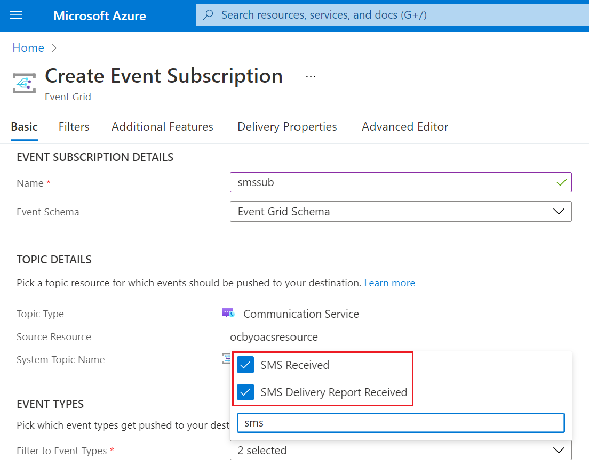
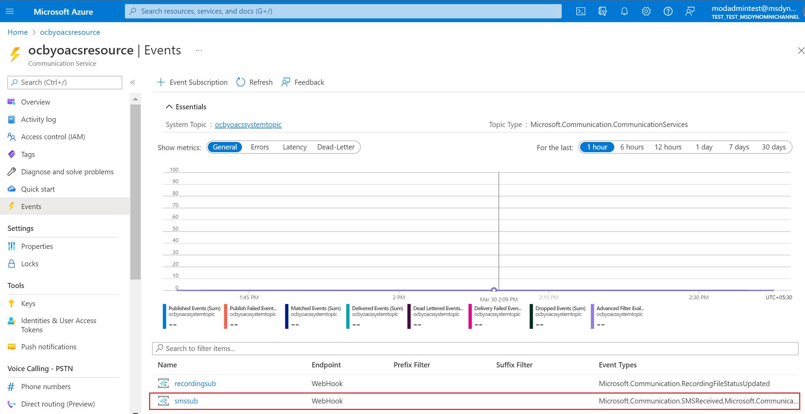

# Enable recording and SMS services 

[!INCLUDE[cc-use-with-omnichannel](../includes/cc-use-with-omnichannel.md)]

This article explains how you can enable recording and SMS services by creating event subscription endpoints. To do this, you must first subscribe to the corresponding events by creating [Event Grid](/azure/event-grid/overview) subscriptions on the Azure portal.

## Prerequisites

- Get the application (client) ID and directory (tenant) ID from the App registrations page of your Azure resource.
- [Get the subscriber endpoint for recording](#get-the-subscriber-endpoint-for-recording).
- [Get the subscriber endpoint for SMS](#get-the-subscriber-endpoint-for-sms).

## Get the subscriber endpoint for recording

1. In Dynamics 365, go to one of the apps, and perform the following steps.
   ### [Customer Service admin center](#tab/customerserviceadmincenter)

    1. In the site map, select **Channels** in **Customer support**. The **Channels** page appears.
    
    2. Select **Manage** for **Phone numbers**.

   ### [Omnichannel admin center](#tab/omnichanneladmincenter)

   - In the site map of Omnichannel admin center, under **General settings**, select **Phone numbers**. 

1. In the **Phone numbers** page that opens, select a phone number, and then select **Advanced**.

1. In the **Manage Azure Communication Services** page that opens, select **Copy** next to **Recording Web Hook Endpoint** and paste the web hook endpoint value in the **Subscriber Endpoint** field.
    > [!div class="mx-imgBorder"]
    > 

## Get the subscriber endpoint for SMS

1. In Dynamics 365, go to one of the apps, and perform the following steps.
   ### [Customer Service admin center](#tab/customerserviceadmincenter)

    1. In the site map, select **Channels** in **Customer support**. The **Channels** page appears.
    
    2. Select **Manage** for **Phone numbers**.

   ### [Omnichannel admin center](#tab/omnichanneladmincenter)

   - In the site map of Omnichannel admin center, under **General settings**, select **Phone numbers**. 

1. In the **Phone numbers** page that opens, select a phone number, and then select **Advanced**.

1. In the **Manage Azure Communication Services** page that opens, select **Copy** next to **SMS Web Hook Endpoint** and paste the value in the **Subscriber Endpoint** field.
    > [!div class="mx-imgBorder"]
    > 

## Create event subscription endpoints

1. Open the resource on the Azure portal, go to **Events**, and select **Event Subscription**.

2. In the **Create Event Subscription** dialog, enter the following details in the **Basic** tab.
    > [!div class="mx-imgBorder"]
    > 
    - **Name**: Enter a name for the recording event subscription.
    - **Event Schema**: Select **Event Grid Schema** from the dropdown list.
    - **System Topic Name**: This field is automatically populated with the system topic name you created. However, if you see multiple values, select the specific system topic name from the dropdown.
    - **Filter to Event Types**: For recording services, select the **Recording File Status Updated (Preview)** option from the dropdown list. 
    - **Endpoint Type**: Select **Web Hook** from the dropdown list.
    - **Endpoint**: Select **Select an endpoint** and in the **Select Web Hook** dialog that opens, enter the **Subscriber Endpoint** and select **Confirm Selection**.

3. Go to the **Additional Features** tab, select the **Use AAD authentication** checkbox, and enter the following details.
    > [!div class="mx-imgBorder"]
    > 
   - **AAD Tenant ID**: Copy the **Directory (tenant) ID** field value from your Azure resource to this field. Not sure how to get your tenant ID? See [Get application and tenant IDs](voice-channel-resource-app-details.md#get-application-and-tenant-ids).
   > [!div class="mx-imgBorder"]
   >  ID.")
   - **AAD Application ID or URI**: Copy the **Application (client) ID** field value from your Azure resource to this field. Not sure how to get your application ID? See [Get application and tenant IDs](voice-channel-resource-app-details.md#get-application-and-tenant-ids).
   > [!div class="mx-imgBorder"]
   >  ID.")

4. Select **Create** to create the event subscription endpoint for recording. This might take some time, so if you get a sync error, try refreshing after some time.

    > [!div class="mx-imgBorder"]
    > 

## Create event subscription endpoint for SMS

For SMS services, select **SMS Received** and **SMS Delivery Report Received** options from the dropdown list.

<!--->
## Create event subscription endpoint for SMS

1. Open the resource on the Azure portal, go to **Events**, and select **Event Subscription**.

2. In the **Create Event Subscription** dialog, enter the following details in the **Basic** tab.
    - **Name**: Enter a name for the recording event subscription.
    - **Event Schema**: Select **Event Grid Schema** from the dropdown list.
    - **System Topic Name**: This field is automatically populated with the system topic name you created. However, if you see multiple values, select the specific system topic name from the dropdown.
    - **Filter to Event Types**: Select both **SMS Received** and **SMS Delivery Report Received** from the dropdown list.
       > [!div class="mx-imgBorder"]
    > 
    - **Endpoint Type**: Select **Web Hook** from the dropdown list.
    - **Endpoint**: Select **Select an endpoint** and in the **Select Web Hook** dialog that opens, enter the **Subscriber Endpoint**.

3. Go to the **Additional Features** tab, select the **Use AAD authentication** checkbox, and enter the following details.
    > [!div class="mx-imgBorder"]
    > 
   - **AAD Tenant ID**: Copy the **Directory (tenant) ID** field value from your Azure resource to this field. Not sure how to get your tenant ID? See [Get application and tenant IDs](voice-channel-resource-app-details.md#get-application-and-tenant-ids).
   > [!div class="mx-imgBorder"]
   >  ID.") 
   - **AAD Application ID or URI**: Copy the **Application (client) ID** field value from your Azure resource to this field. Not sure how to get your application ID? See [Get application and tenant IDs](voice-channel-resource-app-details.md#get-application-and-tenant-ids).
   > [!div class="mx-imgBorder"]
   >  ID.")

4. Select **Create** to create the event subscription endpoint for SMS. This might take some time, so if you get a sync error, try refreshing after some time.
    > [!div class="mx-imgBorder"]
    > 

--->

### See also

[Manage phone numbers](voice-channel-manage-phone-numbers.md)  
[Connect to Azure Communication Services](voice-channel-acs-resource.md)  
[Connect to an existing Azure resource](voice-channel-connect-existing-resource.md)  
[Set up outbound calling](voice-channel-outbound-calling.md)  
[Get resource and app registration details from Azure portal](voice-channel-resource-app-details.md)  
[Register event grid system topics](voice-channel-event-grid.md)  
  
[!INCLUDE[footer-include](../includes/footer-banner.md)]