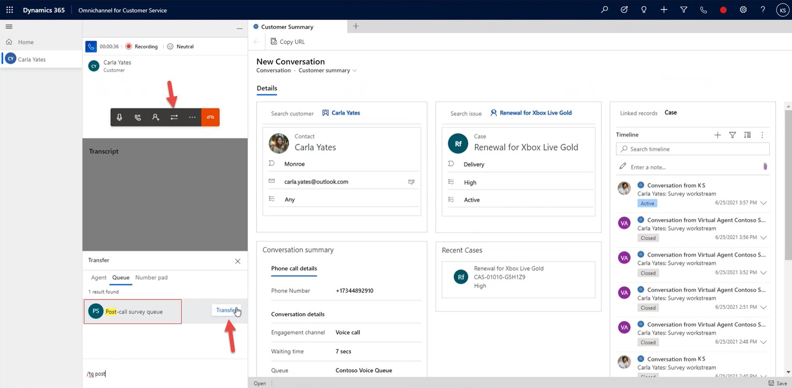

# Configure a post-call survey

[!INCLUDE[cc-use-with-omnichannel](../includes/cc-use-with-omnichannel.md)]

## Introduction

Post-call surveys help measure customer satisfaction in the contact center. Surveys are also an incentive for agents to provide high-quality service. You can configure the survey to take place immediately after the call so that customers can provide their feedback while the conversation is fresh on their minds.

There are three ways to start post-call surveys:

- **Automatic - implicit**: The IVR bot informs the customer about a post-call survey at the end of the call. 
    After the agent disconnects, the call is automatically transferred to a post-call survey bot.
- **Automatic - explicit**: The IVR bot asks the customer if they want to participate in a post-call survey. The consent is saved in a `va_SurveyConsent` Boolean variable.

    If the customer consents, the call is automatically transferred to the post-call survey bot at the end of the agent call. If the customer says no, the call ends when the bot hangs up.

- **Agent-initiated**: Towards the end of a call, the agent can ask the customer if they want to take a survey.
    If the customer says yes, the agent manually transfers the call to the survey bot.

> [!NOTE]
> We recommend that you have two bots if your organization wants to use Power Virtual Agents for both IVR and survey scenarios.

## Step 1: Create a survey bot

Use either Power Virtual Agents (no-code or low-code experience) or Azure bot Service (pro-developer experience).

### Types of surveys in Power Virtual Agents

The following screenshots are examples of the survey types in Power Virtual Agents.

#### Implicit survey

> [!div class="mx-imgBorder"]
> 

#### Explicit survey

> [!div class="mx-imgBorder"]
> 

> [!div class="mx-imgBorder"]
> 

> [!TIP]
> The bot author can use Power Automate to implement custom business logic to decide who receives a survey (for example, the bot may decide to survey someone random, VIP customers, and so forth).

## Step 2: Connect your bot to Omnichannel for Customer Service

- Configure your Power Virtual Agents bot. More information: [Configure handoff to Omnichannel for Customer Service](/power-virtual-agents/configuration-hand-off-omnichannel#configure-hand-off-in-the-power-virtual-agents-app) and [Integrate a Power Virtual Agents bot](configure-bot-virtual-agent.md).
- Configure your Azure bot. More information: [Integrate an Azure bot](configure-bot.md)

## Step 3: Enable post-call survey in phone number settings of the workstream

> [!Note]
> Enabling the post-call survey feature isn't required for the agent-initiated scenario.

1. In **Omnichannel admin center**, select your voice workstream, and then select **Edit** next to the pencil icon to modify the settings.
2. Under **Language**, scroll to the bottom of the dialog, and then toggle **Post-call survey** to **On**.
3. From the dropdown menu, select the required bot.
4. Select **Confirm**.

## Agent-initiated survey

1. Create a queue where only the agent is the bot user.

   > [!div class="mx-imgBorder"]
   > 

2. Transfer the call to the survey queue.

   > [!div class="mx-imgBorder"]
   > 

3. When answered, this sends the user to the bot's greeting topic.

   > [!div class="mx-imgBorder"]
   > 

### See also

[Introduction to the voice channel](voice-channel.md)  
[Outbound calling](voice-channel-outbound-calling.md)  
[Route incoming calls to agents](voice-channel-route-queues.md)  
[Integrate an Azure bot](configure-bot.md)  

[!INCLUDE[footer-include](../includes/footer-banner.md)]
