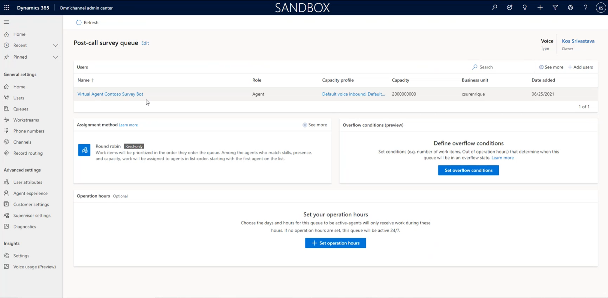
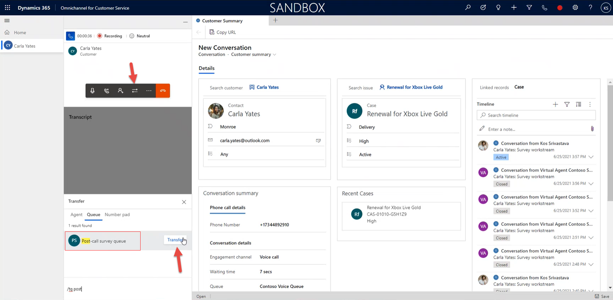
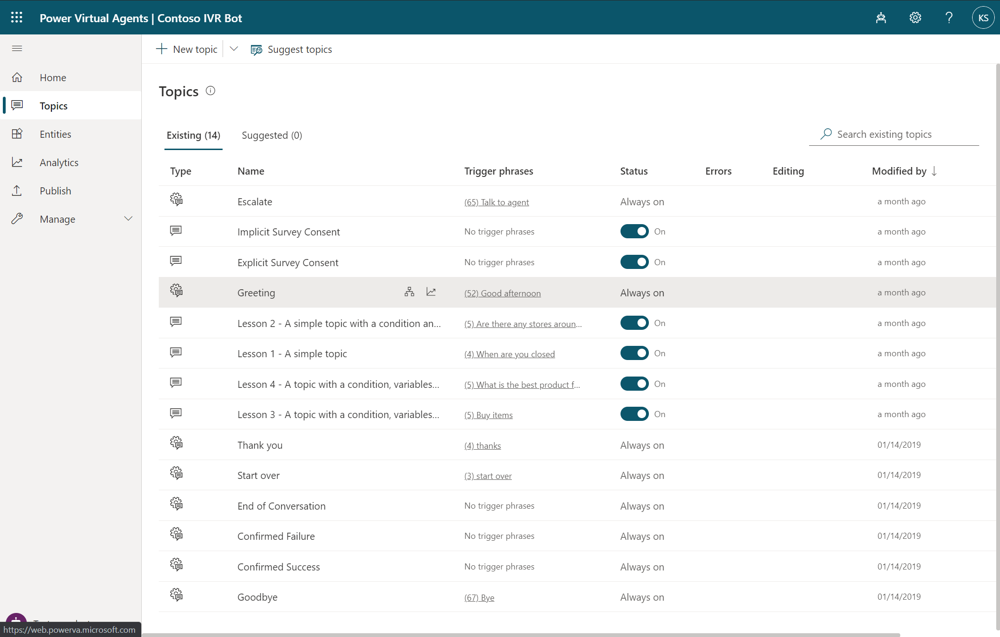

# Configure a Post-call survey

Post-call surveys help measure customer satisfaction in the contact center. Surveys are also an incentive for agents to provide high-quality service. Having the survey take place right after a call gives customers an opportunity to offer feedback while the conversation is fresh on their minds.

There are three ways to initiate post-call surveys:

1. Automatic - implicit
    The IVR bot informs the customer about a post-call survey at the end of the call. 
    After the agent disconnects, the call is automatically transferred to a post-call survey bot.
2. Automatic - explicit
    The IVR bot asks the customer if they want to participate in a post-call survey. The consent is saved in a va_surveyconsent Boolean variable.
    If the customer consents, the call is automatically transferred to the post-call survey bot at the end of the agent call.
    If the customer says no, the call ends when the agent hangs up.
3. Agent-initiated
    Toward the end of a call, the agent can ask the customer if they want to take a survey. 
    If the customer says yes, the agent manually transfers the call to the survey bot.

## Configuration considerations

We recommend that you have two bots if your organization wants to use Power Virtual Agent for both IVR and survey scenarios.

## Step 1: Create a survey bot
Use either Power Virtual Agent (no-code or low-code experience) or Azure bot Service (pro-developer experience)

### Power Virtual Agent examples

#### Implicit survey

> [!div class="mx-imgBorder"]
> 

#### Explicit survey

> [!div class="mx-imgBorder"]
> 

> [!div class="mx-imgBorder"]
> 

> [!TIP] 
> The bot author can use Power Automate to implement custom business logic to decide who receives a survey (for example, the bot may decide to survey someone random, VIP customers, and so forth).

## Step 2: Connect your bot to Omnichannel

- Configure your PVA bot. More information: [Configure handoff to Omnichannel for Customer Service](https://docs.microsoft.com/power-virtual-agents/configuration-hand-off-omnichannel) and [Configure a bot](configure-bot-virtual-agent.md).
- Configure your Azure bot. More information: [Integrate an Azure bot](configure-bot.md)

## Step 3: Enable Post-call survey in workstream phone number settings

> [!Note]
> Enabling the Post-call survey feature isn't required for the agent-initiated scenario.

1. In **Omnichannel admin center**, select your voice workstream, and then select **Edit** to modify the settings.
2. Under **Language**, scroll to the bottom of the dialog, and then toggle **Post-call survey** to **On**.
3. From the drop-down menu, select the bot that you want to complete the survey.
4. Select **Confirm**.

## Agent-initiated survey

1. Create a queue where only the agent is the bot user.

   > [!div class="mx-imgBorder"]
   > 

2. Transfer the call to the survey queue.

   > [!div class="mx-imgBorder"]
   > 

3. When answered, this sends the user to the bot's greeting topic.

   > [!div class="mx-imgBorder"]
   > 

### See also

[Introduction to the voice channel](voice-channel.md)
[Outbound calling](voice-channel-outbound-calling.md)  
[Route incoming calls to agents](voice-channel-route-queues.md)  
[Add Azure Bot Service for conversational IVR](voice-channel-azure-bot-service.md) 

[!INCLUDE[footer-include](../includes/footer-banner.md)]
