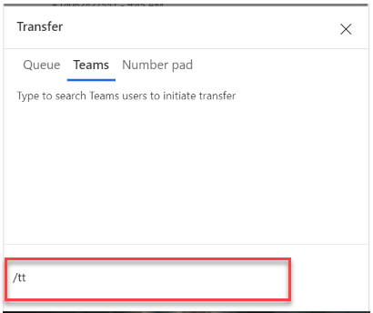
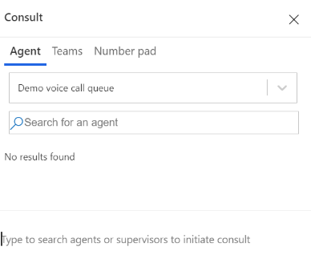
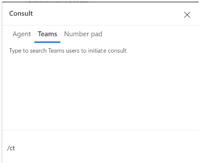

# Transfer calls and consult with users in the voice channel

You can transfer calls or consult with other agents or supervisors to collaborate with them on questions that you might have when you're on a call with a customer. 

To familiarize yourself with the call controls, see [Understand how to use the agent dashboard and call controls](voice-channel-agent-experience.md).

## How you can transfer calls

When you receive an incoming call, you can transfer the call to an agent, a queue, a public switched telephone network(PSTN) Teams user, or an external PSTN number. After you transfer the call, the following actions occur:

 - The customer is automatically put on hold. Hold music plays for the customer. 
 - The primary agent must manually remove the customer from hold.

**Transfer the call**

1. Select **Transfer** in the call window. 

    > [!div class="mx-imgBorder"]
    >  
   
   The **Transfer** dialog box appears. The **Queue**, **Teams**, and **Number pad** tabs are displayed.
  
    > [!div class="mx-imgBorder"]
    > 

3. Based on your requirement, perform one of the following steps.

    - **Transfer to a queue**: Select **Queue**, search for the queue you want to transfer the call to, and then select **Transfer**. The customer is put on hold. The agent who picks up the transferred call will become the primary agent and you will become the secondary agent and will be removed from the call. The primary agent must manually remove the customer from hold. 

        > [!div class="mx-imgBorder"]
        >  
    
    - **Transfer to an external PSTN number**: Select **Number pad**. On the number pad that appears, enter the customer's country code, phone number, and then select **Call** to make your call.  

        > [!NOTE]
        > Once the number is added, the maximum waiting time to transfer the call is eight minutes. If you fail to transfer the call within eight minutes, enter the number again and start over in the queue.

    - **Transfer to Teams user via PSTN**: Select **Teams**, and use the search option to search for a Microsoft Teams user. The results are filtered based on the name and the live presence of the users in Microsoft Teams.   
        > [!div class="mx-imgBorder"]
        >   

    If you've selected either the external PSTN number or Teams to transfer the call, you can talk to the secondary agent who picks up the call, while the customer is on hold. To complete the call transfer, you must select the transfer button next to the secondary agent name in the call window. The secondary agent is now the primary agent and you will be removed from the call.

    > [!NOTE]
    > The call recording and transcript of the conversation with the Teams user is saved in the application for reporting and compliance.

## How you can use consult to collaborate with other agents or supervisors

You can collaborate with another agent, a supervisor, or an external participant (PSTN number or a Teams PSTN number) by using the consult option.  

When you initiate a consult, the following actions occur:
- You are the primary agent. 
- The customer is automatically put on hold. Hold music plays for the customer.
- When the invited collaborator joins the call, they have a consult role.
- The primary agent must manually remove the customer from hold. During a consult, the primary agent can choose to transfer the call to the new participant. 
- If the primary agent ends the call, the call will end for everyone. 
- If the primary agent refreshes their browser, all the participants will be on hold until the primary agent returns to the call. 

**Consult with another user**

1. Select **Consult** in the call window. 

    > [!div class="mx-imgBorder"]
    >  
   
   The **Consult** dialog box appears. The **Agent**, **Teams**, and **Number pad** tabs are displayed.
    > [!div class="mx-imgBorder"]
    >  

3. Based on your requirement, perform one of the following steps.
4
    - **Consult with an internal agent or supervisor**: Select **Agent**. You can either have a call or chat with an internal agent. Select the conversation channel and then search for the agent you'd like to consult with. 
         > [!div class="mx-imgBorder"]
         >  
    - **Consult, then transfer**: The primary agent who initiated the consult can transfer the call to any participant involved in the consult. To transfer a conversation to the consulting agent in the conversation, perform the following steps:
       - If the consult is with an external participant (PSTN or Teams through PSTN), select **Transfer** next to the external phone number in the call window.
       - If the consult is with an internal agent or a supervisor, select  **Transfer** on the call controls. See: [Call controls](voice-channel-agent-experience.md#call-controls)
       - After the call is transferred, the primary agent becomes the consulting agent and can leave the call without ending the call. The consulting agent becomes the primary agent. If the primary agent leaves the call, the call will end for the customer. 

   - **Consult with external PSTN number**: Select the **Number Pad**. On the number pad that appears, enter the customer's country code, phone number, and then select Call to make your call. 
    By default, the consultation is private, the customer is on hold while the primary agent speaks with the new participant. You can also have a public consultation, where the customer is actively involved in the conversation.  
    To make the consultation public, select **Hold** to put the call on hold. When the secondary agent has joined the conversation, remove the customer from hold to continue the consultation. 

   - **Consult with Teams user with PSTN**: Select **Teams** and use the search option to search for and select the Microsoft Teams user you'd like to consult with.  See: [Enable voice consult with Microsoft Teams users](voice-consult-microsoft-teams-user.md) 
        > [!div class="mx-imgBorder"]
        >  
    
    The call recording and transcript of the conversation with the Teams user is saved in the application for reporting and compliance.

### See also

[Overview of the voice channel](voice-channel.md)  
[Enable voice consult with Microsoft Teams users](voice-consult-microsoft-teams-user.md)  
[Call a customer](voice-channel-call-customer.md)  

[!INCLUDE[footer-include](../includes/footer-banner.md)]
