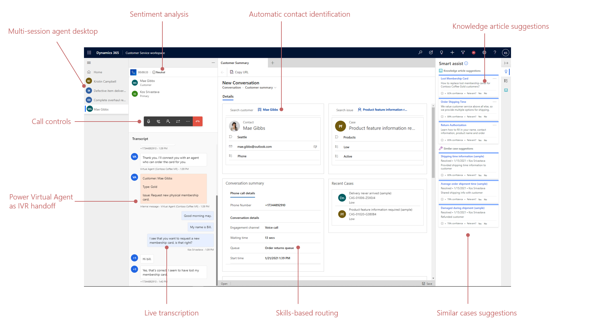

# Introduction to the Voice channel 

Enable customer service representatives to communicate with customers on the phone to resolve issues with the voice channel in Dynamics 365 Customer Service. While many customers increasingly use chat, SMS text messages, and social media to engage and request support from organizations, phone calls continue to be an important communication channel. With the voice channel, Omnichannel provides agents with the ability to receive inbound and make outbound PSTN calls through a native calling experience in Dynamics 365, with real time AI-powered features such as live call transcription, sentiment analysis and AI-based Suggestions working out of the box to boost agent productivity. Omnichannel also provides a rich set of analytics and insights, including AI-driven topic clustering and call insights.

> [!VIDEO 
https://www.microsoft.com/en-us/videoplayer/embed/RE4G43k]

## Why choose the voice channel

### Native

The voice channel is built, owned, and operated completely by Microsoft. This means it is an all-in-one customer service solution without fragmentation or manual data integration required, and a faster time to value by enabling a quick and easy deployment of a voice channel for their business. In addition, the voice channel is built on Microsoft Azure Communication Services with the scale and reliability of the calling platform that powers Microsoft Teams worldwide today. Providing organizations with a choice of telephony delivered directly by Microsoft 

### Built alongside existing omnichannel capabilities with a common data framework

Typically, customer service organizations must manually integrate standalone telephony and CRM solutions, which result in fragmented experiences for agents and customers across engagement channels. Ultimately, these stitched-together solutions from multiple providers are not only complex to roll out and maintain but create data silos with disconnected insights of customer interactions and agent performance across channels. 

In contrast, the voice channel in Dynamics 365 Customer Service is another channel to engage customers alongside Chat, SMS, and social media ensuring consistent, personalized, and connected support across all channels of engagement. As one example, agents can escalate web chat conversations to voice and video calls. As another example, routing a voice call to an agent is completed with Unified Routing, the same way an incoming chat message is assigned to an agent. By utilizing the same platform, the voice channel works well with other technologies like Power Virtual Agent. This means the process to create and deploy a conversational IVR bot is the same as the process to create and deploy a chat bot.

Beyond workflows and processes, the voice channel benefits from a common data framework with the other channels allowing organizations to better understand each customer's journey whether the customer sent a chat, made a phone call, or posted on social media. This means the solution provides a single view of the customer that empowers agents to provide personalized service across all channels, and true omnichannel analytics and insights for agents and supervisors alike. 

### Differentiating AI

The voice channel has Microsoft's award winning AI built into the product. This enables agents to resolve issues faster with tools like call transcriptions and sentiment analysis and gain instant insights into trends. 

## Key capabilities of the voice channel

Take a look at some of the key capabilties that makes the voice channel great for customer service representatives and customers receiving help. 

| Solution | Capability |
| --- | --- |
| Agent experience |  <ul><li>Call controls: Mute, Hold, End</li><li>Music on hold</li><li>Integrated customer and case history lookup</li><li>Notes and knowledge search</li></ul>  |
| Calling and routing  | <ul><li>Ability to handle and distribute incoming calls, Automatic Call Distribution (Routing)</li><li>Ability to make outbound calls</li><li>Transfer to external phone number</li><li>Phone number procurement and management</li><li>Skills-based Assignment</li></ul> |
| AI | <ul><li>Real-time sentiment analysis</li><li>Real-time transcription</li><li>Real-time translation</li><li>Real-time smart assist suggestions</li><li>No-code Virtual Agent as IVR</li></ul> |
| Supervisor experience | <ul><li>Consulting and transferring</li><li>Monitoring and barging</li><li>Ability to record and manage phone calls</li><li>Operations management through supervisor dashboards</li></ul> |
| Customer experience  | <ul><li>Post-call Survey</li><li>Scheduled Callbacks</li><li>Music on hold</li></ul> |

## Agent experience using the Voice channel

Agents receive incoming voice calls the same way they receive other customer requests from channels like SMS and social media. 

A new support session is created when the voice call is accepted. 

> [!div class="mx-imgBorder"]
> 

[Agent experience using the voice channel in Dynamics 365 Customer Service](https://microsoft.sharepoint.com/:v:/t/CRMHOME/ua/EcxIBAEagJdKtkFer7rhItYBZJl_iNg-vtinvyAtaPeq3Q?e=W1tbR7)

## Next steps

1. [Install and set up](voice-channel-install.md)
2. [Make and receive your first phone call](voice-channel-first-call.md)
3. [Using the agent desktop for voice](voice-channel-agent-experience.md)

### See also

[Blog: New voice channel streamlines omnichannel customer experiences](https://cloudblogs.microsoft.com/dynamics365/bdm/2020/09/23/new-voice-channel-streamlines-omnichannel-customer-experiences/)

