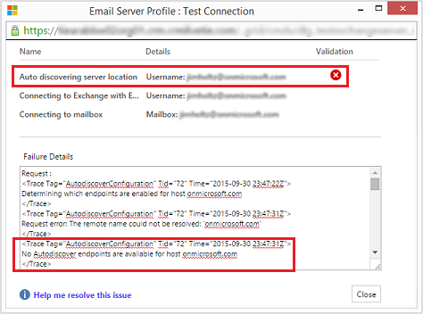
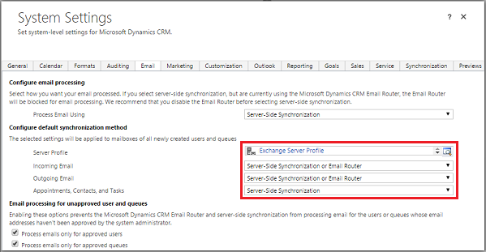
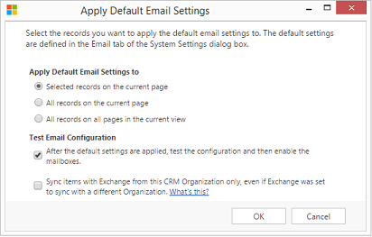

# Connect Dynamics 365 for Customer Engagement apps (online) to Exchange Server (on-premises)

With [!INCLUDE[pn_crm_9_0_0_online](../includes/pn-crm-9-0-0-online.md)], you can connect your Customer Engagement apps with [!INCLUDE[pn_Exchange_Server_full](../includes/pn-exchange-server-full.md)] (on-premises).  

 Check out the following white paper: [Setup Guide: Server-side synchronization for CRM Online and Exchange Server](https://download.microsoft.com/download/E/D/0/ED05CA70-190F-4BAE-9F6A-0BB2F0010B81/Setup%20Guide%20Server-side%20synchronization%20for%20CRM%20Online%20and%20Exchange%20Server.pdf)  

   
## Prerequisites  

1. **Exchange Server**. The following versions are supported: [!INCLUDE[pn_ms_Exchange_Server_2010_short](../includes/pn-ms-exchange-server-2010-short.md)] SP3, [!INCLUDE[pn_Exchange_Server_2013_short](../includes/pn-exchange-server-2013-short.md)] SP1, or [!INCLUDE[pn_exchange_server_2016_short](../includes/pn-exchange-server-2016-short.md)].  

2. **Authentication**. During installation, [!INCLUDE[pn_Exchange](../includes/pn-exchange.md)] configures [!INCLUDE[pn_Internet_Information_Services](../includes/pn-internet-information-services.md)]. To connect Customer Engagement apps with [!INCLUDE[pn_Exchange_Server_short](../includes/pn-exchange-server-short.md)], Windows (NTLM) or Basic authentication must be enabled in [!INCLUDE[pn_Exchange_Server_short](../includes/pn-exchange-server-short.md)]. When configuring Windows (NTLM) authentication, make sure Basic authentication is disabled on Exchange server.  

     For more information on authentication, see:  

   - [!INCLUDE[pn_ms_Exchange_Server_2010_short](../includes/pn-ms-exchange-server-2010-short.md)]: [Configure Integrated Windows Authentication](https://docs.microsoft.com/previous-versions/office/exchange-server-2010/aa998638(v%3dexchg.141))

   - [!INCLUDE[pn_ms_Exchange_Server_2010_short](../includes/pn-ms-exchange-server-2010-short.md)]: [Configure Basic Authentication](https://technet.microsoft.com/library/aa996407\(v=exchg.141\).aspx)  

   - [!INCLUDE[pn_ms_Exchange_Server_2010_short](../includes/pn-ms-exchange-server-2010-short.md)]: [Default Authentication Settings for Exchange-related Virtual Directories](https://technet.microsoft.com/library/gg247612\(v=exchg.141\).aspx)  

   - [!INCLUDE[pn_Exchange_Server_2013_short](../includes/pn-exchange-server-2013-short.md)]: [Authentication and EWS in Exchange](https://msdn.microsoft.com/library/office/dn626019\(v=exchg.150\).aspx)  

   - [!INCLUDE[pn_Exchange_Server_2013_short](../includes/pn-exchange-server-2013-short.md)]: [Default settings for Exchange virtual directories](https://technet.microsoft.com/library/gg247612\(v=exchg.150\).aspx) 

   - [!INCLUDE [pn-exchange-server-2016-short](../includes/pn-exchange-server-2016-short.md)]: [Default settings for Exchange virtual directories](https://technet.microsoft.com/library/gg247612(v=exchg.160).aspx)

3. **ApplicationImpersonation role**. You need to create and configure a service account with the **ApplicationImpersonation** role in [!INCLUDE[pn_Microsoft_Exchange](../includes/pn-microsoft-exchange.md)]. [!INCLUDE[proc_more_information](../includes/proc-more-information.md)] [Impersonation and EWS in Exchange](https://msdn.microsoft.com/library/office/dn722377\(v=exchg.150\).aspx).  

4. **Secured connection**. The connection between Customer Engagement apps and Exchange must be encrypted via [!INCLUDE[pn_ssl_short](../includes/pn-ssl-short.md)] (HTTPS).  

5. **Exchange Web Services (EWS)**. Connections to EWS must be allowed through the firewall. Often a reverse proxy is used for the exterior facing connection.  

> [!TIP]
>  To make sure you’ve got a good connection to [!INCLUDE[pn_Exchange](../includes/pn-exchange.md)] on-premises run the [Microsoft Remote Connectivity Analyzer](https://testconnectivity.microsoft.com/). For information on what tests to run, see [Test mail flow with the Remote Connectivity Analyzer](https://technet.microsoft.com/library/dn305950\(v=exchg.150\).aspx).  

   
## Create an email server profile  

1. Go to **Settings** > **Email Configuration** > **Email Server Profiles**.  

2. Click **New** > **Exchange Server**.  

3. **For an Exchange email server profile, specify the following details:**  

   |                                         Fields                                         |                                                                                                                                                                                                                                                                                                                                                       Description                                                                                                                                                                                                                                                                                                                                                       |
   |----------------------------------------------------------------------------------------|-------------------------------------------------------------------------------------------------------------------------------------------------------------------------------------------------------------------------------------------------------------------------------------------------------------------------------------------------------------------------------------------------------------------------------------------------------------------------------------------------------------------------------------------------------------------------------------------------------------------------------------------------------------------------------------------------------------------------|
   |                                      **General**                                       |                                                                                                                                                                                                                                                                                                                                                                                                                                                                                                                                                                                                                                                                                                                         |
   |                                          Name                                          |                                                                                                                                                                                                                                                                                                                                       Specify a meaningful name for the profile.                                                                                                                                                                                                                                                                                                                                        |
   |                                      Description                                       |                                                                                                                                                                                                                                                                                                                        Type a short description about the objective of the email server profile.                                                                                                                                                                                                                                                                                                                        |
   |                             Auto Discover Server Location                              |                                                                                                                                                                                                                                                          Click **Yes** (recommended), if you want to use the automatically discover service to determine the server location. If you set this to **No**, you must specify the email server location manually.                                                                                                                                                                                                                                                           |
   |                 Incoming Server Location and Outgoing Server Location                  |                                                                                                                                                                                                                                                                                        If you select **No** in **Auto Discover Server Location**, enter a URL for **Incoming Server Location** and **Outgoing Server Location**.                                                                                                                                                                                                                                                                                        |
   |                                    **Credentials**                                     |                                                                                                                                                                                                                                                                                                                                                                                                                                                                                                                                                                                                                                                                                                                         |
   |                            Authenticate Using Impersonation                            |                                                                                                                                                                                                                                                                                    Enter the credentials for the [!INCLUDE[pn_Exchange](../includes/pn-exchange.md)] service account granted the **ApplicationImpersonation** role.                                                                                                                                                                                                                                                                                     |
   |                                       User Name                                        |                                                                                                                                                                                                                                                                                                             Type the user name for the [!INCLUDE[pn_Exchange](../includes/pn-exchange.md)] service account.                                                                                                                                                                                                                                                                                                             |
   |                                        Password                                        |                                                                                                                                                                                                                                                                                                             Type the password for the [!INCLUDE[pn_Exchange](../includes/pn-exchange.md)] service account.                                                                                                                                                                                                                                                                                                              |
   |                                      **Advanced**                                      |                                                                                                                                                                                                                                                                                                                                                                                                                                                                                                                                                                                                                                                                                                                         |
   |                                **Additional Settings**                                 |                                                                                                                                                                                                                                                                                                                                                                                                                                                                                                                                                                                                                                                                                                                         |
   |                                   Process Email From                                   |                                                                                                                                                                                             Select a date and time. Email received after the date and time will be processed by server-side synchronization for all mailboxes associated with this profile. If you set a value less than the current date, the change will be applied to all newly associated mailboxes and their earlier processed emails will be pulled.                                                                                                                                                                                              |
   |                          Minimum Polling Intervals in Minutes                          |                                                                                                                                                                                                                                           Type the minimum polling interval, in minutes, for mailboxes that are associated with this email server profile. The polling interval determines how often server-side synchronization polls your mailboxes for new email messages.                                                                                                                                                                                                                                           |
   |                             Maximum Concurrent Connections                             | Type the maximum number of simultaneous connections that can be made by [!INCLUDE [pn-crm-shortest](../includes/pn-crm-shortest.md)] apps to the corresponding email server per mailbox. Increase the value to allow more parallel calls to [!INCLUDE[pn_Exchange](../includes/pn-exchange.md)] to improve performance or reduce the value if there are errors on [!INCLUDE[pn_Exchange](../includes/pn-exchange.md)] due to large number of calls from [!INCLUDE[pn_microsoftcrm](../includes/pn-dynamics-crm.md)] apps. The default value of this field is 10. The maximum number is considered per mailbox or per email server profile depending on whether the credentials are specified in a mailbox or email server profile. |
   |                       Move Failed Emails to Undeliverable Folder                       |                                                                                                                                                                                                     To move the undelivered email to the Undeliverable folder, click **Yes**. If there’s an error in tracking email messages in [!INCLUDE [pn-crm-shortest](../includes/pn-crm-shortest.md)] apps as email activities, and if this option is set to **Yes**, the email message will be moved to the Undeliverable folder.                                                                                                                                                                                                     |
   |                                **Email Notifications**                                 |                                                                                                                                                                                                                                                                                                                                                                                                                                                                                                                                                                                                                                                                                                                         |
   | Send an alert email to the owner of the email server profile reporting on major events |                                                                                                                                                                                                                                                                                                   If you want the email server profile owner to be notified when more than 50% of the mailboxes fail, click **Yes**.                                                                                                                                                                                                                                                                                                    |

4. Click **Save**.  

5. Click **Test Connection** and review the results. To diagnose issues, see the following section.  

   
### Troubleshooting the Exchange Server (Hybrid) profile connection  
 If you’ve run **Test Connection** and have issues with the Exchange Server (Hybrid) profile connection, use the information in the **Test Connection** dialog box to diagnose and fix the connection.  

   

 In this case, there’s a problem with Auto Discover. The admin should review the user name and password used for **Authentication Using Impersonation** for the Exchange Server (Hybrid) profile.  

 You can find information on recurring issues and other troubleshooting information in [Blog: Test and Enable Mailboxes in Microsoft Dynamics CRM 2015](https://blogs.msdn.com/b/crm/archive/2015/08/31/test-and-enable-mailboxes-in-microsoft-dynamics-crm-2015.aspx) and [Troubleshooting and monitoring server-side synchronization](../admin/troubleshooting-monitoring-server-side-synchronization.md).  

   
## Configure default email processing and synchronization  
 Set server-side synchronization to be the default configuration method.  

1. Go to **Settings** > **Email Configuration** > **Email Configuration Settings**.  

2. Set the processing and synchronization fields as follows:  

   - **Server Profile**: The profile you created in the above section.  

   - **Incoming Email**: Server-Side Synchronization or Email Router  

   - **Outgoing Email**: Server-Side Synchronization or Email Router  

   - **Appointments, Contacts, and Tasks**: Server-Side Synchronization or Email Router  

     If you leave the **Email processing form unapproved user and queues** at the default values (checked), you will need to approve emails and queues for user mailboxes as directed below in **Approve Email**.  

     

3. Click **OK**.  

   
## Configure mailboxes  
 To set mailboxes to use the default profile, you must first set the Server Profile and the delivery method for email, appointments, contacts, and tasks.  

 In addition to administrator permissions, you must have Read and Write privileges on the Mailbox entity to set the delivery method for the mailbox.  

 Select **one** of the following methods:  

### Set mailboxes to the default profile  

1. Go to **Settings** > **Email Configuration** > **Mailboxes**.  

2. Click **Active Mailboxes**.  

3. Select all the mailboxes that you want to associate with the [!INCLUDE[pn_Exchange_Server_short](../includes/pn-exchange-server-short.md)] profile you created, click **Apply Default Email Settings**, verify the settings, and then click **OK**.  

     

    By default, the mailbox configuration is tested and the mailboxes are enabled when you click **OK**.  

### Edit mailboxes to set the profile and delivery methods  

1. Go to **Settings** > **Email Configuration** > **Mailboxes**.  

2. Click **Active Mailboxes**.  

3. Select the mailboxes that you want to configure, and then click **Edit**.  

4. In the **Change Multiple Records** form, under **Synchronization Method**, set **Server Profile** to the [!INCLUDE[pn_Exchange_Server_short](../includes/pn-exchange-server-short.md)] profile you created earlier.  

5. Set **Incoming** and **Outgoing** **Email** to **Server-Side Synchronization or Email Router**.  

6. Set **Appointments, Contacts, and Tasks** to **Server-Side Synchronization**.  

7. Click **Change**.  

   
## Approve email  
 You need to approve each user mailbox or queue before that mailbox can process email.  

1.  Go to **Settings** > **Email Configuration** > **Mailboxes**.  

2.  Click **Active Mailboxes**.  

3.  Select the mailboxes that you want to approve, and then click **More Commands** (**…**) > **Approve Email**.  

4.  Click **OK**.  

   
## Test configuration of mailboxes  

1. Go to **Settings** > **Email Configuration** > **Mailboxes**.  

2. Click **Active Mailboxes**.  

3. Select the mailboxes you want to test, and then click **Test & Enable Mailboxes**.  

    This tests the incoming and outgoing email configuration of the selected mailboxes and enables them for email processing. If an error occurs in a mailbox, an alert is shown on the Alerts wall of the mailbox and the profile owner. Depending on the nature of the error, [!INCLUDE[pn_microsoftcrm](../includes/pn-dynamics-crm.md)] apps tries to process the email again after some time or disables the mailbox for email processing.  

    The result of the email configuration test is displayed in the **Incoming Email Status**, **Outgoing Email Status**, and **Appointments, Contacts, and Tasks Status** fields of a mailbox record. An alert is also generated when the configuration is successfully completed for a mailbox. This alert is shown to the mailbox owner.  

> [!TIP]
>  If you’re unable to synchronize contacts, appointments, and tasks for a mailbox, you may want to select the **Sync items with Exchange from this Dynamics 365 for Customer Engagement apps org only, even if Exchange was set to sync with a different org** check box. [Read more about this check box](when-would-want-use-check-box.md).  

   
## Test email configuration for all mailboxes associated with an email server profile  

1. Go to **Settings** > **Email Configuration** > **Email Server Profiles**.  

2. Select the profile you created, and then click **Test & Enable Mailboxes**.  

    When you test the email configuration, an asynchronous job runs in the background. It may take a few minutes for the test to be completed. [!INCLUDE[pn_microsoftcrm](../includes/pn-dynamics-crm.md)] apps tests the email configuration of all the mailboxes associated with the [!INCLUDE[pn_Exchange_Server_short](../includes/pn-exchange-server-short.md)] profile. For the mailboxes configured with server-side synchronization for synchronizing appointments, tasks, and contacts, it also checks to make sure they’re configured properly.  

> [!TIP]
>  If you’re unable to synchronize contacts, appointments, and tasks for a mailbox, you may want to select the **Sync items with Exchange from this Dynamics 365 for Customer Engagement apps org only, even if Exchange was set to sync with a different org** check box. [Read more about this check box](when-would-want-use-check-box.md).  

### See also  
 [Troubleshooting and monitoring server-side synchronization](../admin/troubleshooting-monitoring-server-side-synchronization.md)   
 [Test mail flow with the Remote Connectivity Analyzer](https://technet.microsoft.com/library/dn305950\(v=exchg.150\).aspx)   
 [Server-side synchronization](../admin/server-side-synchronization.md)   
 [Autodiscover service](https://technet.microsoft.com/library/bb124251\(v=exchg.150\).aspx)   
 [Managing the Autodiscover Service](https://technet.microsoft.com/library/aa995956\(v=exchg.141\).aspx)
