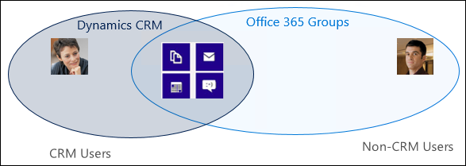
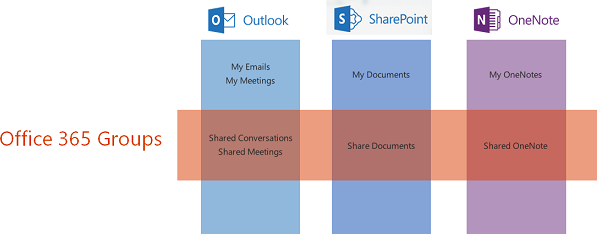
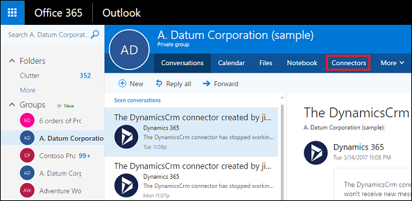
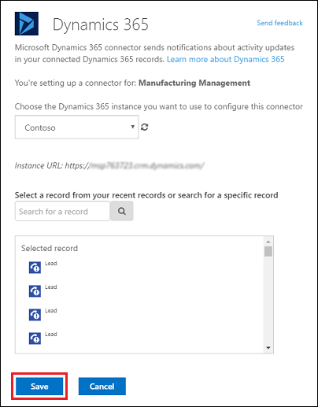
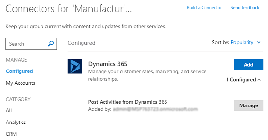

# Deploy Office 365 Groups [!INCLUDE [pn-dynamics-crm-online](../includes/pn-dynamics-crm-online.md)]

[!INCLUDE[pn_office_365_groups](../includes/pn-office-365-groups.md)], available with [!INCLUDE [pn-dynamics-crm-online](../includes/pn-dynamics-crm-online.md)] apps, provides a new environment for collaboration with [!INCLUDE[pn_MS_Office_365](../includes/pn-ms-office-365.md)] users who don’t use [!INCLUDE [pn-crm-shortest](../includes/pn-crm-shortest.md)] apps. For example, use [!INCLUDE[pn_office_365_groups](../includes/pn-office-365-groups.md)] when a sales team has a major opportunity requiring input from several people who don’t have access to [!INCLUDE [pn-crm-shortest](../includes/pn-crm-shortest.md)] apps. [!INCLUDE[pn_office_365_groups](../includes/pn-office-365-groups.md)] provides a single location to share documents, conversations, meetings, and notes. You can enable [!INCLUDE[pn_office_365_groups](../includes/pn-office-365-groups.md)] for any entity.  
  
   
  
 Collaborate with people inside and outside of your [!INCLUDE [pn-crm-shortest](../includes/pn-crm-shortest.md)] apps organization.  
  
   
  
 Share information in multiple ways.  
  
> [!TIP]
>  Check out the following for a quick introduction to [!INCLUDE[pn_office_365_groups](../includes/pn-office-365-groups.md)]:  
> 
> -  Video: [Introducing Groups in Office 365](https://youtu.be/t3OLvYXepvE).  
> -   [Learn more about groups](https://support.office.com/article/Learn-about-Office-365-groups-b565caa1-5c40-40ef-9915-60fdb2d97fa2)  
  
   

## Requirements  
 The following are required to use [!INCLUDE[pn_office_365_groups](../includes/pn-office-365-groups.md)] with [!INCLUDE [pn-crm-shortest](../includes/pn-crm-shortest.md)] apps:  
  
- Customer Engagement apps  
  
- [!INCLUDE[cc_feature_requires_office_365](../includes/cc-feature-requires-office-365.md)]  
  
- [!INCLUDE[cc_Office365PlanRequirement](../includes/cc-office365planrequirement.md)]  
  
- [!INCLUDE[pn_Exchange_Online](../includes/pn-exchange-online.md)]  
  
- To use document storage with [!INCLUDE[pn_office_365_groups](../includes/pn-office-365-groups.md)], you will need [!INCLUDE[pn_sharepoint_online](../includes/pn-sharepoint-online.md)] and access to the group [!INCLUDE[pn_onenote](../includes/pn-onenote.md)] notebook.  
  
   

## Provision Office 365 Groups  
 [!INCLUDE[pn_office_365_groups](../includes/pn-office-365-groups.md)] is a [!INCLUDE [pn-crm-shortest](../includes/pn-crm-shortest.md)] apps solution you provision from your [!INCLUDE[pn_MS_Online_Services_Portal](../includes/pn-ms-online-services-portal.md)].  
  
> [!NOTE]
>  Users must have an [!INCLUDE[pn_Exchange_Online](../includes/pn-exchange-online.md)] mailbox set up to use [!INCLUDE[pn_office_365_groups](../includes/pn-office-365-groups.md)]. [!INCLUDE[pn_Exchange_Online](../includes/pn-exchange-online.md)] is already properly configured for [!INCLUDE[pn_CRM_Online](../includes/pn-crm-online.md)] apps organizations as a part of [!INCLUDE[pn_Office_365](../includes/pn-office-365.md)]. You also need to enable server-based [!INCLUDE[pn_SharePoint_short](../includes/pn-sharepoint-short.md)] integration to see documents in an [!INCLUDE[pn_Office_365](../includes/pn-office-365.md)] Group; you don't have to use [!INCLUDE[pn_SharePoint_short](../includes/pn-sharepoint-short.md)] integration, only set up the connection to [!INCLUDE[pn_sharepoint_online](../includes/pn-sharepoint-online.md)].  Server-based [!INCLUDE[pn_SharePoint_short](../includes/pn-sharepoint-short.md)] integration is also required to enable the group [!INCLUDE[pn_onenote](../includes/pn-onenote.md)] notebook.  
> 
> [!INCLUDE[proc_more_information](../includes/proc-more-information.md)] [Set up Dynamics 365 for Customer Engagement to use SharePoint Online](set-up-dynamics-365-online-to-use-sharepoint-online.md)  
  
1. [!INCLUDE[proc_office365_signin](../includes/proc-office365-signin.md)]  
  
2. [!INCLUDE[proc_office365_choose_admin_crm](../includes/proc-office365-choose-admin-crm.md)]  
  
3. Click the **Instances** tab.  
  
4. Choose your instance, and then click **Solutions**.  
  
5. Select **Office 365 Groups** and then click **Install**.  
  
6. Review the terms of service and then click **Install**.  
  
   Once installation of the solution has completed, you can configure [!INCLUDE[pn_office_365_groups](../includes/pn-office-365-groups.md)].  
  
> [!NOTE]
>  When you install a solution, your Customer Engagement apps site is taken offline in maintenance mode for a short time. We recommend you install the solution when it’s least disruptive to users.  
  
   
## Check required privileges  
 The security privilege, **ISV Extensions**, is required to use [!INCLUDE[pn_office_365_groups](../includes/pn-office-365-groups.md)]. You can add or remove this privilege from custom or default security roles to meet your business needs. If a user doesn’t have this privilege, they won’t be able to see the [!INCLUDE[pn_office_365_groups](../includes/pn-office-365-groups.md)] item in a record’s navigation menu.  
  
1.  Go to **Settings** > **Security**.  
  
2.  Click **Security Roles**.  
  
3.  Choose the security role to check and then click the **Customization** tab.  
  
4.  In the **Miscellaneous Privileges** section, review the **ISV Extensions** privilege setting. If the security role doesn’t have the **ISV Extensions** privilege, select it to set it to Organization.  
  
5.  Click **Save and Close**.  
  
   

## Configure Office 365 Groups  
 Once you provision [!INCLUDE[pn_office_365_groups](../includes/pn-office-365-groups.md)], you can enable them for any entity. Security group membership is associated with the entity. You configure [!INCLUDE[pn_office_365_groups](../includes/pn-office-365-groups.md)] in Customer Engagement apps.  
  
1. In Customer Engagement apps, click **Settings** > **Office 365 Groups**.  
  
2. On the **Office 365 Groups Settings** page, click **Add entity** and choose an entity from the drop-down list. Repeat this step for each entity you want to enable, including custom entities.  
  
3. Optionally, you can click **Auto-create** for an entity to have a new group automatically created when a new record for that entity is created. However, we recommend you choose this option only for entities that typically require large groups to collaborate.  
  
4. When you have added all the entities you want to enable for [!INCLUDE[pn_office_365_groups](../includes/pn-office-365-groups.md)], click **Publish All**.  
  
    All of your pending system customizations will be published, including those you may have saved but not published in another area.  
  
   You’re now ready to use [!INCLUDE[pn_office_365_groups](../includes/pn-office-365-groups.md)]. See [Collaborate with your colleagues using Office 365 Groups](../basics/collaborate-with-colleagues-using-office-365-groups.md).  
  
   
## Use the Office 365 Connectors for Groups  
 Use the [!INCLUDE[pn_Office_365](../includes/pn-office-365.md)] Connectors for Groups to connect new or existing [!INCLUDE[pn_office_365_groups](../includes/pn-office-365-groups.md)] with Customer Engagement apps so the group is notified when new activities are posted. To set it up, follow these steps:  
  
> [!TIP]
>  Check out the following Dynamics 365 for Customer Engagement apps Blog: [Dynamics CRM Online connector for Office 365 Groups](https://blogs.msdn.microsoft.com/crm/2016/04/01/dynamics-crm-online-connector-for-office-365-groups/)  
  
1. Sign in to your [Office 365 Outlook](https://outlook.office365.com).  
  
2. Create or choose an [!INCLUDE[pn_Office_365](../includes/pn-office-365.md)] Group.  
  
3. Click **Connectors**.  
  
     
  
4. Scroll down to **Dynamics 365 Online**, and then click **Add**.  
  
5. If you have access to more than one Customer Engagement instance, choose which instance to connect to this [!INCLUDE[pn_Office_365](../includes/pn-office-365.md)] Group. If you only have access to one Customer Engagement instance, this step will be skipped and you will advance to the next step.  
  
6. Choose the [!INCLUDE [pn-crm-shortest](../includes/pn-crm-shortest.md)] apps record you want to connect this [!INCLUDE[pn_Office_365](../includes/pn-office-365.md)] Group to, and then click **Save**.  
  
     
  
   Once connected, the [!INCLUDE[pn_dynamics_crm_online](../includes/pn-dynamics-crm-online.md)] apps connector shows up at the top of the connection list with a summary of connected records.  
  
     
  
   To delete a connected record, click **View**, and then click **Remove**.  
  
     
  
> [!NOTE]
>  Note the following about the [!INCLUDE[pn_Office_365](../includes/pn-office-365.md)] Connectors for Groups:  
> 
> - Only account, lead, and opportunity records are supported.  
> - You can connect up to five records.  
> - Only task type activities are sent to the group as connector cards.  
> - The activity appears as a new conversation in a card format in the Group.  
> - The fields in the card shown in the Group conversation are not customizable.  
> - Nothing is required in [!INCLUDE [pn-crm-shortest](../includes/pn-crm-shortest.md)] apps to make the connector work.  
> - For sensitive information, you should connect your Dynamics 365 for Customer Engagement apps record to a private group where only approved members can view contents. For public groups, everyone in the org has access to view contents. See "Public and private Office 365 groups" in [Learn more about groups](https://support.office.com/article/Learn-about-Office-365-groups-b565caa1-5c40-40ef-9915-60fdb2d97fa2).  
  
   
## Known issues  
 You need to have Customer Engagement apps version [!INCLUDE[pn_crm_online_2015_update_1_shortest](../includes/pn-crm-online-2015-update-1-shortest.md)] or later, to install [!INCLUDE[pn_office_365_groups](../includes/pn-office-365-groups.md)]. If [!INCLUDE[pn_office_365_groups](../includes/pn-office-365-groups.md)] appears as an available solution in the [!INCLUDE[pn_crm_online_admin_center](../includes/pn-crm-online-admin-center.md)], but you receive the following error when trying to install: "Solution install failed. Please try again later. If the problem persists, contact customer support," you’ll need to update your instance of Customer Engagement apps before you can install [!INCLUDE[pn_office_365_groups](../includes/pn-office-365-groups.md)].  
  
## Privacy notice  
 When a user leverages the Office 365 Groups for Dynamics 365 for Customer Engagement apps feature to connect an Office Group to Microsoft Dynamics 365 for Customer Engagement apps (online), data (including new conversations and documents) will be stored on the Exchange and/or SharePoint system and shared with the members of that Office Group, even if they are not licensed or authorized Dynamics 365 for Customer Engagement apps users. Users will only be able to share the data that they have access to, and Administrators can limit the data that is shared by limiting the access privileges of their users.  
  
### See also  
 [Collaborate with your colleagues using Office 365 Groups](../basics/collaborate-with-colleagues-using-office-365-groups.md)   
 [CRM Blog: Dynamics CRM Online connector for Office 365 Groups](https://blogs.msdn.microsoft.com/crm/2016/04/01/dynamics-crm-online-connector-for-office-365-groups/)   
 [Set up Dynamics 365 for Customer Engagement apps (online) to use Exchange Online](connect-exchange-online.md)   
 [Blog: It's here - Office 365 Groups in CRM Online](https://blogs.technet.com/b/lystavlen/archive/2015/05/08/office-groups.aspx)   
 [Office 365 Groups in Dynamics 365 for Customer Engagement apps FAQs](../basics/office-365-groups-dynamics-365-faqs.md)

[!INCLUDE[footer-include](../../../includes/footer-banner.md)]