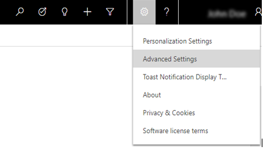

# Determine your environment's organization ID and name

If you have enabled [Unified Interface only mode](about-unified-interface.md#enable-unified-interface-in-dynamics-365-customer-engagement-on-premises), to use the procedures in this article:
1. Select **Settings** () on the navigation bar. 
2. Select **Advanced Settings**.
   > [!div class="mx-imgBorder"] 
   > 

[!INCLUDE[use_advanced_settings](../../../includes/use-advanced-settings.md)]

Follow these steps to determine your organization name and ID.

1. Go to **Settings** > **Customizations** > **Developer Resources**.
2. Under **Instance Reference Information**, make note of **ID** and **Unique Name**. **Unique Name** is the organization name.

> [!div class="mx-imgBorder"] 
> 

[!INCLUDE[footer-include](../../../includes/footer-banner.md)]