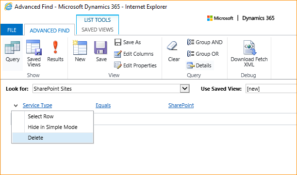
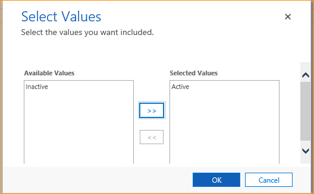

# Switch from the list component to server-based authentication or change SharePoint deployment type

::: moniker range="op-9-1"
[!INCLUDE [cc-use-advanced-settings](../includes/cc-use-advanced-settings.md)]
::: moniker-end

This topic provides an overview about how to switch from the list component to server-based authentication. This topic can also help if you change the [!INCLUDE[pn_ms_SharePoint_long](../includes/pn-ms-sharepoint-long.md)] deployment type, such as moving from [!INCLUDE[pn_SharePoint_short](../includes/pn-sharepoint-short.md)] on-premises to [!INCLUDE[pn_sharepoint_online](../includes/pn-sharepoint-online.md)].  

> [!IMPORTANT]
> In 2015, [we announced the deprecation of the list component]( https://cloudblogs.microsoft.com/dynamics365/no-audience/2015/05/15/dynamics-crm-2015-update-1-list-component-deprecation/?source=crm). Notice that, the list component wasn’t released for this version of Dynamics 365 Customer Engagement (on-premises) and previous versions of the list component aren’t supported with this version. If you are using the list component you must move your document management to server-based authentication.

 
## Switch from list component to server-based authentication  
 If your organization is already using the list component with [!INCLUDE[pn_ms_SharePoint_long](../includes/pn-ms-sharepoint-long.md)] for document management with Dynamics 365 Customer Engagement (on-premises), you can switch to server-based authentication by following these steps.  
  
1. Follow the steps to set up server-based [!INCLUDE[pn_SharePoint_short](../includes/pn-sharepoint-short.md)] integration that best fits your deployment type. For more information, see the appropriate topic for your [!INCLUDE[pn_SharePoint_short](../includes/pn-sharepoint-short.md)] deployment below.  

   > [!NOTE]
   > If you've made changes to [!INCLUDE[pn_SharePoint_short](../includes/pn-sharepoint-short.md)], such as new [!INCLUDE[pn_SharePoint_short](../includes/pn-sharepoint-short.md)] servers, new site collections, or migrated from [!INCLUDE[pn_SharePoint_short](../includes/pn-sharepoint-short.md)] on-premises to [!INCLUDE[pn_microsoft_sharepoint_online](../includes/pn-microsoft-sharepoint-online.md)], consider deactivating outdated [!INCLUDE[pn_SharePoint_short](../includes/pn-sharepoint-short.md)] site records. When you run the Enable Server-Based SharePoint Integration wizard, the wizard will attempt to validate all active [!INCLUDE[pn_SharePoint_short](../includes/pn-sharepoint-short.md)] sites. [!INCLUDE[proc_more_information](../includes/proc-more-information.md)] [Deactivate a site](../admin/switching-list-component-changing-deployment.md#BKMK_deact_site)  
  
2. Although it is not required for server-based authentication, we recommend that you deactivate and then delete the list component [!INCLUDE[pn_SharePoint_short](../includes/pn-sharepoint-short.md)] solution from the [!INCLUDE[pn_SharePoint_short](../includes/pn-sharepoint-short.md)] site collection. To do this, after you have confirmed that server-based authentication is enabled, in a web browser follow these steps. 
      1. Sign-in to the site collection, click the **Settings** button in the top-right corner, then **Site Settings**, and then under **Web Designer Galleries**, click **Solutions**. 
      2. Choose **crmlistcomponent**, and then on the tool bar click **Deactivate**. 
      3. Choose the **crmlistcomponent** again, and then on the tool bar click **Delete**.  
  
   
## Changing the SharePoint deployment type  
  
1. After the migration of [!INCLUDE[pn_ms_SharePoint_long](../includes/pn-ms-sharepoint-long.md)] to either online or on-premises is completed, deactivate the outdated [!INCLUDE[pn_SharePoint_short](../includes/pn-sharepoint-short.md)] site records. You must do this because, when you run the Enable Server-Based SharePoint Integration wizard, the wizard will attempt to validate all active [!INCLUDE[pn_SharePoint_short](../includes/pn-sharepoint-short.md)] sites. [!INCLUDE[proc_more_information](../includes/proc-more-information.md)] [Deactivate a site](../admin/switching-list-component-changing-deployment.md#BKMK_deact_site)  
  
2. Follow the steps to set up server-based [!INCLUDE[pn_SharePoint_short](../includes/pn-sharepoint-short.md)] integration that best fits your deployment type. For more information, see the above section [Switch from list component to server-based authentication](#BKMK_switchlistcomp).  
  
   
### Deactivate a site  
  
1. [!INCLUDE[proc_settings_doc_management](../includes/proc-settings-doc-management.md)]  
  
2. Click **SharePoint Sites**.  
  
3. Select the [!INCLUDE[pn_SharePoint_short](../includes/pn-sharepoint-short.md)] site you want to remove, and then on the tool bar select **Deactivate**.  
  
4. Repeat step three for all sites that you want to deactivate.  

### What to do when the Enable Server-Based SharePoint Integration wizard doesn’t appear
If the **Enable Server-Based SharePoint Integration** icon doesn't appear in the **Document Management** area after you deactivate all SharePoint sites, follow these steps.
1.	Select Advanced Find and create the following query. 
    -	**Look for**: **SharePoint Sites** 
    -	**Use Saved View**: **[new]**
    -	Select the down arrow next to the **Service Type** clause and then select **Delete** to remove it. 

        

2. Add **Status** as a new clause, select **Active** as the value, and then select **OK**: 

    

3. The **Status** clause appears like this. 

    

4. Select **Results**.
    In the list of active SharePoint sites returned by the query, select all records, and then on the toolbar, select **Deactivate**.

### See also
[Set up SharePoint integration](../admin/set-up-sharepoint-integration.md) 

[!INCLUDE[footer-include](../../../includes/footer-banner.md)]
