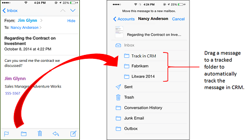
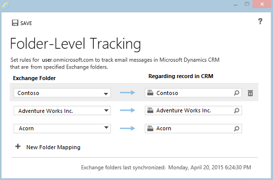

# Move Outlook email to a tracked Exchange folder

 Track customer interactions wherever you are, and from virtually any device by using folder tracking. After you set up a tracked folder, you can drag or move email to that folder to track it automatically in Dynamics 365 Customer Engagement (on-premises). Additionally, if you set a regarding record (such as a specific account or opportunity record) for the folder, Customer Engagement (on-premises) automatically links all email in that folder to that specific record. Tracked folders work in [!INCLUDE[pn_Exchange_Online](../includes/pn-exchange-online.md)], [!INCLUDE[pn_outlook_web_app](../includes/pn-outlook-web-app.md)], or any other mobile app that supports [!INCLUDE[pn_Exchange](../includes/pn-exchange.md)].  

   

> [!TIP]
>  Tracked folders work with [!INCLUDE[pn_Exchange](../includes/pn-exchange.md)] Inbox rules. This makes it easy to automatically route email messages to a particular folder. For example, set up an [!INCLUDE[pn_Exchange](../includes/pn-exchange.md)] rule that automatically routes email from a Contoso contact to a tracked Contoso folder, which is linked to a specific Contoso opportunity. [Tell me more about setting up rules](https://go.microsoft.com/fwlink/p/?LinkID=528086).  

To see folder tracking in action, see the video [Folder Level Tracking in CRM Online ](https://youtu.be/HiNpINvFKq8).

   

## Requirements for using tracked folders  

- The tracking folders feature must also be enabled by your administrator. For more information, contact your Customer Engagement (on-premises) administrator. For admin information on enabling tracked folders, see [Configure folder-level tracking](../admin/configure-outlook-exchange-folder-level-tracking.md).  

- Your organization must use server-side synchronization as your email synchronization method. If you don’t know which synchronization method your organization uses, contact your Customer Engagement (on-premises) administrator. For admin information about setting up server-side synchronization, see [Set up server-side synchronization](../admin/set-up-server-side-synchronization-of-email-appointments-contacts-and-tasks.md).  

   

## Set up a tracked folder  

1. In the web app, on the nav bar, click **Options** .  

2. In the **Set Personal Options** dialog box, click the **Email** tab, and then under **Select the email messages to track in Dynamics 365**, click **Configure Folder Tracking Rules**.  

3. In the **Folder-Level Tracking** dialog box, under **Exchange Folder**, click **+ New Folder Mapping**, click the down arrow in the box that appears, and then select the folder you want to track.  

     

   > [!NOTE]
   >  You can only track folders or subfolders inside your Exchange Inbox. Only the folder you select will be tracked. For example, if you select a folder that includes subfolders, the subfolders aren’t tracked unless you specifically select them in this dialog box. The maximum number of folders you can track is 25.  

4. If you want to link the folder to a specific record—for example, an account or opportunity—under **Regarding Record in Dynamics 365 for Customer Engagement**, click the **Lookup** button , and then search for the record.  

5. Repeat steps 3 and 4 for any additional folders you want to track and (optionally) link to regarding records.  

6. When you’re done adding and linking folders, click **Save**.  

   

## Best practices for folder tracking  

- Make sure to take advantage of folder tracking on your mobile devices. If your device supports [!INCLUDE[pn_Exchange](../includes/pn-exchange.md)] email, folder tracking will work automatically. You don’t need to install anything. Just drag or move email to a tracked folder to automatically track that email in Customer Engagement (on-premises).  

- Whether you set a regarding record for a folder or not depends on how you plan to use the folder:  

  - If you receive a small volume of email from many different customers, you may want to create a single folder called “Track in Dynamics 365 for Customer Engagement” (or similar name) that isn’t linked to a particular record. That way, you can drag messages to that folder to track them automatically. If you later want to link an email message in that folder to a specific Customer Engagement (on-premises) record, open that activity record in Customer Engagement (on-premises), and then fill in the Regarding field.  

  - If you receive large volumes of email from a particular customer, create a folder (or use an existing folder) just for that customer and link it to a specific record. For example, create a Contoso folder and set the regarding record to a Contoso account record or opportunity record.  

- Any email in response to email that has been tracked will only be auto tracked if the response email is in the Inbox folder. If it has been moved manually or via Outlook rules into a sub-folder within Inbox, it will not be tracked automatically. Workaround: (1) do not use rule-based folder routing or (2) do not manually move email from a folder to the Inbox for any email response that you think needs to be tracked in Customer Engagement (on-premises).

- You can set up multiple folders that link to the same regarding record. For example, you could link a Contoso Sales Proposal folder and a Contoso Legal Matters folder to the same Contoso account record.  

- It’s best not to use the same folder for different records over a period of time. For example, let’s say you’re tracking email communications for an opportunity with Customer 1, but you’ve won the opportunity, and now you don’t need to track further communications with that customer. You may be tempted to simply change the regarding record for that folder to a new customer (Customer 2) you’re working with. If you do that, however, all email in that folder, including the email pertaining to Customer 1, will be associated with Customer 2. So it’s best in this case to create a new folder associated with Customer 2, and then set the regarding record for that new folder to Customer 2. Then you can delete the regarding record for the Customer 1 folder.  

- You can include an untracked folder inside a tracked folder. For example, let’s say you want to store personal email from a Contoso contact. You can create a Personal subfolder under the Contoso folder and leave it untracked.  

- If you no longer need to track a folder, it’s a good idea to untrack it for performance reasons. To untrack a folder, remove it from the **Folder-Level Tracking** dialog box.  

   

## What happens when you untrack, move, delete, or rename folders, or change the regarding record?  
 The following table shows what happens when untrack, move, or delete folders, or change the regarding record linked to a tracked folder.  

| Action          | Result       |
|---------------|-----------------|
|                               Untrack a folder by deleting it from the **Folder-Level Tracking** dialog box                               |                                                                                                                                                                                                                              All email messages previously included in that folder will still be tracked, and the regarding record will still be linked to those email messages. New email messages you add to that folder won’t be tracked.                                                                                                                                                                                                                               |
| Delete a folder from [!INCLUDE[pn_Outlook_short](../includes/pn-outlook-short.md)] or [!INCLUDE[pn_Exchange](../includes/pn-exchange.md)] |                                                                                                                                                                                                                                  All email messages included in that folder will be deleted from Outlook or Exchange Online. Email messages already tracked through that folder will not be deleted from Microsoft Dynamics 365 for Customer Engagement, however.                                                                                                                                                                                                                                  |
|   Move a folder in [!INCLUDE[pn_Outlook_short](../includes/pn-outlook-short.md)] or [!INCLUDE[pn_Exchange](../includes/pn-exchange.md)]   |                                                                                                                                                                                                                                                            The folder and all its contents will continue to be tracked. If you move a folder outside your Inbox, folder-level tracking rules will be disabled.                                                                                                                                                                                                                                                             |
|  Rename a folder in [!INCLUDE[pn_Outlook_short](../includes/pn-outlook-short.md)] or [!INCLUDE[pn_Exchange](../includes/pn-exchange.md)]  |                                             The folder and all its contents will continue to be tracked. **Tip:**  When you rename folders, the software uses the [!INCLUDE[pn_Exchange](../includes/pn-exchange.md)] folder ID for tracking purposes – it’s not dependent on the actual name of the folder. This is important to know if you delete a folder, and then rename a new folder with the same name as the deleted folder. For example, let’s say you delete Folder 1, create Folder 2, and then rename Folder 2 to be Folder 1. The tracking information for the original Folder 1 won’t be retained in this case.                                             |
|      Remove the link between a tracked folder and a specific record by deleting the link in the **Folder-Level Tracking** dialog box      |                                                                                                                                                                                                                                                                   All messages in that folder that were previously linked will continue to be linked. New messages added to that folder won’t be linked.                                                                                                                                                                                                                                                                   |
|                    Move an email message in a tracked folder that’s linked to a specific record to a different folder                     |                                                                                                                                                                                                                        If the new folder doesn’t have a regarding record, the email message will continue to be linked to the original record. If the new folder has a regarding record, the email message will be linked to that regarding record.                                                                                                                                                                                                                        |
|     Manually change the regarding record for an email message that’s linked to a different regarding record through a tracked folder      | The tracked folder rule takes precedence. When the folder is synchronized, the email message will be re-linked to the record specified in the folder tracking rule, even if you change the regarding record manually. To change the regarding record in this case, do one of the following:   -   Move the message to a tracked folder linked to the record you want. -   Remove the  link to the regarding record  in the **Folder-Level Tracking** dialog box before you manually change the regarding record. -   Move the specific email message outside the tracked folder, and then manually change the regarding record for that email message. |
|                      Two users move the same email message to separate folders that have different regarding records                      |                                                                                                                                                                                                                                                               You can only set one regarding record for an email message. In this case, the record that’s processed first is linked to the regarding record.                                                                                                                                                                                                                                                               |

### See also  
 [Frequently asked questions about synchronizing records between Customer Engagement (on-premises) and Microsoft Outlook](frequently-asked-questions-synchronizing-records-dynamics-365-and-outlook.md) 
 [Configure folder-level tracking](../admin/configure-outlook-exchange-folder-level-tracking.md)

[!INCLUDE[footer-include](../../../includes/footer-banner.md)]