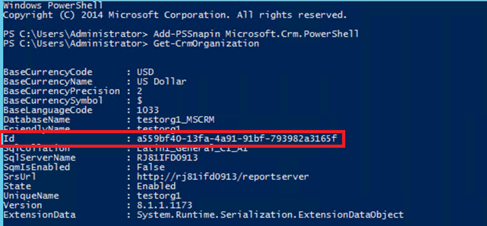

# Security enhancements: User session and access management 

You can use security enhancements to better secure Dynamics 365 Customer Engagement (on-premises). 

## User session timeout management

The maximum user session timeout of 24 hours is removed.  This means that a user is not forced to login with their credentials to use the Customer Engagement (on-premises) and other Microsoft service apps like Outlook that were opened in the same browser session every 24 hours. 

## Configure session timeout 

1. In Customer Engagement (on-premises), choose **Settings** > **Administration** > **System Settings** > **General** tab.
2. Under **Set session timeout**, set the values to apply to all your users.

> [!NOTE]
> Default values are:
> - Maximum Session Length: 1440 minutes
> - Minimum Session Length: 60 minutes
> - How long before session expires before showing timeout warning: 20 minutes

## Inactivity timeout

By default, Customer Engagement (on-premises) does not enforce an inactivity session timeout.  A user can remain logged in the application until the session timeout expires.  You can change this behavior.

- To enforce users to automatically signed out after a pre-determined period of inactivity, admins can set an inactivity timeout period for Customer Engagement (on-premises). The application signs out the user when the inactivity session expires.

> [!NOTE]
> Inactivity session timeout is not enforced in the following:
> 1. [!INCLUDE [pn-oc-online-short](../includes/pn-oc-online-short.md)]
> 2. [!INCLUDE [pn-dyn-365-phones](../includes/pn-dyn-365-phones.md)] and [!INCLUDE [pn-dyn-365-tablets](../includes/pn-dyn-365-tablets.md)]
> 3. [!INCLUDE [pn-unified-service-desk](../includes/pn-unified-service-desk.md)] client using [WPF](/dotnet/framework/wpf/) browser (Internet Explorer is supported)
> 4. Live Assist (Chat)

Microsoft Internet Explorer 11 support is deprecated. We recommend that you use Microsoft Edge. More information: [Deprecation announcement](/power-platform/important-changes-coming#internet-explorer-11-support-for-dynamics-365-and-microsoft-power-platform-is-deprecated)

To enforce the inactivity session timeout for Web Resources, Web Resources need to include the ClientGlobalContext.js.aspx file in their solution.

The Customer Engagement (on-premises) portal has its own settings to manage its session timeout and inactivity session timeout independent of these system settings.

## Configure inactivity timeout

1. In Customer Engagement (on-premises), choose **Settings** > **Administration** > **System Settings** > **General tab**.
2. Under **Set inactivity timeout**, set the values to apply to all your users.

> [!NOTE]
> Default values are:
> - Minimum Duration of Inactivity: 5 minutes
> - Maximum Duration of Inactivity: less than Maximum Session length or 1440 minutes

## Steps for enabling security enhancements for Dynamics 365 for Customer Engagement apps (on-premises) deployments

These security enhancements are shipped disabled by default.  Administrators can enable these enhancements when using one of the supported Dynamics 365 for Customer Engagement apps (on-premises) builds listed below.

 ### Requirement
 These security enhancement features require the Feature Control Bit FCB.UCIInactivityTimeout to be enabled and claims-based authentication for user authentication. You can configure claims-based authentication in one of two ways:
 - With an Internet-facing deployment (IFD). See [Configure IFD for Microsoft Dynamics 365 for Customer Engagement](/previous-versions/dynamicscrm-2016/deployment-administrators-guide/dn609803(v=crm.8)).
 - With claims-based authentication alone if Microsoft Dynamics 365 for Customer Engagement apps is deployed in the same domain where all Microsoft Dynamics 365 for Customer Engagement apps users are located, or users are in a trusted domain. See [Configure claims-based authentication](/previous-versions/dynamicscrm-2016/deployment-administrators-guide/dn920270(v=crm.8)).

To obtain SDK sample code (for reference, not required to configure and enable session timeout):

1. Access your Dynamics 365 for Customer Engagement server using your administrator account.
2. Open a browser session and download the [Dynamics 365 for Customer Engagement apps Software Development Kit (SDK)](/dynamics365/customer-engagement/developer/download-dynamics-365-sdk-v9).
3. Select and run **MicrosoftDynamics365SDK.exe**. This will extract the download and create an SDK folder on your Dynamics 365 for Customer Engagement server.
4. Open a PowerShell command prompt.
5. Navigate to the downloaded SDK folder.
6. Open the SampleCode\PS folder.

After updating to a supported on-premises version, follow the steps below to enable security enhancements.

### User session timeout

System admins can now force users to re-authenticate after a set period.  You can set an active session timeout for each of your Dynamics 365 for Customer Engagement instances.  Users can only remain signed in to the application for the duration of the session.  Once the session expires, they’ll need to sign in again with their credentials.  System admins can also require sign in for users after a period of inactivity.  You can set an inactivity timeout for each of your instances.  The helps prevent unauthorized access by a malicious user from an unattended device. 

**Enable user session timeout**

  1. Enable session timeout:
     ```    
     SetAdvancedSettings.ps1 -ConfigurationEntityName ServerSettings -SettingName AllowCustomSessionDuration -SettingValue true
     ```

  2. Enable inactivity timeout:
     ``` 
     SetAdvancedSettings.ps1 -ConfigurationEntityName ServerSettings -SettingName AllowCustomInactivityDuration -SettingValue true
     ```

### Access token management

To better protect user access and data privacy in Dynamics 365 for Customer Engagement, when a user signs out in the web client and needs to return to the application, they will need to enter their credentials again in all open browser sessions. Dynamics 365 for Customer Engagement apps ensures that the sign-in token was originally generated for the current browser and computer.

**Enable access token management**

To enable for all organizations by default, copy and run this command in PowerShell:

```    
SetAdvancedSettings.ps1 -ConfigurationEntityName ServerSettings -SettingName WSFedNonceCookieEnabled -SettingValue true
```

Sample:


-OR- 

To enable for a single organization, copy and run this command in PowerShell:

```
SetAdvancedSettings.ps1 -ConfigurationEntityName Organization -SettingName WSFedNonceCookieEnabled -SettingValue true -Id <Your organization ID GUID>
```
To get [Your organization ID GUID], open PowerShell, and run the following:

```
Add-PSSnapin Microsoft.Crm.PowerShell 
Get-CrmOrganization
```
        
Sample:




[!INCLUDE[footer-include](../../../includes/footer-banner.md)]