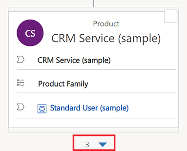

# See relationships in a hierarchical view

You can see how info is related or grouped by viewing accounts, products, or users in hierarchical charts. You can select a tile in the chart to get the full details and then navigate to the info you’re interested in.  
   
 For example, from the hierarchical charts view for **accounts**, you can:  
  
-   See how an account is doing in overall revenue  
  
-   Drill into tiles for accounts to see where the deals are coming from and how revenue is distributed across sub-accounts  
  
-   Find out who is working an account and enlist help from others by sending email or sharing the account with other salespeople right from within the chart view  
  
-   View important details about each account, such as credit limit and latest activity posts for the account  

From the hierarchical charts view for **products**, you can see all the products available to sell, and how they're related in bundles or families. Salespeople can avoid missing a potential sale, because they can see all related products in one view.  

From the hierarchical charts view for **users**, you can find out who another team member's boss is, or who else is on their team without switching to another app.  

Hierarchical views are also available on mobile.  

To see hierarchies that show the relationships between records, on the list of accounts, contacts, products, or users, select a record, and on the command bar, choose **View Hierarchy** or select the hierarchy icon.   

> [!div class="mx-imgBorder"] 
> ")  

The hierarchy of the related records is shown in a Tree view and Tile view:

> [!div class="mx-imgBorder"] 
> ")

You can take the following actions from the hierarchical view:

-  In the Tree view, select the **Open this record** icon to open a record.

   Or

-  In the Tile view, select the record name.

-  Expand or collapse the items in the Tree view.

-	 In the Tile view, select the down arrow to see the record’s child records of the existing record.

   > [!div class="mx-imgBorder"] 
   > 

   The number before the arrow denotes the number of child records for that record.

-	 Use command bar options to take action on selected records. You can select a record by selecting the check box in the top-right corner of a tile in the Tile view. 

