# Configure interactive experience dashboards

[!INCLUDE[cc-applies-to-update-9-0-0](../includes/cc_applies_to_update_9_0_0.md)]

The [!INCLUDE[pn_dyn_365_service](../includes/pn-dyn-365-service.md)], Customer Service hub provides a modern, intuitive, and interactive experience for managing your customer service operations. This was formerly called Interactive Service hub. This hub is loaded with capabilities, interactive dashboards, and redesigned forms that pull together key information, so customer service representatives can focus on what’s important to them and get things done faster. For service reps, the interactive experience dashboards are a one-stop workplace to see their workload information and take actions. The dashboards are fully configurable, security-role based, and deliver workload information across multiple streams in real time. Customer service reps will no longer need to page through the application looking for particular cases; they’ll be able to act on a case right from the dashboard. While end users will access these dashboards using the Customer Servie hub or Interactive Service hub URL, as an administrator or customizer, you’ll do all of your configuration work in the [!INCLUDE[pn_crm_shortest](../includes/pn-crm-shortest.md)] web application user interface. You won’t have to write code.  
  
> [!IMPORTANT]
>  This feature was introduced in [!INCLUDE[pn_crm_online_2016_update.md](../includes/pn-crm-online-2016-update.md)].  
  
   
## Interactive experience dashboards overview  
 The interactive experience dashboards come in two forms: multi-stream and single-stream. In addition, multi-stream dashboards can be home page or entity-specific dashboards. The entity-specific dashboards are configured in a different part of the user interface and partially preloaded with the entity-specific configuration information.  
  
 The multi-stream dashboards display data in real time over multiple data streams. There’s no limit on how many streams you can configure on the dashboard. The data in a stream can be based only on one entity, but, each stream can be based on a different entity. In the entity-specific dashboards, all streams are based on the same entity. The data flows from various views or queues, such as **My Activities**, **My Cases**, or **Cases in the Banking Queue**. The multi-stream home page dashboards typically target Tier 1 customer support, where service representatives handle many support cases at the same time. However, entity-specific dashboards can be also suitable for Tier 2 support that focuses on more complex cases. In the multi-stream dashboard, you can easily switch from a standard view to the tile view. The interactive tiles are an aggregated view of the data across the views or queues. For example, you can configure a tile based on the **My Active Cases** view that currently contains ten active cases. The tile will display the number 10. A service representative can click a tile to drill down to see the actual records and navigate to a specific case.  
  
 The single-stream dashboards display real-time data over one stream based on an entity view or queue. The tiles are positioned on the right side of the dashboards and are always shown. The single-stream dashboards are typically helpful to Tier 2 service leads or managers, who monitor fewer, but more complex or escalated cases.  
  
 Multi-stream and single-stream dashboards contain interactive charts that provide a count of relevant records, such as cases by priority or by status. These charts also act as visual filters. The visual filters (interactive charts) are based on multiple entities and in the single-stream dashboards, the entity in the data stream defines the visual filter entity. If you click the **High Priority Cases** circle in the **Cases by Priority** chart, the dashboard will refresh, to show you only high priority cases. With charts and tiles the service reps will be able to see the changes and patterns in data, and act quickly to address the issues that interest them most.  
  
 Service reps can apply additional filtering with global filter and timeframe filter. The global filter works at a field level on all charts, and also on streams and tiles that are based on the filter entity (you specify the filter entity when you configure the visual filters). For example, the reps can apply a global filter to show them only escalated cases and the cases that are marked “Request”. The timeframe filter will allow service reps to display cases in a specified period of time. Filtering helps to remove the clutter on the screen and show only the work items that the user wants to focus on. However, if the service rep wants to see the entire unfiltered workload, they can easily clear a particular filter or all filters. You can configure specific colors in some charts and streams for the option set fields (not all charts can be shown in color). For example, you can show high priority cases in red and low priority cases in yellow. The reps will be able to sort the data in the streams based on different criteria tied to a particular entity field, such as the priority, status, or the date the record was created or modified. [!INCLUDE[proc_more_information](../includes/proc-more-information.md)] [Configure dashboard colors](#configure-dashboard-colors)
  
> [!NOTE]
>  The interactive dashboards are solution aware and can be exported and then imported into a different environment as a solution. However, the queues that the streams and tiles are based on aren’t solution aware. Before importing the dashboard solution into the target system, the queues have to be manually created in the target system in **Settings** > **Service Management** > **Queues**. After you create the queues, import the dashboard solution to the target system, and then edit the streams or tiles that are based on the queues  to assign the newly created queues appropriately.  
  
 The illustrations in this topic show multi-stream and single-stream dashboards with the header pane. Below the header you see visual filters and streams. In the single-stream dashboard, you also see tiles. For each dashboard type, you can choose from several different layouts that are also shown. The dashboard header contains the following controls and clickable icons, from left to right: dashboard picker, refresh, visual filter icon, global filter icon, and timeframe filter.  
  
### Multi-stream dashboard standard view  
 In the multi-stream dashboard, you see a row of visual filters at the top with the data streams below them.  
  
 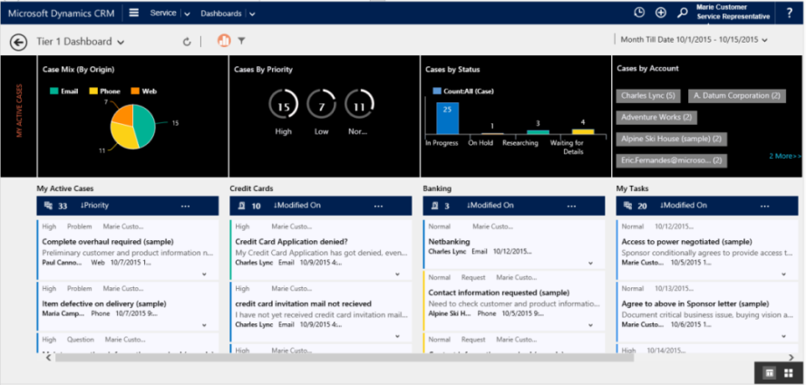  
  
### Multi-stream dashboard tile view  
 The same dashboard, only in the tile view.  
  
 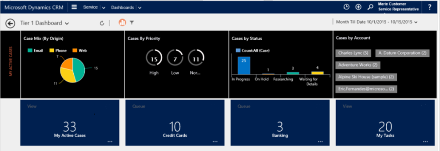  
  
### Multi-stream dashboard layouts  
 For multi-stream dashboards, you can choose from four different layouts.  
  
 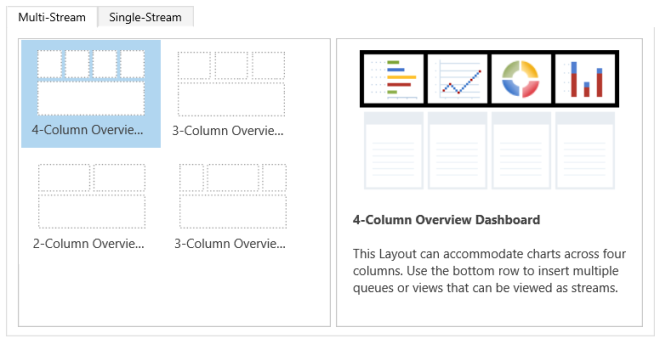  
  
### Multi-stream entity-specific dashboard  
 The entity-specific dashboard for the `Case` entity is shown here.  
  
 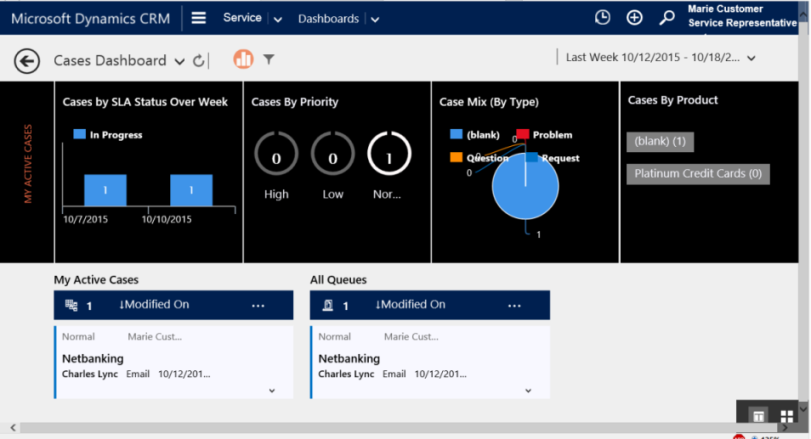  
  
### Single-stream dashboard  
 The single-stream dashboard contains the data stream on the left and visual filters and tiles on the right.  
  
 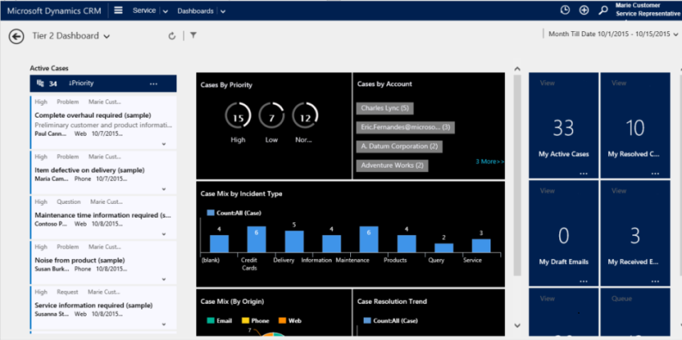  
  
### Single-stream dashboard layouts  
 For single-stream dashboards, you can choose from four different layouts.  
  
 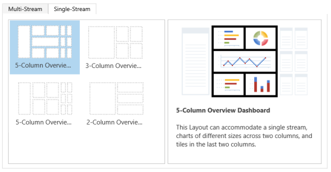  
  
   
## Configure entities, fields, and security roles for the interactive dashboards  
 When you configure interactive dashboards, your first task is to enable entities, fields, and security roles for the interactive experience.  
  
### Enable entities  
 You can create interactive dashboards for entities that are enabled for the interactive experience. You can also enable custom entities and custom activities for the interactive dashboards.  
  
 Out of the box, the following system entities are enabled for interactive dashboards:  
  
-   Case
-   Contact
-   Account  
-   Social Profile  
-   Queue Item  
-   Knowledge Article  
-   Activities: 
    - Email
    - Phone Call
    - Task
    - Appointment
    - Social Activity  
  
#### Enable a custom entity for the interactive experience:  
  
1. [!INCLUDE[proc_settings_customization](../includes/proc-settings-customization.md)]  
  
2.  Click **Customize the System**.  
  
3.  Under **Components**, expand **Entities**, and then expand the entity you want to enable.  
  
4.  On the **General** tab, select the **Enable for interactive experience** check box. Click **Save and Close**.  
  
5.  Click **Publish** for your changes to take effect.  
  
6.  Click **Prepare Client Customizations**.  
  
 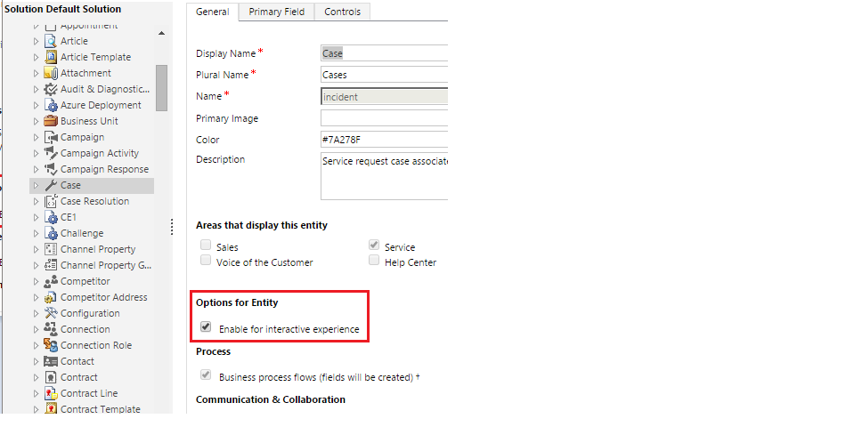  
  
### Configure fields  
 For a field to appear in the global filter and be included in the data stream sort, you have to set two flags, as shown in the example below for the **IsEscalated** field of the Case entity.  
  
 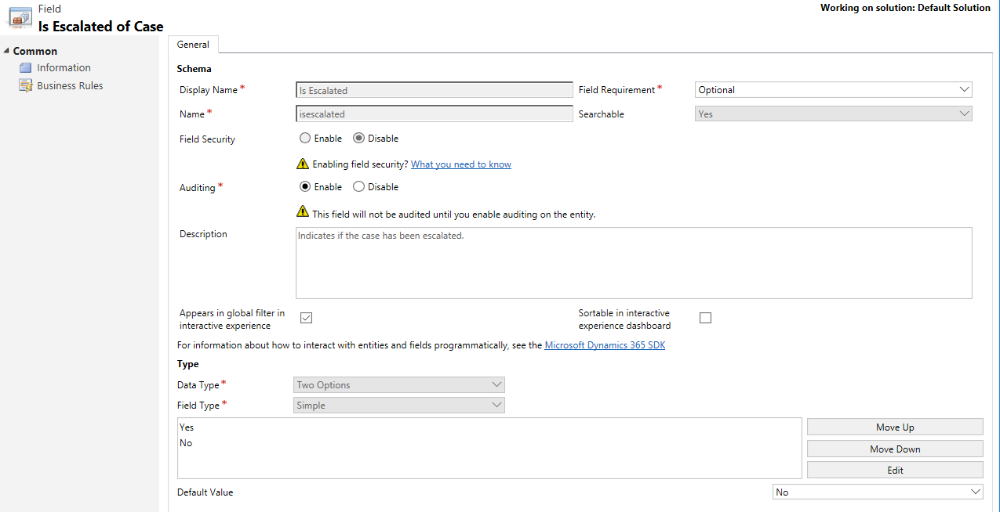  
  
### Configure global filter fields  
 For a field to appear in the global filter, you have to set the **Appears in global filter in interactive experience** flag for this field. The fields that you configure will appear in the global filter flyout window when the global filter icon is clicked on the dashboard header. In the flyout window, the service reps can select the fields on which they want to filter globally, in charts, and also in streams and tiles that are based on the filter entity. For more information about the filter entity see the “Configure multi-stream interactive dashboard” section later in this topic.  
  
 The global filter flyout window is shown here:  
  
   
  
> [!NOTE]
>  When you configure a visual filter (interactive chart) based on the fields like priority or status, a best practice is to also enable these fields (priority, status) to appear in the global filter.  
  
 #### To set the global filter flag  
  
1. [!INCLUDE[proc_settings_customization](../includes/proc-settings-customization.md)]  
  
2.  Click **Customize the System**.  
  
3.  Under **Components**, expand **Entities**, and then expand the entity you want.  
  
4.  In the navigation pane, click **Fields** and in the grid, double-click the field you want to enable.  
  
5.  In the **General** tab, select the **Appears in global filter in interactive experience** check box. Click **Save and Close**.  
  
6.  Click **Publish** for your changes to take effect.  
  
7.  Click **Prepare Client Customizations**.  
  
### Configure sortable fields  
 For a field to be used in sorting stream data, you have to set the **Sortable in interactive experience dashboard** flag for this field. The fields that you configure for sorting will appear in the drop-down list in the **Edit Property** flyout dialog when the user clicks **More (…)** on the stream header. The following illustration shows the flyout dialog with the list of the available fields for sorting, in the **Sort By** drop-down list. The default sort is always set on the **Modified On** field.  
  
   
  
 #### To set the sort flag  
  
1. [!INCLUDE[proc_settings_customization](../includes/proc-settings-customization.md)]  
  
2.  Click **Customize the System**.  
  
3.  Under **Components**, expand **Entities**, and then expand the entity you want.  
  
4.  In the navigation pane, click **Fields** and in the grid, double-click the field you want to enable.  
  
5.  In the **General** tab, select the **Sortable in interactive experience dashboard** check box. Click **Save and Close**.  
  
6.  Click **Publish** for your changes to take effect.  
  
7.  Click **Prepare Client Customizations**.  
  
### Enable security roles  
 Select and enable security roles that will be able to view the interactive dashboards.  
  
 #### To enable the security roles for the interactive experience  
  
1. [!INCLUDE[proc_settings_customization](../includes/proc-settings-customization.md)]  
  
2.  Click **Customize the System**.  
  
3.  Under **Components**, click **Dashboards**.  
  
4.  In the grid, select the interactive dashboard you want and click **Enable Security Roles** on the task bar.  
  
5.  In the **Assign Security Roles** dialog, select the **Display only to these selected security roles** option and select the roles that you want to enable. Click **OK**.  
  
6.  Click **Publish** for your changes to take effect.  
  
7.  Click **Prepare Client Customizations**.  
  
   
  
 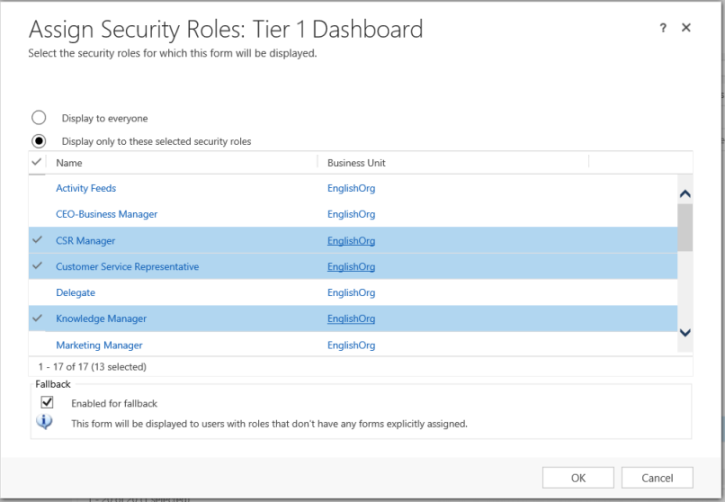  
  
   
## Configure interactive experience dashboards  
 The following sections describe how to configure various types of the interactive dashboards.  
  
### Configure a multi-stream interactive dashboard using the 4-column layout  
  
1. [!INCLUDE[proc_settings_customization](../includes/proc-settings-customization.md)]  
  
2.  Click **Customize the System**.  
  
3.  Under **Components**, click **Dashboards**.  
  
4.  In the grid, click **New**, and select **Interactive experience dashboard** in the drop-down list, as shown here.  
  
 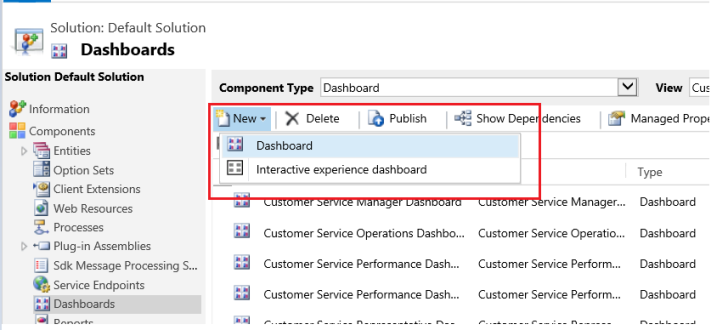  
  
5.  Choose the layout and click **Create**.  
  
6.  When the dashboard form opens, fill in the filtering information at the top of form, as shown here.  
  
   
  
   - **Filter Entity**: The visual filters (interactive charts) and global filter attributes are based on this entity.  
      
    - **Entity View**: The visual filters (interactive charts) are based on this view.  
      
    - **Filter By**: The field that the time frame filter applies to.  
      
    - **Time Frame**: The default time frame filter value for the **Filter By** field.  
      
 After you  have specified the filtering information, start adding components for the charts and the data streams. To add a component, simply click on the element in the center of the chart or stream, and when the dialog appears, enter the required information, as shown in the following illustrations.  
  
 The following shows adding the **Cases By Priority** doughnut chart.  
  
 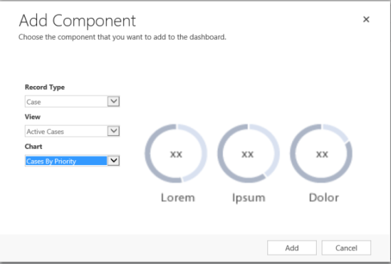  
  
 Some charts, such as bar charts or pie charts, render showing the data stored in the system. The doughnut charts and tag charts load as static images and don’t show the preview of the actual data.  
  
> [!NOTE]
>  The charts configured for the visual filters can use the fields of the **Filter** entity as well as related entities. When you use charts based on related entity fields, the customer service representatives can filter charts using these related entity fields. The fields that are based on the related entity usually have the following format in the chart configuration window: “field name (entity name)”, such as the **Modified By (Delegate)** field. To create multi-entity charts, you must add  fields of a related entity to any of the views, and then use these fields while creating charts.  
  
   
  
 Next, configure the streams. Just like with adding components in the charts, click the element inside the stream panel. When the dialog appears, select **View** or **Queue** depending on what element you want the stream to use. Enter the required information, as shown in the following illustrations.  
  
> [!NOTE]
>  The **Queue** option is available in the dialog box only for queue-enabled entities. For entity dashboards, if the entity is not queue enabled, you won't see the **Queue** option in the dialog box. You can only use the **View option** in the stream of dashboards for entities that are not queue enabled.  
  
 Configure the stream for the **Items available to work on** as shown here:  
  
 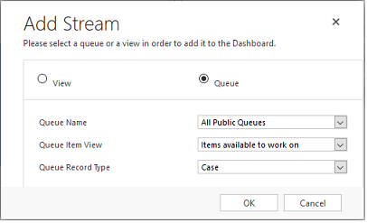  
  
 The following illustration is an example of the chart panel, left to right: doughnut chart, tag chart, and bar chart:  
  
   
  
 This illustration is an example of the stream panel with several streams:  
  
   
  
 After you have completed configuring the dashboard, save it and publish the customizations for your changes to take effect. Also, make sure to click **Prepare Client Customizations**.  
  
#### Edit or delete individual streams of an existing dashboard  
 In previous releases, if you wanted to change one of the streams of an existing dashboard, you had to delete all the streams from the dashboard, and add the ones you wanted. With CRM Online Update 1, you can edit individual streams of an existing dashboard.  
  
1. [!INCLUDE[proc_settings_customization](../includes/proc-settings-customization.md)]  
  
2.  Click **Customize the System**.  
  
3.  Under **Components**, click **Dashboards**.  
  
     -OR-  
  
     If you want to edit the stream of an entity dashboard, then under **Components**, expand **Entities** and click the entity you want. Click **Dashboards** under the entity, in the navigation pane.  
  
4.  In the grid, click the name of the interactive dashboard that you want to edit to open it.  
  
5.  Click the stream that you want to edit to select it, and then click **Edit Component**.  
  
6.  Depending on whether you want to add a view or queue to the stream, select the view or queue details for the stream, and then click **Set**.  
  
7.  Click **Save**.  
  
 You can also delete an individual stream from a dashboard. To do this, select the stream, and then on the command bar, click **Delete**.  
  
### Configure an entity-specific dashboard  
 An entity-specific dashboard is a multi-stream dashboard. Configuring this dashboard is similar to configuring a home page multi-stream dashboard, but you do it in the different place in the UI and there are other minor differences. For example, instead of selecting an entity, some fields in the entity-specific dashboard are preset to the entity for which you are creating the dashboard.  
  
1. [!INCLUDE[proc_settings_customization](../includes/proc-settings-customization.md)]  
  
2.  Click **Customize the System**.  
  
3.  Under **Components**, expand **Entities** and click the entity you want. Click **Dashboards** under the entity, in the navigation pane.  
  
4.  In the grid, click **New**, and select **Interactive experience dashboard** in the drop-down list.  
  
5.  Choose the layout and click **Create**.  
  
6.  When the dashboard form opens, the **Filter Entity** is preset to the entity for which you are creating the dashboard. The **Entity View** drop-down list contains the available views for the entity. Select the view and fill in the rest of the required information on the page.  
  
 The rest of the setup is very similar to the home page multi-stream dashboard setup described in the previous section.  
  
### Configure a single-stream dashboard  
 Configuring a single-stream dashboard is similar to the multi-stream dashboard. All UI navigation steps are the same as for the multi-stream dashboard. You can choose a layout that includes tiles or the layout that doesn’t include tiles. If the tiles are included, they are always displayed on the dashboard. To configure a tile, you click on the icon in the center of the tile. When the **Add Tile** window opens, fill in the required data. The following illustration is an example of the tile setup.  
  
 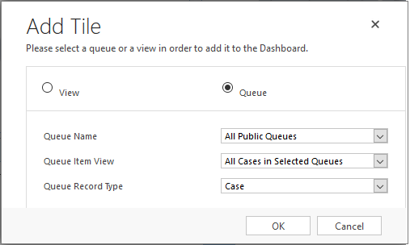  
  
   
## Configure dashboard colors  
 For all **Option Set** and **Two Options** type fields, such as the **Case Type**, **IsEscalated** or **Priority** of the `Case` entity, you can configure a particular color that will appear in the charts and streams for specific field values. For example, high priority cases can be shown in red, medium priority cases in blue, and low priority cases in green in the interactive charts. In the streams, there will be a thin vertical line in color next to the work item description.  
  
> [!NOTE]
>  The color coding isn’t available for the tag charts and doughnut charts. These charts appear on the dashboard in white, gray, and black shades.  
  
1. [!INCLUDE[proc_settings_customization](../includes/proc-settings-customization.md)]  
  
2.  Click **Customize the System**.  
  
3.  Under **Components**, expand **Entities**, and then expand the entity you want.  
  
4.  In the navigation pane, click **Fields**. In the grid, double-click the field that you want to configure the color for.  
  
5.  In the **General** tab, in the **Type** sub-area, select **Yes** and click **Edit**.  
  
6.  When the **Modify List Value** dialog appears, set the new value in the **Color** text box. Click **OK**.  
  
     Click **Save and Close**.  
  
7.  Click **Publish** for your changes to take effect.  
  
In the following example, we’re changing the color for the **IsEscalated** field. Use the **Edit** button to open the **Modify List Value** dialog box:  
  
 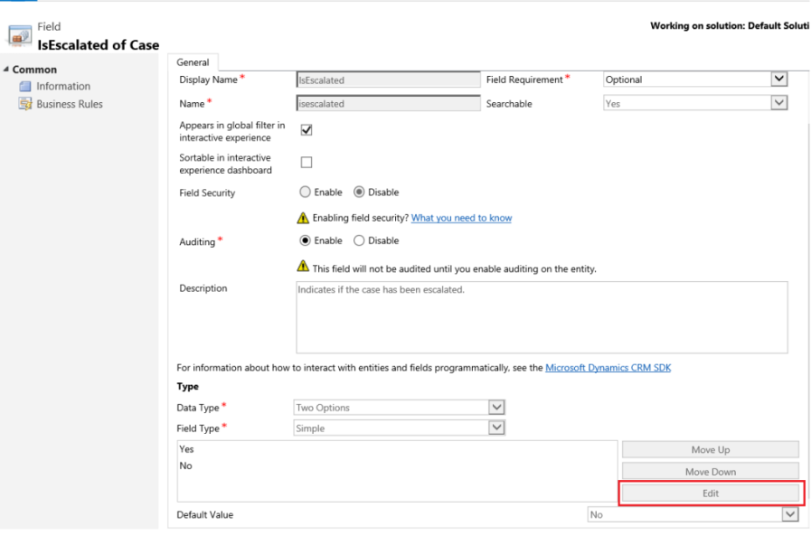  
  
When the **Modify List Value** dialog box opens, choose the color as shown here:  
  
 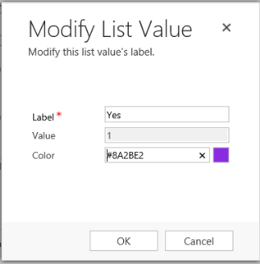  
  
### See also  
 [Create and edit dashboards](../customize/create-edit-dashboards.md)   
 [Create or edit a chart](../basics/create-edit-chart.md)  
