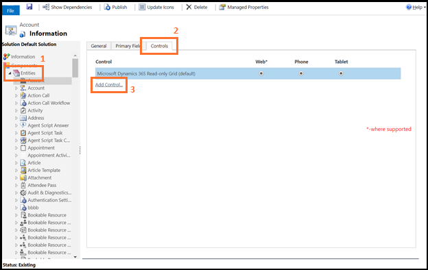
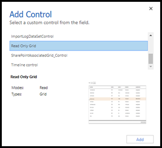
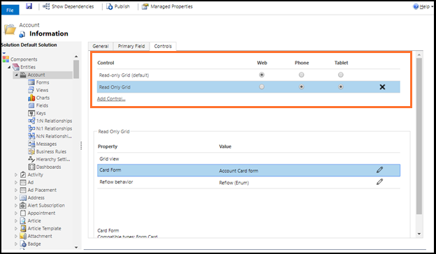
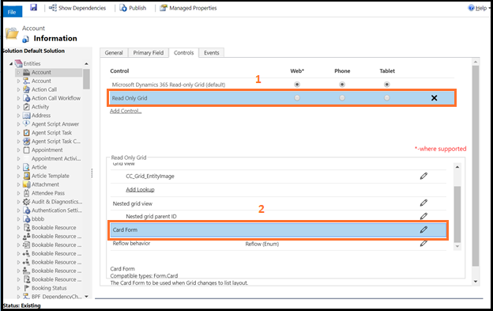
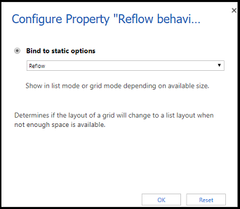

# Specify properties for Unified Interface apps

The Unified Interface framework uses responsive design principles to provide an optimal viewing and interaction experience for any screen size or orientation. With custom business apps that use the Unified Interface framework, the grid (view) control is responsive. As the size of the container decreases—for example, on phones and smaller viewports—the grid is transformed into a list. 

The Read Only Grid control specifies how a grid should reflow to different screen sizes. As an app maker, if you’re working with a Unified Interface app, you can configure the Read Only Grid control and its properties for custom grids and lists.
- **Card Form property:** Use a card form for lists instead of the default list template. Card forms provide more information for list items than the default list template.
- **Reflow behavior property:** Use this parameter to specify a grid to reflow in to a list or not.

## Allow grid to reflow into list

Adding the Read Only Grid control to your controls list allows you to  configure the following features: 
- Allow a grid to reflow into a list on small displays such as mobile.
- Specify the rendering mode as grid-only or list-only.  

1. Open solution explorer.
2. In navigation pane expand **Entities**, select the appropriate entity (such as **Account** or **Contact**), and then on the **Controls** tab, select **Add Control**.

    

3. Select **Read Only Grid** from the list of controls, and then choose **Add**.

    The control is added to the list of available controls.

    

4. Select the devices (**Web**, **Phone**, or **Tablet**) for which you want to make the grid read-only.

    

5. Configure the **Card Form** property.

    You can use the Card Form property to show list items instead of the default list template. Card forms provide more information for list items than the default list template does.    

    a. Choose the pencil icon next to **Card Form**.

    

    b.  Select the **Entity** and **Card Form** types.

    

    c. Choose **OK**.
6. Configure the **Reflow behavior** property. 

    a. Choose the pencil icon next to **Reflow behavior**.

    

    b. Select the grid flow type from **Bind to static options** drop down.

    |Flow Type|Description|
    |--------------|--------------------|
    |**Reflow**|Allows the grid to render into list mode depending when there is no enough display space.|
    |**Grid Only**|Restricts the grid to reflow into list even when there is no enough display space.|
    |**List Only**|Displays only as a list even when there is enough space to display as grid.|

     

    c. Choose **OK**.

7. Save and publish the changes. 

## Conditional image
You can display a custom icon instead of a value in a list and establish the logic used to select them based on a column’s values by using JavaScript. For more information about conditional images, see [Display custom icons instead of values in list views](display-custom-icons-instead.md).

### See also
[Create or edit a view](create-edit-views.md)

[!INCLUDE[footer-include](../../../includes/footer-banner.md)]