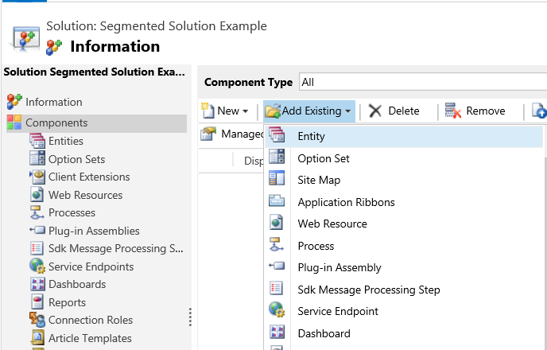
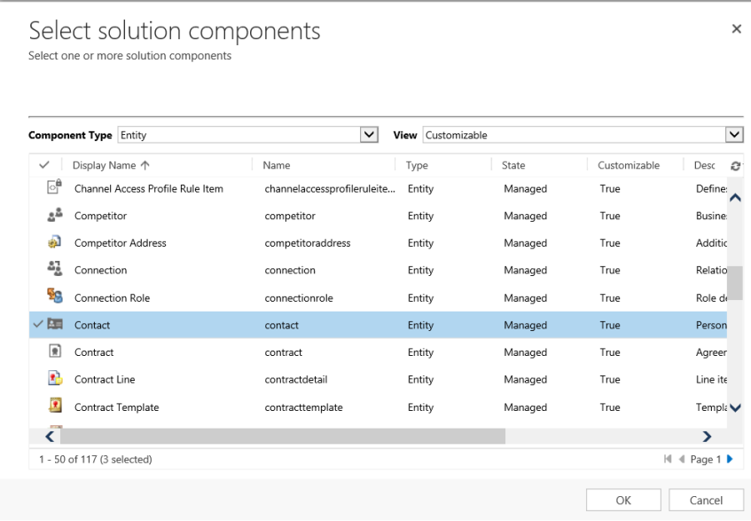
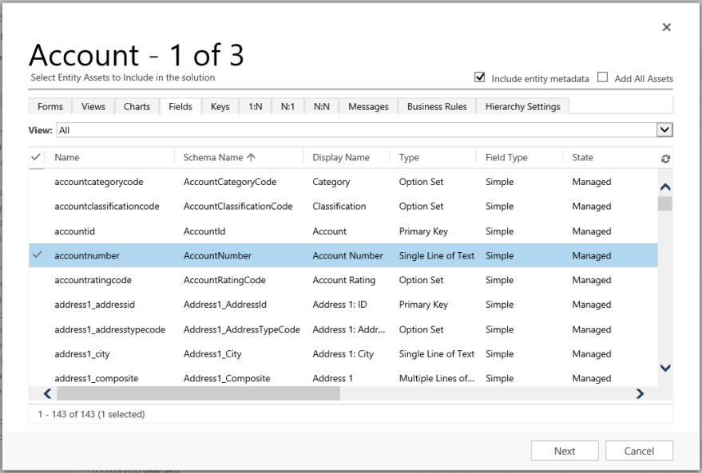
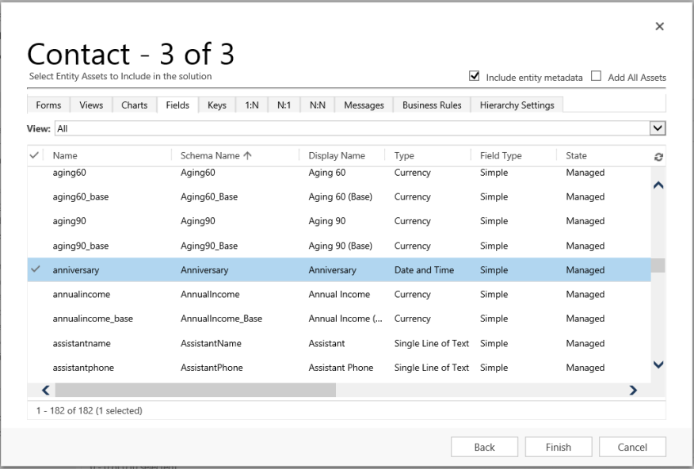
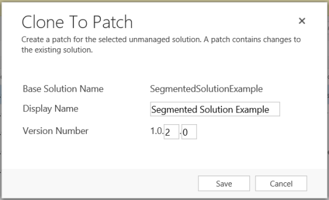
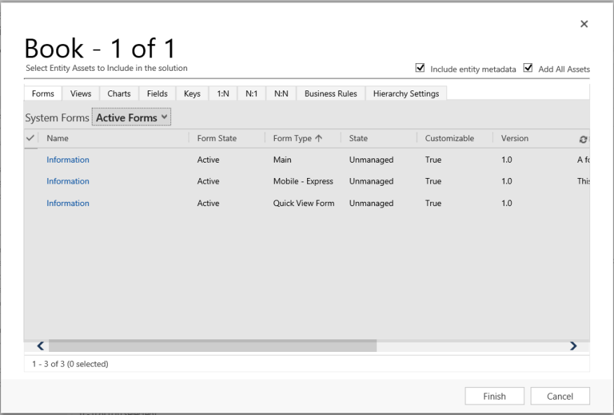
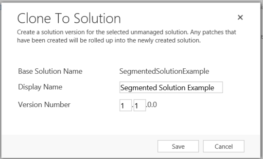
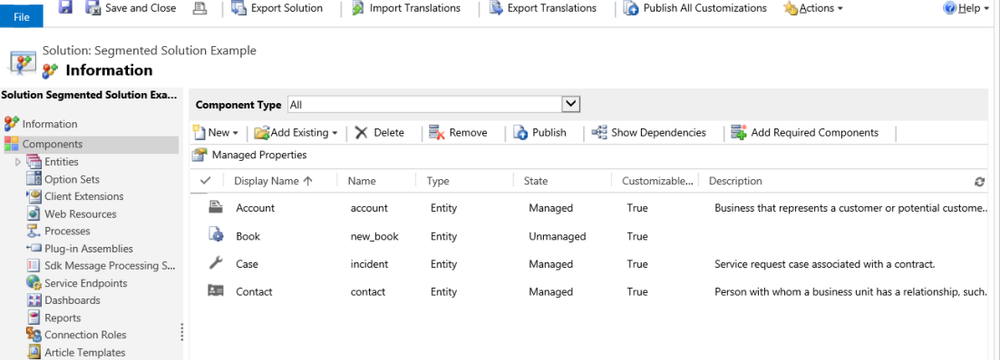

# Use segmented solutions and patches to export selected entity assets
[!INCLUDE [applies-to-on-premises](../includes/applies-to-on-premises.md)] [Use segmented solutions and patches](/powerapps/maker/common-data-service/use-segmented-solutions-patches-simplify-updates)

To gain tighter control over what you distribute in solutions and solution patches, use solution segmentation. With solution segmentation, you can export solutions with selected entity assets, such as entity fields, forms, and views, rather than entire entities with all the assets. To create the segmented solutions and patches, you can use the solutions user interface, without writing code.  
  
 In addition to having more control over what’s in a solution, you’ll be able to control what goes into a patch. You can create a patch for a parent solution and export it as a minor update to the base solution. When you clone a solution, the system rolls up all related patches into the base solution and creates a new version.  
  
 When you’re working with patches and cloned solutions, keep the following information in mind:  
  
-   A patch represents an incremental minor update to the parent solution. A patch can add or update components and assets in the parent solution when installed on the target system, but it can’t delete any components or assets from the parent solution.  
  
-   A patch can have only one parent solution, but a parent solution can have one or more patches.  
  
-   A patch is created for unmanaged solution. You can’t create a patch for a managed solution.  
  
-   When you export a patch to a target system, you should export it as a managed patch. Don’t use unmanaged patches in production environments.  
  
-   The parent solution must be present in the target system to install a patch.  
  
-   You can delete or update a patch.  
  
-   If you delete a parent solution, all child patches are also deleted. The system gives you a warning message that you can’t undo the delete operation. The deletion is performed in a single transaction. If one of the patches or the parent solution fails to delete, the entire transaction is rolled back.  
  
-   After you have created the first patch for a parent solution, the solution becomes locked, and you can’t make any changes in this solution or export it. However, if you delete all of its child patches, the parent solution becomes unlocked.  
  
-   When you clone a base solution, all child patches are rolled up into the base solution and it becomes a new version. You can add, edit, or delete components and assets in the cloned solution.  
  
-   A cloned solution represents a replacement of the base solution when it’s installed on the target system as a managed solution. Typically, you use a cloned solution to ship a major update to the preceding solution.  
  
## Understanding version numbers for cloned solutions and patches  
 A solution’s version has the following format: major.minor.build.revision. A patch must have a higher build or revision number than the parent solution. It can’t have a higher major or minor version. For example, for a base solution version 3.1.5.7, a patch could be a version 3.1.5.8 or version 3.1.7.0, but not version 3.2.0.0. A cloned solution must have the version number greater than or equal to the version number of the base solution. For example, for a base solution version 3.1.5.7, a cloned solution could be a version 3.2.0.0, or version 3.1.5.7. In the UI, you can only set the major and minor version values for a cloned solution, and the build or revision values for a patch.  
  
## Create a segmented solution with the entity assets you want  
 To create a segmented solution, start with creating an unmanaged solution and adding the existing resources. You can add multiple system or custom entities, and for each entity, choose the assets you want to include in the solution. The wizard-like setup takes you step-by-step through the process of adding entity assets.  
  
1. [!INCLUDE[proc_settings_solutions](../includes/proc-settings-solutions.md)]  
  
2. Select **New** and create a solution. Enter information in the required fields. Select **Save & Close**.  
  
3. Open the solution you just created. In the **Add Existing** drop-down list, select **Entity**.  
  
4. In the **Select solution components** dialog box, select one or more entities you want to add to the solution. Select **OK**.  
  
5. The wizard opens. Follow the wizard to add assets for each selected entity to the solution.  
  
6. Select **Publish** for changes to take effect.  
  
   The following illustrations provide an example of creating a segmented solution by choosing entity assets from the `Account`, `Case`, and `Contact` entities.  
  
   Start by choosing the **Entity** component.  
  
     
  
   Then, select the solution components.  
  
     
  
   Follow the wizard. In Step 1, starting in alphabetical order, select the assets for the first entity, the `Account` entity, as shown here.  
  
     
  
   Open the **Fields** tab and select the **Account Number** field.  
  
     
  
   In Step 2, for the **Case** entity, add all assets.  
  
     
  
   In Step 3, add the **Anniversary** field for the **Contact** entity.  
  
     
  
   As a result, the segmented solution that’s created contains three entities, `Account`, `Case`, and `Contact`. Each entity contains only the assets that were chosen.  
  
     
  
## Create a solution patch  
 A patch contains changes to the parent solution, such as adding or editing components and assets. You don’t have to include the parent’s components unless you plan to edit them.  
  
 #### Create a patch for an unmanaged solution  
  
1. [!INCLUDE[proc_settings_solutions](../includes/proc-settings-solutions.md)]  
  
2. In the grid, select an unmanaged solution to create a patch for. Select **Clone a Patch**. The dialog box that opens contains the base solution’s name and the patch version number. Select **Save**.  
  
3. In the grid, find and open the newly created patch. Just like with the base solution, follow the wizard to add the components and assets you want.  
  
4. Select **Publish** for your changes to take effect.  
  
   The following illustrations provide an example of creating a patch for an existing solution. Start by selecting **Clone a Patch** (in the compressed view, the **Clone a Patch** icon is depicted as two small squares, as shown below).  
  
     
  
   In the **Clone To Patch** dialog box you see that the version number for the patch is based on the parent solution version number, but the build number is incremented by one. Each subsequent patch has a higher build or revision number than the preceding patch.  
  
     
  
   The following screenshot shows the base solution **SegmentedSolutionExample**, version **1.0.1.0** and the patch **SegmentedSolutionExample_Patch**, version **1.0.2.0**.  
  
     
  
   In the patch we added a new custom entity called `Book`, and included all assets of the `Book` entity in the patch.  
  
     
  
## Clone a solution  
 When you clone an unmanaged solution, all patches related to this solution are rolled up into the newly-created version of the original solution.  
  
1. [!INCLUDE[proc_settings_solutions](../includes/proc-settings-solutions.md)]  
  
2. From the list, select an unmanaged solution you want to clone. Select **Clone Solution**. The dialog box that opens contains the base solution’s name and the new version number. Select **Save**.  
  
3. Select **Publish** for your changes to take effect.  
  
   Continuing on with the example, you see the **Clone to Solution** dialog box that shows the new solution version number.  
  
     
  
   After cloning, the new solution version contains three original entities (`Account`, `Case`, and `Contact`), and the custom entity called `Book` that was added in the patch. Each entity contains only the assets that were added in the example.  
  
     
  
### See also  
 [Solutions overview](../customize/solutions-overview.md)
 [Create patches to simplify solution updates](../developer/create-patches-simplify-solution-updates.md)

