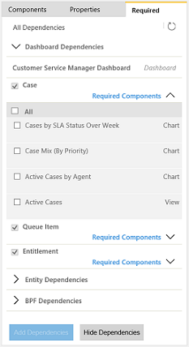

# Validate and publish an app using the app designer

Validate an app to check for asset dependencies that are required for the app to work, but haven't yet been added to the app.  
  
 For example, you've added a Customer Service Performance dashboard to the app, which uses charts like Case Mix (By Priority) or Case Resolution Trend (By Day) that you haven't added. When you validate this app, you'll get a list of all missing, required assets.  
  
 When you validate the app, the app designer canvas shows you details about the assets that are missing.  
  
1.  In the app designer, select **Validate**.  
  
     A notification bar appears and shows you whether the app has any errors or warnings. The notification bar shows warnings in cases where, for example, an entity has no forms or views, or the app doesn’t contain any components. An error might appear if a site map isn't configured for the app. You can publish an app without addressing warnings, but errors must be fixed before you can publish.  
  
       
  
     The app designer also shows a warning symbol with the number of dependencies on each artifact or asset tile that is missing a required asset.  
  
       
  
2.  To add the required assets, select the **Required** tab on the right side of the canvas. The **Required** tab is visible when at least one required asset is missing from the app.  
  
     The tab shows a list of required components.  
  
       
  
3.  Select the assets that you want to add, and then select **Add Dependencies**. When you add a required asset, the count on the tile to which you've added the asset decreases.  
  
    > [!NOTE]
    >  If a common asset is required across various app components&mdash;for example, a form is required for a dashboard and an entity&mdash;and you add that asset only once from the Dashboard dependency tree, the dependency count will decrease only on the Dashboard tile, but not on the Entity tile. However, the dependency will be resolved for both.  
    >   
    >  Select **Get Latest Dependencies**  or select **Validate** again to get the latest set of dependencies. You'll only see these buttons after you save your app.  
  
     Select **Hide Dependencies** if you don't want to add the suggested required components. Any unresolved warnings will appear again when you open the app in the app designer and select **Validate** or **Get Latest Dependencies** .  
  
    > [!NOTE]
    >  If you hide dependencies now and want to export this app later, all of these dependencies will appear again.  
  
## Publish an app using the app designer

Publish an app to make it available to users.  
  
 After you've added components, validated, and saved the app,  on the command bar, select **Publish**. You can also publish the app from the app tile on the My Apps page. In the **Apps Being Edited** view, in the lower right corner of the app tile you want to publish, select the **More options** button (**...**), and then select **Publish**.  
  
 The app status changes to Published. You can see this in the top-right corner of the app designer. The app moves from the **Apps Being Edited** view to the **Published Apps** view, and the published date is shown on the app tile.  
  
> [!NOTE]
> - If your app has a validation error, you'll see the error on a notification bar. You won't be able to publish the app until you resolve the error.  
> - You can't publish an app until you save it.  

### See also  
 [Add or edit app components](../customize/add-edit-app-components.md)   
 

[!INCLUDE[footer-include](../../../includes/footer-banner.md)]
