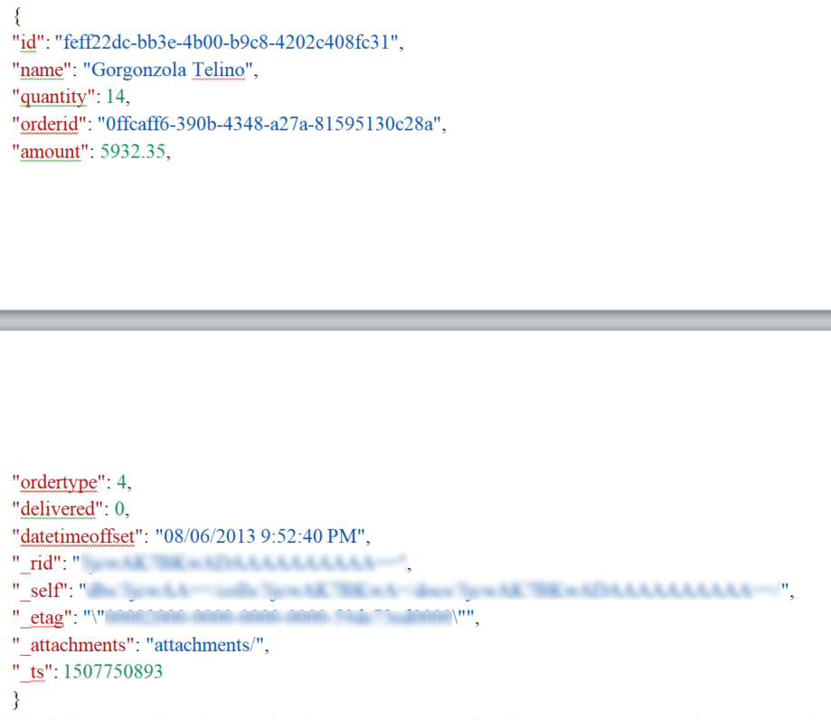
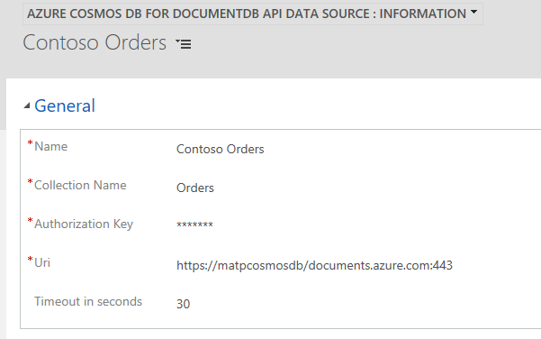

# Azure Cosmos DB SQL API Data Provider requirements, configuration, and best practices

This topic describes the requirements for the [!INCLUDE [cc-docdb-api-data-provider](../includes/cc-docdb-api-data-provider.md)] as well as how to configure and recommended best practices when you use the [!INCLUDE [cc-docdb-api-data-provider](../includes/cc-docdb-api-data-provider.md)] with virtual entities. 

> [!IMPORTANT]
> - [!INCLUDE [cc-preview-features-definition](../includes/cc-preview-features-definition.md)]
> - [!INCLUDE [cc-preview-features-definition](../includes/cc-preview-features-expect-changes.md)]
> - [!INCLUDE [cc-preview-features-definition](../includes/cc-preview-features-no-ms-support.md)]

## What is Azure Cosmos DB?

[!INCLUDE [cc-azure-cosmos-db](../includes/cc-azure-cosmos-db.md)] is Microsoft's globally distributed multi-model database service for mission-critical applications. It provides rich and familiar SQL query capabilities with consistent low latencies over schema-less JSON data. More information: [Introduction to Azure Cosmos DB: SQL API](/azure/cosmos-db/sql-api-introduction)

## Requirements

- Azure subscription that includes [!INCLUDE [cc-azure-cosmos-db](../includes/cc-azure-cosmos-db.md)].
- An [!INCLUDE [cc-docdb-api-long](../includes/cc-docdb-api-long.md)] collection.
- The [!INCLUDE [cc-azure-cosmos-db](../includes/cc-azure-cosmos-db.md)] database type should be SQL. 

## Data type mapping

Suppose you have an [!INCLUDE [cc-azure-cosmos-db](../includes/cc-azure-cosmos-db.md)] document in a collection named *Orders* that has the following JSON structure.

This table indicates the data type mappings for the [!INCLUDE [cc-docdb-api-short](../includes/cc-docdb-api-short.md)] document in the *Orders* collection with the appropriate data type.

| [!INCLUDE [cc-docdb-api-short](../includes/cc-docdb-api-short.md)] Data | Data Type |
|-------------------------------------------------------------------------|------------------------------------------------------------------|
|                                   id                                    |                           Primary Key                            |
|                                  name                                   |                       Single Line of Text                        |
|                                quantity                                 |                           Whole Number                           |
|                                 orderid                                 |                       Single line of text                        |
|                                ordertype                                |                            Option Set                            |
|                                 amount                                  |                    Decimal Number or Currency                    |
|                                delivered                                |                           Two Options                            |
|                             datetimeoffset                              |                          Date and Time                           |

> [!NOTE]
> - Attributes with an underscore (_) prefix are generated by the [!INCLUDE [cc-docdb-api-short](../includes/cc-docdb-api-short.md)].
> - Attributes that are configured as optional in the [!INCLUDE [cc-docdb-api-short](../includes/cc-docdb-api-short.md)] document and are mapped as **Business Required** will cause a runtime error.
> - id attribute values must be guids.
> - For more information about using dates in [!INCLUDE [cc-docdb-api-short](../includes/cc-docdb-api-short.md)], see [Working with Dates in Azure Cosmos DB](https://azure.microsoft.com/blog/working-with-dates-in-azure-documentdb-4/).

## Supported SQL query filtering

SQL query filtering supports the following operators. 

- Comparison operators:<,>,<=, >=,!=
- Logical operators: and, or 
- Set operators: in, not in
- String operators: like, contains, begins with, ends with

> [!NOTE]
> Usage of the like operator is translated to the equivalent contains/begins with/ends with operators. The  [!INCLUDE [cc-docdb-api-short](../includes/cc-docdb-api-short.md)] does not support pattern arguments as described in the topic [Like (Transact-SQL)](/sql/t-sql/language-elements/like-transact-sql). The [!INCLUDE [cc-docdb-api-data-provider](../includes/cc-docdb-api-data-provider.md)] can translate the single special case Like(‘[aA]%’) to BeginsWith(‘a’) OR BeginsWith(‘A’). Notice that string comparison in the [!INCLUDE [cc-docdb-api-short](../includes/cc-docdb-api-short.md)] is case sensitive.

## Add a data source using the Azure Cosmos DB for SQL API Data Provider

1. Go to [AppSource](https://appsource.microsoft.com/product/dynamics-365/mscrm.documentdb_data_provider?tab=Overview), select **GET IT NOW**, and follow the instructions to add the application to your environment or Dynamics 365 Customer Engagement (on-premises) or later instance.
2. After the solution is installed, sign in to the environment and go to **Settings** > **Administration** > **Virtual Entity Data Sources**.
3. On the Actions toolbar select **NEW**, and in the **Select Data Provider** dialog box select **Azure Cosmos DB for SQL API Data Provider**, and then select **OK**.
   
4. Enter the following information, and then select **SAVE & CLOSE**.
   - **Name**. Type a name that describes the data source.
   - **Collection Name**. The name of the Azure Cosmos DB *database* containing the collection you want to surface in a virtual entity.  
   - **Authorization Key**. The primary or secondary key for the [!INCLUDE [cc-azure-cosmos-db](../includes/cc-azure-cosmos-db.md)] account. You can find the key from the Azure admin portal under the **Keys** setting under your [!INCLUDE [cc-azure-cosmos-db](../includes/cc-azure-cosmos-db.md)] account.
   - **Uri**. The URI of the resource group where the [!INCLUDE [cc-azure-cosmos-db](../includes/cc-azure-cosmos-db.md)] collection is located. The URI is formed similar to https://contoso/documents.azure.com:443. You can find the URI from the Azure admin portal under the **Keys** setting for the [!INCLUDE [cc-azure-cosmos-db](../includes/cc-azure-cosmos-db.md)] account. 
   - **Timeout in seconds**. Enter the number of seconds to wait for a response from the [!INCLUDE [cc-azure-cosmos-db](../includes/cc-azure-cosmos-db.md)] service before a data request time-out. For example, enter 30 to wait a maximum of thirty seconds before a time-out occurs. The default timeout is 120 seconds.

## Best practices and limitations

- Notice the following when you use [!INCLUDE [cc-azure-cosmos-db](../includes/cc-azure-cosmos-db.md)] as a Data Source:
  - Each [!INCLUDE [cc-azure-cosmos-db](../includes/cc-azure-cosmos-db.md)] Data Source can only be associated with a single virtual entity.
  - You can connect multiple Data Sources to the same Collection in the [!INCLUDE [cc-azure-cosmos-db](../includes/cc-azure-cosmos-db.md)].

- You can’t segment the data in a collection by entity.
- [!INCLUDE [cc-azure-cosmos-db](../includes/cc-azure-cosmos-db.md)] databases do not require a schema, however the data within the [!INCLUDE [cc-azure-cosmos-db](../includes/cc-azure-cosmos-db.md)] must be structured using a predictable schema. 
- Although the [!INCLUDE [cc-docdb-api-data-provider](../includes/cc-docdb-api-data-provider.md)] implements query translation of projection, filtering, and sorting operators, it does not support join operations.
- You can only filter by a single column with [!INCLUDE [cc-docdb-api-short](../includes/cc-docdb-api-short.md)].

## See also

[Create and edit virtual entities that contain data from an external data source](create-edit-virtual-entities.md)

[!INCLUDE[footer-include](../../../includes/footer-banner.md)]
